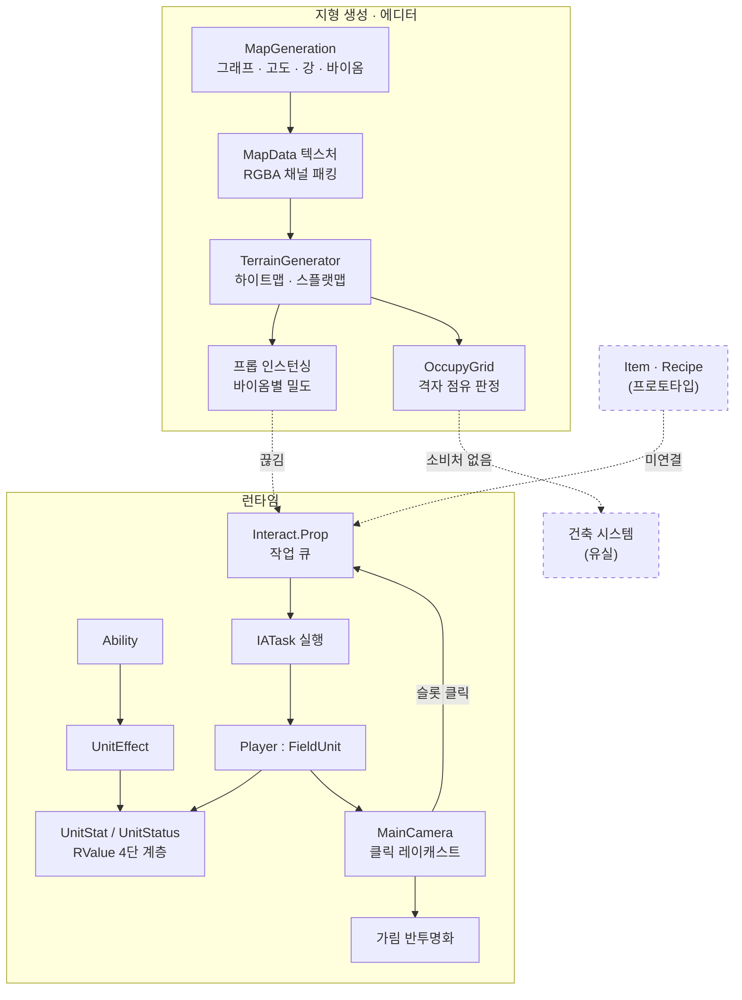
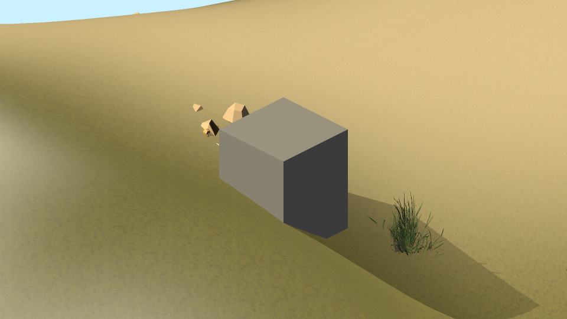
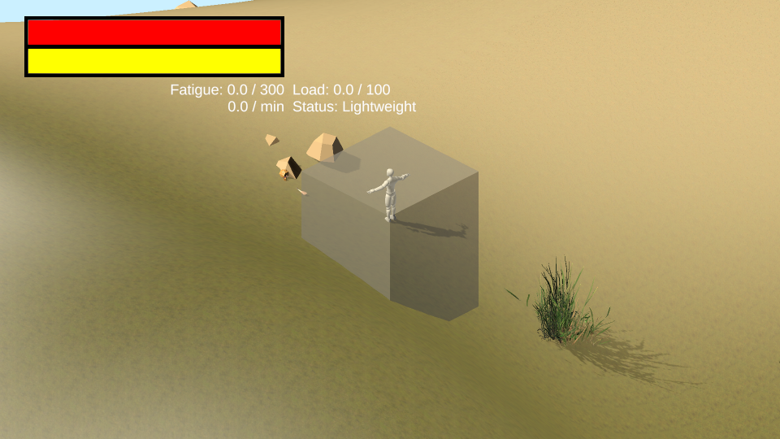

# BuilderRPG

> 절차적으로 생성한 섬 위에서 건설하고 살아가는 쿼터뷰 RPG — 개인 프로젝트
>
> Unity 2023.2.1f1 / URP 16.0.4 / C#

시드 하나로 섬을 만들고, 그 위에 캐릭터를 세우고, 주변 사물과 상호작용하는 것까지가 현재 동작하는 범위입니다.


*시드 `20260730` · 512×512 · 목표 육지 비율 45% · 강 14개 — 전 과정이 에디터에서 진행률 표시와 함께 생성됩니다*

---

## 1. 구현 현황

영역마다 완성도가 다르므로 성숙도를 함께 표기합니다.

| 등급 | 의미 |
|---|---|
| 동작 | 플레이 모드에서 검증됨 |
| 부분 동작 | 핵심 경로는 돌지만 미완 부분이 있음 |
| 프로토타입 | 구조만 있고 내용이 비어 있음 |
| 유실 | 코드는 git 이력에 있으나 의존 에셋이 복구되지 않음 |

| 영역 | 성숙도 | 규모 | 상세 |
|---|---|---|---|
| 절차적 지형 생성 | 동작 | 테스트 64케이스 | [문서 01](docs/01-절차적-섬-생성.md) |
| 스탯 · 버프 · 어빌리티 | 동작 | 테스트 27케이스 | [문서 02](docs/02-스탯-버프-시스템.md) |
| 상호작용 · 작업 큐 | 부분 동작 | 편집 도구 비활성 | [문서 03](docs/03-상호작용-작업큐.md) |
| 카메라 가림 반투명화 | 동작 | 약 200행 | [문서 04](docs/04-URP-가림-반투명화.md) |
| 아이템 · 제작 | 프로토타입 | 모델만 존재 | [문서 05](docs/05-미완성-설계.md) |
| NPC · 지식 | 프로토타입 | 표시기만 동작 | [문서 05](docs/05-미완성-설계.md) |
| 건축 | 유실 | 455행 (이력에 존재) | [문서 05](docs/05-미완성-설계.md) |

---

## 2. 기술 스택과 규모

| 항목 | 내용 |
|---|---|
| 엔진 | Unity 2023.2.1f1 |
| 렌더링 | Universal Render Pipeline 16.0.4 |
| 주요 패키지 | AI Navigation 2.0.6 · Test Framework 1.3.9 · Editor Coroutines |
| 언어 | C# (`Rair.*` 네임스페이스) |

| 어셈블리 | 파일 | 행 | 성격 |
|---|---|---|---|
| `Rair.Runtime` | 53 | 4,301 | 게임 로직. 빌드 산출물에 포함 |
| `Rair.Editor` | 12 | 1,153 | 에디터 도구. 산출물에서 제외 |
| `Rair.Tests` | 8 | 1,560 | EditMode 테스트 81개 메서드 / 97개 케이스 |

서드파티 에셋과 포크한 서브모듈은 위 집계에서 제외했습니다.

### 2.1 선행 작업과의 관계

지형 생성 파트는 백지에서 시작하지 않았습니다.
Amit Patel의 *Polygon Map Generation* 알고리즘을 Stafford Williams가 Unity로 이식한
[polygon-map-unity](https://github.com/staff0rd/polygon-map-unity)를 포크해 작업했습니다.
그래프 구축 · 고도 전파 · 강 · 습도 · 바이옴 분류의 알고리즘 골격은 선행 작업의 것입니다.

포크에서 한 작업은 "50×50 고정 크기의 2D 데모"를 "가변 크기의 3D 플레이 가능 지형을 뽑는 도구"로
바꾸는 것입니다 — 파이프라인 코루틴화, 목표 육지 비율 자동 수렴, 채널 패킹, Terrain 변환기,
에디터 워크플로 등이며, 문서 01에서 ★ 표시로 구분해 두었습니다.
그 외 영역은 선행 작업 없이 설계·구현했습니다.

### 2.2 작업 형태

4절까지의 게임 시스템 구현은 직접 작성한 코드입니다.

5절의 프로젝트 운영 작업 — 어셈블리 분할, 테스트 작성, 감사 도구, 그리고 이 문서를 포함한
문서화 전반 — 은 AI 도구를 사용해 진행했습니다.
즉 게임 로직과 그것을 지탱하는 기반 정비의 작업 형태가 다릅니다.

---

## 3. 시스템 구성과 결합 관계



실선은 실제로 연결되어 동작하는 경로이고, 점선은 아직 이어지지 않은 곳입니다.

| 끊긴 지점 | 사정 |
|---|---|
| 지형 프롭 → 상호작용 | `Rair.Field.Maps.Prop`(배치 정보 struct)과 `Rair.Field.Interact.Prop`(상호작용 MonoBehaviour)은 이름만 같고 무관한 타입입니다. 지형이 심은 나무는 클릭할 수 없습니다 |
| 점유 격자 → 건축 | 소비처인 건축 시스템이 유실 상태입니다. 그래서 의미만 테스트로 고정해 두었습니다 |
| 아이템 → 상호작용 | 아이템 실물이 정의되어 있지 않습니다 |

---

## 4. 시스템별 요약

### 4.1 절차적 지형 생성 — 동작

시드와 세 파라미터(맵 크기, 목표 육지 비율, 강 개수)만으로
Voronoi 그래프 기반의 섬을 만들고 플레이 가능한 Unity Terrain으로 변환합니다.

| 시각화 텍스처 | 데이터 텍스처 |
|---|---|
|  |  |
| 사람이 보는 지도 | Terrain 변환기가 읽는 입력 (R:고도 G:습도 B:바이옴 A:육지) |

- **목표 육지 비율 자동 수렴** — 이진 탐색으로 노이즈 임계값을 조정합니다.
  이 구현이 수렴하지 않고 있었고, 테스트가 그것을 찾아냈습니다 (문서 01의 4.3절)
- **채널 패킹** — 고도·습도·바이옴·육지여부를 RGBA 4채널에 인코딩해 텍스처 하나로 넘깁니다
- **진행률 추상화** — 전 과정이 코루틴이고 `ProgressTimer`가 `[2/4]` 형태로 전체 진행률을 표시합니다

→ [문서 01](docs/01-절차적-섬-생성.md)

### 4.2 스탯 · 버프 · 어빌리티 — 동작

"이동속도"라는 값 하나에 상하한, 가산·승산 수정자, 정확한 원복, 순서 무관성,
다른 스탯과의 연동, UI 계산 과정 노출이 함께 요구됩니다.
`float` 필드로는 감당할 수 없어 값의 종류를 타입 계층으로 나눴습니다.

핵심은 `*`를 곱셈이 아니라 `Multiplier += (f - 1)`로 정의한 것입니다.
가산기와 승산기가 독립 누산기에 쌓이므로 교환법칙이 성립하고 역연산이 정확히 상쇄됩니다.
두 성질은 테스트로 고정되어 있습니다.

→ [문서 02](docs/02-스탯-버프-시스템.md)

### 4.3 상호작용 · 작업 큐 — 부분 동작

오브젝트를 클릭하면 가능한 상호작용이 뜨고, 고르면 캐릭터가 다가가 수행합니다.

설계의 축은 작업 큐를 유닛이 아니라 대상이 소유한다는 것입니다.
나무 한 그루를 두 사람이 동시에 벨 수 없으므로, 큐를 대상에 두면 배타성이 자료구조로 보장됩니다.
상호작용은 여러 단계로 쪼개지고 각 단계가 `Manual`(유닛 구속) / `Auto`(방치 가능)로 구분됩니다.

미완 — 커스텀 인스펙터가 `#if false`로 막혀 있어 상호작용을 코드로만 정의할 수 있습니다.
`cancellable` · `onCondition` · `level` 필드는 선언만 되고 소비처가 없습니다.

→ [문서 03](docs/03-상호작용-작업큐.md)

### 4.4 카메라 가림 반투명화 — 동작

| 적용 전 | 적용 후 |
|---|---|
|  |  |

쿼터뷰에서 카메라와 캐릭터 사이에 낀 오브젝트를 반투명하게 만듭니다.
URP에서는 빌트인 시절의 방법이 통하지 않아 제약 셋을 차례로 우회했습니다 —
`OnPreCull` 부재, URP Lit의 투명 전환이 단일 스위치가 아닌 점, 원상 복구의 정확성입니다.

→ [문서 04](docs/04-URP-가림-반투명화.md)

### 4.5 미완성 갈래 — 아이템 · NPC · 건축

아이템은 물성 모델(질량·부피·온도·열용량)과 병합 엔진이 있으나 아이템 실물이 없고,
NPC는 키워드 지식 표시기가 동작하나 그것을 쓸 NPC가 비어 있으며,
건축은 코드가 커밋 `0d8ef958`에 남아 있으나 의존 프리팹의 메시가 유실되었습니다.

셋 다 모델을 먼저 만들고 사용처를 나중에 둔 구조이며, 반대 순서였던 건축만 한때 동작했습니다.

→ [문서 05](docs/05-미완성-설계.md)

---

## 5. 프로젝트 운영

게임 콘텐츠가 아니라 프로젝트 기반을 정비한 작업입니다. 2.2절에 밝힌 대로 AI 도구를 사용했습니다.

### 5.1 엔지니어링 — 어셈블리 · 테스트 · 감사 도구

| 영역 | 이전 | 현재 |
|---|---|---|
| 어셈블리 | 정의 없음. `#if UNITY_EDITOR` 산재 | 3분할 (`Runtime` / `Editor` / `Tests`) |
| 플레이어 빌드 | 실패 | 통과 (프로젝트 최초) |
| 테스트 | 0개 | 81개 메서드 · 97개 케이스 |
| 끊긴 참조 | 일회용 스크립트로 조사 | 상시 도구 3종 |

테스트는 변이 테스트로 검증했습니다. 사후에 쓴 테스트가 통과하는 것만으로는
결함 검출 능력이 증명되지 않으므로, 고쳤던 결함을 다시 넣어 실제로 잡히는지 확인했습니다.
잡히지 않은 변이 2건은 테스트의 구멍이 아니라 변이가 동작을 바꾸지 않은 경우로 분석해 기록했습니다.

어셈블리 분할 과정에서는 에디터 전용 어셈블리의 `MonoBehaviour`를 씬에 붙이면
플레이 모드를 오갈 때 직렬화 값이 기본값으로 초기화된다는 것을 실측했습니다.
에디트 모드에서는 컴파일·바인딩·씬 검증이 모두 통과해 드러나지 않습니다.

→ [문서 06](docs/06-엔지니어링.md)

### 5.2 개발 이력 — GUID 유실 사고

2026년 7월, `.gitignore` 설정 오류로 `.meta` 파일이 커밋되지 않아 에셋 참조가 대규모로 끊겼습니다.
프리팹의 메시, 머티리얼, 터레인 레이어가 이름만 남고 연결이 사라진 상태였습니다.

복구는 git 이력에서 GUID를 역추적하는 방식으로 진행했고, 되살릴 수 없는 것과 되살린 것을 구분해 기록했습니다.
건축 시스템이 "유실"로 표기되는 이유가 여기에 있습니다.

재발 방지로 `.gitattributes`에 Unity YAML의 줄바꿈 변환 금지를 명시했고,
사고 당시의 일회용 스크립트를 상시 감사 도구로 옮겼습니다.

→ [문서 07](docs/07-에셋-GUID-복구.md)

---

## 6. 알려진 한계

| 항목 | 내용 |
|---|---|
| 게임 루프 부재 | 생성 · 이동 · 상호작용은 되지만 목표와 진행이 없습니다 |
| PlayMode 테스트 없음 | 전부 EditMode입니다. `MonoBehaviour` 경로는 검증되지 않습니다 |
| CI 없음 | 테스트와 빌드가 수동 실행입니다 |
| 끊긴 참조 잔존 | 원인 GUID 109개 (복구 대상 101 / 정리 대상 8) |
| 서드파티 의존 | 터레인 레이어 8종이 샘플 에셋 패키지의 것입니다 |

---

## 7. 저장소 구조

```
Assets/Game Assets/Scripts/     자체 코드
  ├─ Fields/                    지형 · 카메라 · 상호작용 · UI
  ├─ Units/                     유닛 · 플레이어 · NPC
  ├─ Skill/                     어빌리티 · 이펙트
  ├─ Items/                     아이템 (프로토타입)
  ├─ Editors/                   에디터 도구 (Rair.Editor)
  └─ MapGenerator/              포크한 서브모듈
Assets/Tests/EditMode/          테스트 (Rair.Tests)
docs/                           문서 01~07
  ├─ images/                    문서용 스크린샷
  └─ internal/                  작업 기록
RECOVERY-TODO.md                감사 도구 산출물 — 복구 대상 목록
UNREACHABLE-ASSETS.md           감사 도구 산출물 — 미참조 에셋 목록
```
