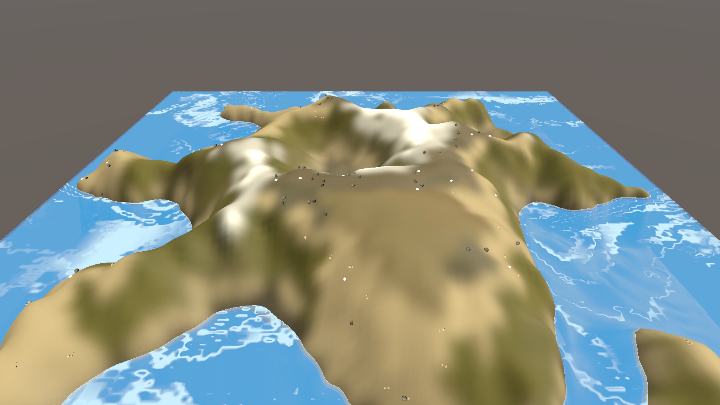
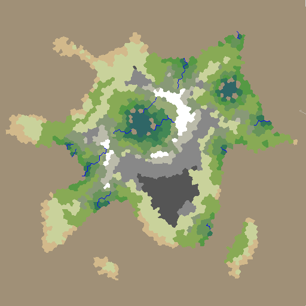
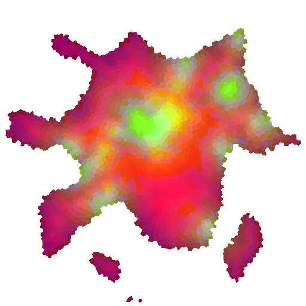
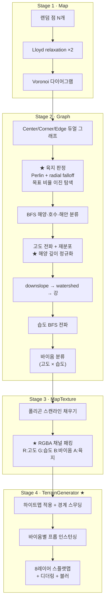
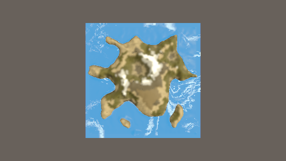
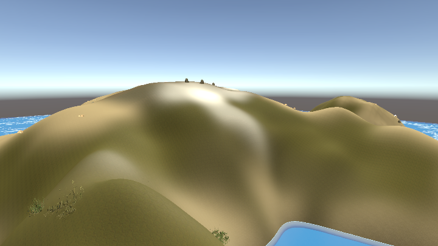

# 절차적 섬 생성 파이프라인

> Unity 2023.2 / URP · C# · 개인 프로젝트 *BuilderRPG* 중 지형 생성 파트
>
> 구현 성숙도 — 동작. 테스트 64케이스로 고정되어 있습니다.
> 전체 개요는 [저장소 README](../README.md)를 참조하십시오.

## 1. 개요

시드 하나와 세 개의 파라미터(맵 크기, 목표 육지 비율, 강 개수)만 주면
Voronoi 그래프 기반의 섬을 생성하고, 이를 플레이 가능한 Unity Terrain으로 변환하는 에디터 도구입니다.

최종 산출물은 다음 네 가지입니다.

| 산출물 | 내용 |
|---|---|
| 시각화 텍스처 | 바이옴별 색상 + 강 라인이 그려진 미니맵용 PNG |
| 데이터 텍스처 | 고도·습도·바이옴·육지여부를 RGBA 4채널에 패킹한 PNG |
| Unity Terrain | 하이트맵 + 8레이어 스플랫맵이 적용된 실제 지형 |
| 배치된 프롭 | 바이옴별 밀도 규칙에 따라 인스턴싱된 나무·바위 등 |

512×512 맵 기준으로 약 5,200개의 폴리곤이 생성되며,
전 과정이 에디터를 멈추지 않고 진행률 표시와 함께 실행됩니다.



*시드 `20260730` · 512×512 · 목표 육지 비율 45% · 강 14개*

| 시각화 텍스처 | 데이터 텍스처 |
|---|---|
|  |  |
| 바이옴 색상 + 강 라인. 미니맵용 | R:고도 G:습도 B:바이옴 A:육지 (4.8절) |

왼쪽은 사람이 보는 지도, 오른쪽은 Terrain 변환기가 읽는 입력입니다.
오른쪽 이미지가 흐릿한 갈색으로 보이는 것은 각 채널에 서로 다른 의미가 실려 있어서입니다 —
빨강이 고도, 초록이 습도, 파랑이 바이옴 인덱스, 알파가 육지 여부입니다.

---

## 2. 출발점과 기여 범위

이 파트는 백지에서 시작하지 않았습니다. 정확히 밝히자면:

기반이 된 선행 작업

- Amit Patel, *[Polygon Map Generation for Games](https://www.redblobgames.com/maps/mapgen2/)* — 알고리즘 원안
- Alan Shaw, `as3delaunay` — Fortune 알고리즘 기반 Voronoi/Delaunay 구현 (MIT)
- Julian Ceipek, `Unity-delaunay` — 위 라이브러리의 Unity C# 이식 (MIT)
- Stafford Williams, `polygon-map-unity` — Patel 알고리즘의 Unity 이식

저는 마지막 저장소를 포크해서 작업했습니다. 즉 그래프 구축 · 고도 전파 · 강/분수령 · 습도 전파 · 바이옴 분류의 알고리즘 골격은 선행 작업의 것입니다.

제가 한 작업

원본은 "50×50 고정 크기의 2D 맵을 평면에 텍스처로 붙여 보여주는 데모"였고,
이를 가변 크기의 3D 플레이 가능 지형을 뽑아내는 프로덕션 도구로 바꾸는 것이 목표였습니다.

| # | 작업 | 성격 |
|---|---|---|
| 1 | 파이프라인 전체를 코루틴화 + `ProgressTimer` 진행률 추상화 설계 | 신규 |
| 2 | 목표 육지 비율 자동 수렴 (이진 탐색) | 신규 |
| 3 | 데이터 텍스처 채널 패킹 및 인코딩 | 신규 |
| 4 | Terrain 변환기 — 하이트맵 / 스플랫맵 / 프롭 배치 | 신규 |
| 5 | 커스텀 에디터 워크플로 (프리셋·진행바·취소·재시작) | 신규 |
| 6 | 해양 깊이 모델 도입 (고도 음수 영역) | 개선 |
| 7 | 코너 정규화 자료구조를 2D 공간 해시로 교체 | 개선 |
| 8 | 맵 크기 파라미터화 및 노이즈 주파수 정규화 | 개선 |

아래 본문에서 ★ 표시된 항목이 제 기여분입니다.

> 포크한 저장소는 서브모듈로 편입되어 있습니다 —
> `Assets/Game Assets/Scripts/MapGenerator/polygon-map-unity/`.
> 원본 대비 변경점을 파일 단위로 정리한 것이 그쪽 `README.md`에 있습니다.

---

## 3. 전체 구조



각 스테이지는 독립된 `IProgressTimerProvider` 구현체이고,
에디터는 네 개의 타이머를 순차적으로 관찰하며 `[2/4]` 형태로 전체 진행률을 표시합니다.

---

## 4. 단계별 상세

### 4.1 그래프 구축

균일 랜덤 점은 뭉치거나 비는 구간이 생겨 폴리곤 크기가 들쭉날쭉해집니다.
Lloyd relaxation을 2회 적용해 각 점을 자기 Voronoi 영역의 무게중심으로 옮기면
셀 크기가 고르게 정리됩니다.

```csharp
public static void RelaxPoints(Vector2[] points, float width, float height) {
  Voronoi v = new(points, null, new Rect(0, 0, width, height));
  for (int i = 0; i < points.Length; i++) {
    var region = v.Region(points[i]);
    points[i] = new Vector2(region.Average(q => q.x), region.Average(q => q.y));
  }
}
```

이후 Voronoi 다이어그램에서 듀얼 그래프를 세웁니다.
Voronoi 다이어그램과 Delaunay 삼각분할은 서로 듀얼 관계이므로,
하나의 `Edge`가 네 점을 동시에 참조합니다 — Voronoi 변의 양 끝 코너 `v0`/`v1`,
그리고 그 변을 사이에 둔 두 폴리곤 중심 `d0`/`d1`.

이 구조 덕분에 "인접 폴리곤 순회"와 "폴리곤 경계선 순회"가 같은 자료구조로 해결됩니다.

#### ★ 코너 정규화 — 공간 해시 교체

Voronoi 라이브러리는 같은 좌표의 코너를 변마다 별개 객체로 뱉습니다.
이를 하나로 합치는 정규화가 필요한데, 원본 구현은 이랬습니다.

```csharp
// 원본: x좌표만으로 버킷팅한 List를 LINQ로 선형 스캔
for (var i = (int)(point.x - 1); i <= (int)(point.x + 1); i++)
    foreach (var kvp in _cornerMap.Where(p => p.Key == i)) { ... }
```

`_cornerMap`이 `List<KeyValuePair<int, Corner>>`라서 `Where`가 매 조회마다
전체 리스트를 훑습니다. 코너 수에 비례하는 비용이 조회마다 발생하니
맵 크기를 키우자마자 이 지점이 병목이 됐습니다.

`(int, int)` 튜플을 키로 쓰는 2D 공간 해시로 교체했습니다.

```csharp
public Dictionary<(int, int), List<Corner>> cornerMap = new();

private bool TryGetCorner(Vector2 point, out Corner corner) {
  int x = (int)point.x, y = (int)point.y;
  corner = default;
  var box = new (int, int)[] { (x-1,y-1), (x-1,y), (x-1,y+1),
                               (x,  y-1), (x,  y), (x,  y+1),
                               (x+1,y-1), (x+1,y), (x+1,y+1) };
  foreach (var p in box)
    if (cornerMap.TryGetValue(p, out var l) &&
        l.Any(c => Vector2.Distance(c.point, point) < .01f)) {
      corner = l.First(c => Vector2.Distance(c.point, point) < .01f);
      return true;
    }
  return false;
}
```

이제 조회 비용이 인접 9개 버킷의 원소 수에만 의존합니다.
같은 맥락에서 `OrderBy(...).First()`로 최소/최대를 찾던 코드도
단일 순회 `MinItem`/`MaxItem` 확장 메서드로 교체했습니다.

> `Quadtree.cs`에 사분 트리 구현도 함께 남아 있습니다.
> 공간 인덱싱의 대안으로 만들었지만, 딕셔너리 방식으로 충분해서 주석 처리했습니다.

---

### 4.2 ★ 육지 판정과 목표 비율 자동 수렴

가장 공들인 부분입니다.

문제. 원본의 Perlin 섬 생성은 고정 임계값을 씁니다.

```csharp
// 원본
var checkValue = PERLIN_CHECK_VALUE + PERLIN_CHECK_VALUE * q.magnitude * q.magnitude;
return perlin > checkValue;   // PERLIN_CHECK_VALUE = 0.3f 고정
```

시드에 따라 육지 비율이 크게 요동칩니다. 어떤 시드는 대륙이 나오고 어떤 시드는
점점이 흩어진 군도가 나옵니다. 게임에 쓰려면 "육지 40%짜리 섬을 달라"고
지정할 수 있어야 하는데, 이 구조로는 원하는 결과가 나올 때까지 시드를 굴리는 수밖에 없습니다.

접근. 해수면 값을 미지수로 두고 이진 탐색으로 수렴시킵니다.
Perlin 노이즈 필드는 시드가 고정되면 결정적이므로,
해수면을 올리면 육지가 단조 감소합니다. 단조 함수이니 이진 탐색이 성립합니다.

```csharp
public static float SeaLevel { get; private set; }
private static float _gap;

public static void ResetPerlin() { SeaLevel = .5f; _gap = .25f; }

public static void SetPerlin(float targetRatio, float resultRatio) {
  SeaLevel += (targetRatio < resultRatio) ? _gap : -_gap;
  _gap /= 2;      // 탐색 폭을 절반으로
}
```

호출부는 오차 1% 이내로 수렴할 때까지 최대 10회 반복합니다.

```csharp
IslandShape.ResetPerlin();
int _tries = 1;
do {
  int water = 0;
  var IsLand = IslandShape.MakePerlin(_size);
  foreach (var q in vars.corners) if (q.water = !IsLand(q.point)) water++;
  var result = 1 - ((float)water / vars.corners.Count);

  if (Mathf.Abs(landRatio - result) < .01f) break;
  else IslandShape.SetPerlin(landRatio, result);
} while (++_tries < 10);
```

보정은 최대 9회 일어나고 그동안 탐색 폭이 0.25에서 약 0.001까지 좁혀집니다.

…라고 설계했지만, 실제로는 수렴하지 않았습니다. 아래 4.3절에서 다룹니다.

섬 형태. 판정식 자체도 다시 썼습니다.
Perlin 노이즈에 중심에서의 거리 제곱에 반비례하는 감쇠항을 더합니다.
가장자리로 갈수록 육지가 될 확률이 떨어져 자연스럽게 섬 형태가 잡힙니다.

```csharp
return q => {
  var p = (q + offset) * freq;
  float perlin = Mathf.PerlinNoise(p.x, p.y);            // 0 ~ 1
  float dist = new Vector2(q.x*2/size - 1, q.y*2/size - 1).sqrMagnitude;
  var ground = MIDPOINT_VALUE * (1 - dist);              // 중심 0.66 → 가장자리 음수
  return perlin + ground > SeaLevel;
};
```

주파수 정규화. 맵 크기를 키웠을 때 노이즈 특징 크기가 같이 커지면
"큰 맵일수록 지형이 밋밋해지는" 문제가 생깁니다. 기준 크기(512) 대비로 나눠
크기와 무관하게 지형 디테일의 절대 크기가 유지되도록 했습니다.

```csharp
var freq = new Vector2(1/size, 1/size) * FREQUENCY * ZOOM_FACTOR * size / (int)Size.s4;
//         ~~~~~~~~~~~~~~~~~~~~~~~~~~~ size가 약분되어 상수가 된다
```

---

### 4.3 ★ 그런데 수렴하지 않았습니다 — 테스트가 찾아낸 것

앞 절은 설계 의도입니다. 실제로는 그렇게 동작하지 않았습니다.

이 결함은 코드를 아무리 읽어도 보이지 않았고,
나중에 테스트를 도입하면서 *"육지 비율이 목표치 ±1%로 수렴한다"*를
실제로 검사하자마자 드러났습니다.

실측 (`Size.s2`, 목표 35%, 시드 5종)

| 시드 | 육지 비율 | 최종 `SeaLevel` |
|---|---|---|
| 1 | 13.3 % | 0.9072 |
| 7 | 27.9 % | 0.9229 |
| 42 | 35.5 % | 0.8711 |
| 99 | 34.5 % | 0.8340 |
| 123 | 25.7 % | 0.8604 |

5개 중 2개는 목표 근처에 옵니다. 몇 번 돌려보는 것만으로는 알아채기 어렵습니다.

`SeaLevel`이 초기값 0.5에서 0.83~0.92까지 한 방향으로만 밀린 것도
탐색이 구간을 좁히지 못했다는 신호입니다.
정상적인 이분 탐색이라면 목표를 사이에 두고 진동하며 좁혀져야 합니다.

원인. `MakePerlin`이 호출될 때마다 새 오프셋을 뽑고 있었습니다.

```csharp
public static System.Func<Vector2, bool> MakePerlin(float size) {
  Vector2 offset = Random.value * new Vector2(10000, 10000);   // ← 매 호출 새 지형
  ...
}
```

그런데 탐색 루프는 이 함수를 매 반복 다시 호출합니다(4.2절 코드).
즉 반복마다 다른 노이즈 필드를 재고 있었습니다.
지형 N을 측정해서 조정한 해수면을 지형 N+1에 적용하는 셈이라,
보폭만 절반씩 줄어드는 무작위 행보가 됩니다.
9회를 소진하면 마지막 지형의 결과가 그대로 채택됩니다.

이분 탐색은 대상 함수가 고정되어 있을 때만 성립합니다.
저는 "해수면을 올리면 육지가 준다"는 단조성만 확인했고,
무엇에 대한 단조성인지는 확인하지 않았습니다.
단조성은 *같은 지형 안에서* 성립하는 성질인데, 그 전제가 매 반복 깨지고 있었습니다.

수정. 오프셋을 탐색 루프 밖으로 옮겼습니다.
펄린 노이즈는 위치에 대해 결정적이므로 오프셋이 곧 지형의 시드입니다.

```csharp
/// <summary>지형 하나를 새로 뽑고 탐색 상태를 초기화합니다.</summary>
public static void ResetPerlin() {
  SeaLevel = .5f;
  _gap = .25f;
  _offset = Random.value * new Vector2(10000, 10000);   // 탐색 시작 전 한 번만
}

public static System.Func<Vector2, bool> MakePerlin(float size) {
  var offset = _offset;    // 읽기만 한다
  ...
}
```

검증. `[Ignore]`를 뗀 테스트로 확인했습니다 —
시드 5종 전부 목표 35% ±1% 이내로 수렴합니다.
(생성 완료 후 측정값이므로 `AssignCoasts`의 경계 보정까지 포함한 수치입니다.)

> 이 절을 남겨 두는 이유.
> 고친 코드만 보여주면 "이분 탐색을 적용했다"로 끝나는 이야기입니다.
> 하지만 실제로 일어난 일은 알고리즘의 전제 조건을 검증하지 않은 채
> 코드 리뷰로 정당화했고, 실행 검증이 들어오자 곧바로 무너진 것입니다.
> 수동 검산으로는 나올 수 없는 종류의 결함이었습니다 — 시드를 바꿔 여러 번 돌려야 보입니다.

---

### 4.4 해양·호수·해안 분류

코너의 물 여부만으로는 "바다"와 "내륙 호수"를 구분할 수 없습니다.
맵 경계에서 시작하는 BFS 연결성 판정으로 구분합니다.

1. 맵 경계 코너와 그 인접 3단계까지 무조건 `ocean`
2. `ocean`에서 물길로 도달 가능한 모든 `water` 코너를 `ocean`으로 전파
3. 물이 아니면서 물과 인접한 코너는 `coast`
4. 폴리곤 속성은 자기 코너들로부터 유도 — `coast`/`border`는 하나라도 있으면 참

결과적으로 `water`이면서 `ocean`이 아닌 것이 호수로 정의됩니다.

```csharp
Queue<Corner> oceanQ = new(vars.corners.Where(p => p.ocean));
while (oceanQ.TryDequeue(out var q)) {
  foreach (var s in q.adjacent.Where(c => c.water && !c.ocean)) {
    s.ocean = true;
    oceanQ.Enqueue(s);
  }
  if (Timer.Elapsed) yield return null;
}
```

마지막에 상호 배타 조건(`coast && water`)을 검증하는 어서션을 넣어
그래프 정합성이 깨지면 즉시 드러나도록 했습니다.

---

### 4.5 고도 — 전파, 재분포, ★ 해양 깊이

전파. 해안(고도 0)에서 시작해 내륙으로 BFS하며 항상 이전보다 높은 값을 부여합니다.
이 방식의 핵심은 지역 최소점이 생기지 않는다는 것입니다.
덕분에 이후 강 생성에서 "물이 고여 멈추는" 경우가 원천적으로 발생하지 않습니다.

재분포. 전파된 원시 고도는 분포가 편향돼 있습니다.
내륙 코너를 고도순 정렬한 뒤 순위 비율로 재할당해
"낮은 지형이 흔하고 높은 지형이 드문" 분포를 강제합니다.

```csharp
var interiors = vars.corners.Where(c => !c.ocean && !c.coast)
                            .OrderBy(p => p.elevation).ToList();
for (int p = 0; p < interiors.Count; p++)
  interiors[p].elevation = (float)p / interiors.Count;
```

★ 해양 깊이. 원본은 2D 맵만 그리면 되니 바다를 전부 고도 0으로 눕혔습니다.

```csharp
// 원본
corners.Where(p => p.ocean || p.coast).ToList().ForEach(p => p.elevation = 0);
```

3D 지형으로 만들려면 수심이 있어야 합니다.
경계를 `-1`로 두고 바다 쪽으로 별도 BFS를 돌린 뒤,
그 결과를 음수 구간으로 정규화했습니다.

```csharp
var oceans = vars.OceanCorners.OrderBy(p => p.elevation);
float maxDepth = oceans.First().elevation, minDepth = oceans.Last().elevation;
float factor = 1 / (minDepth - maxDepth);
foreach (var x in oceans)
  x.elevation = (x.elevation - minDepth) * factor;   // 음수 값을 가진다
```

최종 고도 범위가 `[-1, 1]`이 되고, 텍스처에 쓸 때 `(elevation + 1) / 2`로
`[0, 1]`에 매핑합니다. 해수면이 정확히 0.5에 오므로 물 레이어를 그 높이에 두면 맞아떨어집니다.

---

### 4.6 물길 — downslope, watershed, 강

각 코너가 가장 낮은 인접 코너를 가리키게 합니다(`downslope`).
더 낮은 이웃이 없으면 자기 자신을 가리킵니다.

```csharp
foreach (var c in vars.corners) {
  var lowest = c.adjacent.MinItem(c => c.elevation);
  c.downslope = (lowest.elevation < c.elevation) ? lowest : c;
}
```

이 포인터를 따라가면 물이 흘러갈 경로가 나옵니다.
분수령(watershed) 계산은 고도 오름차순으로 순회하며
`c.watershed = c.downslope.watershed` 한 줄이면 끝납니다 —
낮은 곳이 먼저 확정되므로 자연스럽게 경로 압축이 일어납니다.

강은 고도 0.3~0.9 구간의 육지 코너를 무작위로 골라
해안에 닿거나 더 내려갈 곳이 없을 때까지 `downslope`를 타고 내려가며
지나는 변과 코너의 `river` 카운트를 올립니다.
여러 강이 같은 경로를 지나면 카운트가 누적되어 자연스럽게 하류가 굵어집니다.

---

### 4.7 습도와 바이옴

담수(강·호수)를 시드로 BFS 전파하되, 한 칸 퍼질 때마다 0.9배로 감쇠시킵니다.
바다는 습기를 가지되 퍼뜨리지 않습니다 — 전파가 끝난 뒤에 값을 설정합니다.

```csharp
while (queue.Any()) {
  var q = queue.Dequeue();
  float adjacentMoisture = q.moisture * 0.9f;
  foreach (var r in q.adjacent.Where(s => s.moisture < adjacentMoisture)) {
    r.moisture = adjacentMoisture;
    queue.Enqueue(r);
  }
}
```

바이옴은 (고도, 습도) 2차원 분류표입니다.
Whittaker 생물군계 다이어그램의 이산화 버전으로, C# 튜플 패턴 매칭으로 표현하면
분류표가 코드에서 그대로 표처럼 읽힙니다.

```csharp
return (p.elevation, p.moisture) switch {
  (> .8f, > .50f) => Biome.Snow,
  (> .8f, > .33f) => Biome.Tundra,
  (> .8f, > .16f) => Biome.Bare,
  (> .8f,      _) => Biome.Scorched,
  (> .6f, > .66f) => Biome.Taiga,
  (> .6f, > .33f) => Biome.Shrubland,
  (> .6f,      _) => Biome.TemperateDesert,
  // ... 총 18종
};
```

---

### 4.8 ★ 텍스처 인코딩 — 채널 패킹

그래프는 메모리상의 객체 그래프라 런타임에 들고 있기 무겁고 직렬화도 번거롭습니다.
필요한 정보만 텍스처 한 장의 4채널에 패킹해서 넘기기로 했습니다.

| 채널 | 내용 | 인코딩 |
|---|---|---|
| R | 고도 | `(elevation + 1) / 2` → `[0,1]` |
| G | 습도 | 그대로 `[0,1]` |
| B | 바이옴 | 열거형 인덱스 / 2의 거듭제곱 |
| A | 육지 여부 | 바다 0, 육지 1 |

바이옴은 열거형이라 부동소수 채널에 그대로 넣으면 반올림으로 값이 뭉개집니다.
열거형 최댓값 이상의 2의 거듭제곱으로 나눠 정규화하면
왕복 변환에서 값이 보존됩니다.

```csharp
public static readonly int Length2Pow =
  2 << (int)Mathf.Log(Enum.GetValues(typeof(Biome)).Cast<int>().Max(), 2);

public static float ToFloat(this Biome biome) => (float)biome / Length2Pow;
public static Biome ToBiome(this float ratio) => (Biome)(int)(ratio * Length2Pow);
```

폴리곤 채우기는 스캔라인 알고리즘입니다.
각 y행마다 폴리곤 변과의 교차점을 구해 정렬하고, 쌍끼리 구간을 칠합니다.
픽셀 색을 상수가 아니라 `Func<int, int, Color32>`로 받게 해서
단색 채우기와 그라디언트 채우기가 같은 코드를 공유하도록 했습니다.

```csharp
static void FillPolygonWithFunc(this Texture2D texture,
                                IEnumerable<Vector2> points,
                                Func<int, int, Color32> func)
```

그라디언트 모드에서는 폴리곤 내부 각 픽셀을 코너들로부터의
역거리 가중 평균으로 보간해, 폴리곤 경계에서 값이 계단처럼 끊기지 않게 합니다.

---

### 4.9 ★ Unity Terrain 변환

여기서부터는 전부 신규 작성분입니다. 데이터 텍스처를 실제 지형으로 바꿉니다.

#### 하이트맵

```csharp
MapTData.heightmapResolution = MapSize;
MapTData.size = new(MapData.width, vars.TotalHeight, MapData.height);

//! 해수면을 월드 y=0에 맞춥니다. 지형의 절반 높이만큼 내려야
//! 물 평면과 해안선이 일치합니다.
var tr = MapTerrain.transform;
tr.position = new Vector3(tr.position.x, -vars.TotalHeight / 2f, tr.position.z);

float[,] heights = new float[MapSize, MapSize];
for (int x = 0; x < MapData.width; x++)
for (int y = 0; y < MapData.height; y++) {
  var height = MapData.GetPixel(x, y).r;
  for (int j = 0; j < mapScale; j++)
  for (int k = 0; k < mapScale; k++)
    heights[y * mapScale + j, x * mapScale + k] = height;
}
```

Unity 하이트맵 배열은 `[y, x]` 순서라 축을 바꿔 넣어야 합니다.
`mapScale`은 텍스처 1픽셀을 하이트맵 여러 칸으로 확대하기 위한 배율입니다.

이어서 폴리곤 경계의 각진 단차를 박스 블러로 눕힙니다.
반경과 반복 횟수는 인스펙터에서 조절합니다.

수직 스케일과 오프셋은 한 쌍입니다.
고도가 `[-1,1] → [0,1]`로 매핑되므로 해수면이 정확히 전체 높이의 절반이고,
육지가 쓸 수 있는 기복은 나머지 절반뿐입니다.

이 값이 오래 `const 10`으로 박혀 있었습니다.
512 폭 맵에서 육지 기복이 5유닛이라 지상 시점에서 평면과 구분되지 않았습니다.
인스펙터로 빼고 기본값을 96으로 올렸습니다(3편의 `MIN_ALPHA`와 같은 종류의 부채입니다 —
눈으로 보면서 정해야 하는 값을 상수로 둔 것).

높이를 바꿀 때 터레인의 Y 오프셋을 함께 갱신하지 않으면 두 가지가 동시에 깨집니다.

| 증상 | 원인 |
|---|---|
| 해저가 물 위로 드러난다 | 물 평면은 `y≈0` 고정인데 해수면이 위로 올라감 |
| 프롭이 공중에 뜬다 | `GetWorldPos`의 기준점이 터레인 위치라, 배치 후 터레인을 내리면 프롭만 남는다 |

그래서 오프셋을 수동 설정이 아니라 생성 시점에 높이로부터 유도하도록 했습니다.

#### 스플랫맵

바이옴 → 텍스처 레이어 가중치를 표로 정의했습니다.
8개 레이어(잔디/흙/모래/눈/수풀/황무지/암부/수중)에 대한 배합비입니다.

> 표의 열 순서가 터레인 레이어 배열 순서와 일치해야 합니다.
> 이 결합은 코드로 강제되지 않고 주석에만 적혀 있습니다.
> 실제로 이 지점에서 문제가 있었습니다 — 8절을 보십시오.

```csharp
float[] cellData = biomes[y, x] switch {
  //? 순서 :                      Grass  Dirt  Sand  Snow  Lush Bleak  Dark  Water
  Biome.Beach      => new float[] {    0, .15f, .70f,    0,    0,    0, .15f,    0 },
  Biome.Taiga      => new float[] { .25f, .25f,    0, .40f, .10f,    0,    0,    0 },
  Biome.Grassland  => new float[] {    1,    0,    0,    0,    0,    0,    0,    0 },
  Biome.Scorched   => new float[] {    0, .40f, .10f,    0,    0, .50f,    0,    0 },
  // ... 18종
};
```

바이옴이 폴리곤 단위라 그대로 칠하면 경계가 자로 그은 듯 각집니다. 두 단계로 풉니다.

1. 랜덤 스왑 디더링 — 확률 `q`로 셀을 반경 2 이내 임의 이웃과 교환해 경계를 부순다
2. 박스 블러 — 이웃 평균으로 가중치를 섞어 그라디언트를 만든다

```csharp
// 1. 디더링
Vector2Int p = new(Random.Range(-r, r), Random.Range(-r, r));
if (q > Random.value)
  (splatmap[i, j], splatmap[i + p.x, j + p.y]) = (splatmap[i + p.x, j + p.y], splatmap[i, j]);
```

#### 프롭 배치

바이옴별 배치 규칙을 `ScriptableObject`로 분리해 기획 데이터로 다룹니다.

```csharp
[CreateAssetMenu(menuName = "ScriptableObjects/TerrainPropData")]
public class TerrainPropData : ScriptableObject { public Prop[] props; }

[Serializable] public struct Prop {
  public string name;
  public GameObject[] prefabs;
  [Serializable] public class Condition {
    [InspectorName("바이옴")] public Assets.Maps.Biome biome;
    [Range(0, .25f)] public float scale;      // 크기 지터
    [Range(0, .2f)]  public float density;    // 배치 확률
  }
  [EnumAsElementName(nameof(Condition.biome))] public Condition[] conditions;
}
```

`EnumAsElementName`은 직접 만든 `PropertyDrawer`로,
인스펙터의 배열 요소 이름을 `Element 0` 대신 내부 열거형 값(`Taiga`)으로 표시합니다.
조건이 수십 개로 늘어나면 이게 없으면 편집이 불가능합니다.

배치 루프는 그리드를 순회하며 바이옴을 샘플링하고, 확률 판정 후
위치 지터 · 랜덤 Y회전 · 크기 지터를 적용해 인스턴싱합니다.

```csharp
var pos = grid.GetWorldPos(new(i, j), .2f);
pos += Vector3.up * MapTerrain.SampleHeight(pos);
var rotation = Quaternion.Euler(0, Random.value * 360, 0);
var obj = Object.Instantiate(prop.prefabs.Random(), pos, rotation, vars.propParent);
obj.transform.localScale *= Random.Range(1 - condition.scale, 1 + condition.scale) * gridScale;
break;   // 한 셀에는 하나만
```

---

## 5. ★ 횡단 관심사 — 멈추지 않는 실행과 진행률

이 도구에서 엔지니어링 관점으로 가장 의미 있는 부분입니다.

문제. 512×512 맵 생성은 수십 초가 걸립니다.
동기 실행하면 그동안 에디터가 완전히 얼어붙습니다.
응답 없음 상태로 몇십 초를 기다리는 도구는 아무도 쓰지 않습니다.
게다가 실패했을 때 어느 단계에서 얼마나 갔는지 알 수 없습니다.

접근. 파이프라인의 모든 단계를 `IEnumerator`로 바꾸고,
일정 시간이 지날 때마다 제어권을 에디터에 반납합니다.
런타임이 아니라 에디터 타임이므로 `EditorCoroutine`을 씁니다.

시간 판정은 정적 게이트 하나로 통일했습니다.
"마지막 양보로부터 50ms가 지났는가"를 모든 단계가 공유합니다.

```csharp
private static float lastTick = 0;
private const float TICK = .05f;
public static bool TimerElapsed
  => Time.realtimeSinceStartup - lastTick > TICK
     && (lastTick = Time.realtimeSinceStartup) > 0;
```

각 루프는 이 한 줄만 끼워 넣으면 됩니다.

```csharp
foreach (var c in vars.centers) {
  c.biome = GetBiome(c);
  if (Timer.Elapsed) yield return null;
}
```

진행률. 단순히 "진행 중"만 보여주면 부족합니다.
30개가 넘는 서브스텝 각각이 전체에서 차지하는 비중이 다르기 때문입니다.
그래서 `ProgressTimer`에 단계 이름 · 시작 비율 · 세부 카운터 사용 여부를
튜플 배열로 선언하게 했습니다.

```csharp
public ProgressTimer Timer { get; private set; } = new(
  "Graph",
  ("Building Graph Points"           , .00f, false),
  ("Building Graph Delunay Points"   , .04f,  true),
  ("Building Graph Sorted Corners"   , .64f,  true),
  ("Assigning Water Level"           , .66f, false),
  ("Assigning Oceans"                , .72f, false),
  ("Assigning Corner Elevations"     , .78f, false),
  ("Calculating Watersheds"          , .86f, false),
  ("Calculating Rivers"              , .88f, false),
  ("Setting Biomes"                  , .96f, false)
  // ... 총 18단계
);
```

`detail`이 `true`인 단계는 다음 단계 시작 비율까지의 구간을
세부 카운터로 선형 보간해 채웁니다.

```csharp
public float CurrentRatio
  => detail[Current]
    ? ratio[Current] + (float)detailStep.x / detailStep.y * (ratio[Current+1] - ratio[Current])
    : ratio[Current];
```

비율 배열이 실제 소요 시간 프로파일에서 나온 값이라,
진행바가 중간에 멈춘 듯 오래 머무르는 구간 없이 비교적 고르게 찹니다.

결과. 사용자에게는 이렇게 보입니다.

```
[Graph] Calculating Rivers (4213/8192)        [2/4]  ▓▓▓▓▓▓▓▓▓░░░░░
```

4개 스테이지가 각각 `Timer.Finished`를 노출하므로,
에디터는 "아직 안 끝난 첫 번째 스테이지"를 찾아 그 타이머를 그리기만 하면 됩니다.

```csharp
(var p, int step) =
    m.Timer.Finished          is not true ? ((IProgressTimerProvider)m, 1)
  : m.Graph.Timer.Finished    is not true ? (m.Graph, 2)
  : m.MapTexture.Timer.Finished is not true ? (m.MapTexture, 3)
                                            : (g, 4);
EditorGUI.ProgressBar(Indented, p.Timer.CurrentRatio, $"{p.Timer} [{step}/4]");
```

부가 효과. 코루틴이라 중단이 공짜로 따라옵니다.
`EditorCoroutineUtility.StopCoroutine` 한 번이면 즉시 멈추고,
멈춘 지점의 진행률을 노란색으로 남긴 채 재시작 버튼을 띄웁니다.

---

## 6. 에디터 워크플로

`RandomTextureGenerator`의 커스텀 인스펙터로 전 과정을 조작합니다.

- 시드 고정 — 같은 맵을 재현. 마음에 드는 지형을 찾으면 시드를 적어둔다
- 샘플 프리셋 — 검증된 시드/파라미터 조합을 한 번에 로드
- 랜덤 컨피그 — 육지 비율과 강 개수를 매번 무작위로
- 연동 제약 — 강 개수 상한이 맵 크기와 육지 비율에 따라 자동 조정된다
- 진행 / 취소 / 재시작 — 위 5절

```csharp
inst.riverCount = EditorGUILayout.IntSlider(
  "River Amount", inst.riverCount, 0,
  (int)((int)inst.mapSize / 16 * inst.landRatio));   // 상한이 연동된다
```

생성이 끝나면 시각화 텍스처와 데이터 텍스처를 각각 PNG로 인코딩해
지정된 에셋 경로에 덮어쓰고 `AssetDatabase.Refresh()`를 호출합니다.
결과물이 프로젝트 에셋으로 남으므로 다음 실행 때 재생성 없이 바로 씁니다.

---

## 7. 설계 판단 기록

왜 Voronoi인가. 정사각 그리드 기반 생성은 지형 경계가 축에 정렬돼
인공적으로 보입니다. Voronoi 셀은 불규칙한 볼록다각형이라
해안선과 바이옴 경계가 자연스럽고, 셀 단위 인접 관계가 그래프로 명확히 정의됩니다.

왜 그래프를 런타임에 안 들고 텍스처로 굽는가. 5,000개 폴리곤의 객체 그래프는
상호 참조가 많아 직렬화가 까다롭고 메모리도 큽니다.
게임 런타임에 실제로 필요한 건 "이 좌표의 고도·습도·바이옴" 뿐이라,
공간 조회가 O(1)인 텍스처가 자료구조로 더 적합합니다.

왜 이진 탐색인가. 해수면-육지비율 관계가 단조 감소라 성립합니다.
경사하강 같은 걸 쓸 이유가 없고, 반복마다 탐색 폭이 정확히 절반씩 줄어
수렴 횟수의 상한을 미리 알 수 있습니다.

왜 진행률 비율을 하드코딩했는가. 각 단계의 소요 시간을 실측해 넣은 값입니다.
동적 추정도 가능하지만 첫 실행에서는 어차피 데이터가 없고,
단계 구성이 자주 바뀌지 않아 실측값 고정이 더 정확했습니다.

---

## 8. 이후 보완된 것

이 문서를 쓰면서 정리한 결함들을 별도 보완 작업으로 처리했습니다.
경위는 [보완 작업 기록](internal/보완-작업-기록.md)에 있습니다.

| 당시 상태 | 현재 |
|---|---|
| 육지 비율이 수렴하지 않음 | 오프셋을 탐색 루프 밖으로 이전. 시드 5종 ±1% 수렴 (4.3절) |
| 하이트맵·스플랫맵 블러가 in-place | 양쪽 모두 버퍼 교대로 수정 |
| 채널 주석이 실제 인코딩과 불일치 | 서브모듈 정리 후 수정 |
| 점유 그리드의 의미 미정 | "플래그가 서 있으면 그만큼 차 있다"로 통일 |
| 에디터 전용이라 런타임 생성 불가 | 코루틴 구동과 에셋 저장을 분리해 경로 개방 |
| 테스트 없음 | 섬 생성·스플랫맵 검증 도입 |
| Terrain 적용 단계 미검증 | `TerrainApplicationTests` 18건 추가 (총 77건) |
| 수직 스케일이 `const 10` — 지형이 평면 | 인스펙터 필드로 노출, 기본값 96 |
| 터레인 Y 오프셋을 수동으로 맞춰야 함 | 생성 시점에 높이로부터 유도 |
| 높이를 바꾸면 씬 배치가 손으로 맞춰야 함 | 지표면 스냅·묻힘 검사 에디터 도구 + 테스트 20건 (총 97건) |
| 스플랫맵이 조용히 실패하고 있었음 | 터레인 레이어 8종 복원 — 아래 |

### 스플랫맵이 실패하고 있었습니다

문서용 스크린샷을 찍으려고 실제로 생성을 돌려 보고서야 발견했습니다.

```
Exception: Float array size wrong (layers should be 2)
  at TerrainGenerator.SetSplatMaps
```

코드는 8레이어 가중치를 쓰는데 터레인에 유효 레이어가 2개뿐이었습니다.
`SetAlphamaps`가 예외로 죽고, 터레인은 예전에 성공했던 생성이 남긴
낡은 알파맵을 그대로 유지합니다. 그래서 화면은 그럴듯해 보이고
콘솔을 확인하지 않으면 실패를 알아채기 어렵습니다.

원인은 이 파이프라인이 아니라 [GUID 유실 사고](07-에셋-GUID-복구.md)입니다.
터레인 팔레트가 참조하는 레이어 GUID 7개 중 6개가
git 이력 어디에도 존재하지 않습니다 — `.meta`가 한 번도 커밋되지 않은 채
GUID가 재생성되면서 영구히 끊긴 참조입니다.
그 상태에서 미사용 에셋 정리가 실행되어, 대체할 수 있었던 레이어 에셋들까지 삭제됐습니다.

복구는 삭제 이전 커밋에서 필요한 8종만 선별했습니다.
전체를 되돌리면 429개 파일이 다시 들어오므로,
코드가 기대하는 8열에 대응하는 레이어와 그 텍스처만 골랐습니다.

| 코드 열 | 배정한 레이어 |
|---|---|
| Grass | `Grass_A` |
| Dirt | `Soil_Rocks` |
| Sand | `Sand` |
| Snow | `Snow` |
| Lush | `Grass_Moss` |
| Bleak | `Grass_Dry` |
| Dark | `Rock` |
| Water | `Tidal_Pools` |

레이어 8개 + 텍스처 24장, 총 32개 에셋입니다.

복원 후 실제로 반영된 결과입니다.

| 상공 | 지상 |
|---|---|
|  |  |
| 맵 형상과 일치. 봉우리에 설원 | 프롭이 지표면에 접지, 기복 확인 |

지도와 지형의 색이 달라 보이는 것은 출처가 다르기 때문입니다 —
지도는 바이옴별 색상표(`Biome.Color()`)를, 지형은 8레이어 텍스처의 가중 혼합을 씁니다.
같은 초원이라도 지도에서는 선명한 초록, 지형에서는 `Grass_A` 텍스처의 실제 색으로 나옵니다.

#### 강 개수가 바이옴 다양성을 좌우합니다

이 이미지를 뽑는 과정에서 알게 된 것입니다.

처음에는 문서에 적혀 있던 프리셋(육지 35% · 강 6개)으로 생성했는데,
지형이 거의 모래빛 한 가지였습니다. 시드를 바꿔도 비슷했습니다.

원인은 시드가 아니라 습도였습니다. 바이옴은 `(고도, 습도)` 2차원 표로 갈리는데,
습도의 유일한 공급원이 강과 호수이고 한 칸 퍼질 때마다 0.9배로 감쇠합니다(4.7절).
강이 6개면 내륙 습도가 낮게 유지되어 같은 고도대에서 건조 쪽 분기로 몰립니다.

```csharp
(> .6f, > .66f) => Biome.Taiga            // 습하면 침엽수림
(> .6f, > .33f) => Biome.Shrubland
(> .6f,      _) => Biome.TemperateDesert  // 건조하면 사막
```

강을 14개로 올리자 같은 고도 분포에서 침엽수림·초원·설원이 함께 나왔습니다.
강 개수는 "물길을 몇 개 그릴까"가 아니라 "이 섬이 얼마나 습할까"를 정하는 파라미터입니다.
에디터의 강 개수 상한이 `맵크기/16 × 육지비율`로 묶여 있어,
습한 섬을 원하면 육지 비율도 함께 올려야 합니다.

> 배합비 자체에도 조정 여지가 있습니다.
> 현재 표는 여러 바이옴을 Sand·Dirt·Bleak 위주로 보내서,
> 습도를 올려도 지형은 지도보다 채도가 낮게 나옵니다.

점유 그리드는 문서의 당초 서술이 부정확했습니다.
"호출부가 육지를 `FULL`로 매핑한다"고 적었으나 실제 코드는 `(Occupy)p.a`였고,
알파가 land 채널(육지 1, 바다 0)이라 육지 → `Floor`(1), 바다 → `None`(0)이 됐습니다.
결함은 `FULL` 매핑이 아니라 의미가 뒤집힌 변환이었고, 그래서 물 위가 건축 가능으로 읽혔습니다.

```csharp
p.a > .5f ? Occupy.None : Occupy.FULL   // 육지는 비어 있고, 바다는 완전 점유
```

런타임 생성은 에디터 의존이 실제로는 두 가지뿐이었습니다.
생성 절차(`MapGeneration.Run`)는 `IEnumerator`만 돌려주고 구동 주체를 문맥이 고릅니다 —
플레이 모드·빌드는 `MonoBehaviour.StartCoroutine`, 에디트 모드는 `EditorCoroutine`.
에셋 저장은 `SaveHook`으로 빼서 에디터가 채우고, 런타임에서는 비어 있어 건너뜁니다.

---

## 9. 남은 한계

- 인게임 진입 흐름이 없습니다. 코드 경로는 열렸지만(8절),
  실제로 이 진입점을 호출할 UI와 게임 흐름은 아직 없습니다.
- 샘플 프리셋 시드가 낡았습니다.
  오프셋 이전과 블러 수정으로 생성되는 지형이 전부 달라져,
  기존 프리셋(`870685556`)은 당시와 다른 결과를 냅니다.
- 점유 그리드를 소비하는 코드가 없습니다.
  의미는 확정하고 테스트로 못박았지만, 건축 시스템이 빠져 있어 실사용 검증이 안 됩니다.
  의존 프리팹의 `m_Mesh`가 유실 상태라 에셋 복구가 선행되어야 합니다.
- `Quadtree.cs`가 주석 처리된 채 남아 있습니다.
  공간 인덱싱의 대안으로 만들었다가 딕셔너리로 충분해서 쓰지 않게 된 코드입니다.

---

## 10. 코드 위치

| 영역 | 경로 |
|---|---|
| 그래프 · 섬 형태 · 텍스처 | `Assets/Game Assets/Scripts/MapGenerator/polygon-map-unity/Map/` |
| 진행률 추상화 | `.../polygon-map-unity/ProgressTimer.cs` |
| 폴리곤 채우기 · 채널 패킹 | `.../polygon-map-unity/Extensions/VectorExtensions.cs` |
| Terrain 변환기 | `Assets/Game Assets/Scripts/Fields/Map/TerrainGenerator.cs` |
| 생성 단계 조립 | `.../Fields/Map/MapGeneration.cs` |
| 설정 보유 씬 컴포넌트 | `.../Fields/Map/RandomTextureGenerator.cs` |
| 프롭 배치 데이터 | `.../Fields/Map/TerrainProps.cs` |
| 에디터 구동(`EditorCoroutine`) | `Assets/Game Assets/Scripts/Editors/Map/MapGenerationRunner.cs` |
| 커스텀 인스펙터 | `.../Editors/Map/RTGEditor.cs` |
| 지표면 스냅·묻힘 검사 | `.../Editors/Map/TerrainSnap.cs` |
