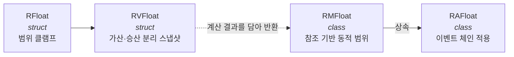

# 스탯 · 버프 시스템

> Unity 2023.2 · C# · 개인 프로젝트 *BuilderRPG* 중 유닛 능력치 파트

## 1. 개요

RPG에서 "이동속도"라는 값 하나에 붙는 요구사항을 나열해 보면 이렇습니다.

- 기본값이 있고, 상한과 하한이 있다
- 장비가 `+2`를 더하고, 버프가 `×1.3`을 곱한다
- 버프가 끝나면 **정확히 원래대로** 돌아와야 한다
- 버프 두 개가 겹쳤을 때 적용 순서가 결과를 바꾸면 안 된다
- 어떤 상태에서는 그냥 0이 된다 (과적, 기절)
- 최대치가 고정이 아니라 **다른 스탯에 연동**된다
- UI에 "질주 속도 30% 증가"처럼 **계산 과정을 그대로** 보여줘야 한다

`float` 필드 하나로는 이 중 어느 것도 안 됩니다.
그래서 **값의 종류를 타입 계층으로 나누고, 연산자에 도메인 규칙을 새겨 넣는** 방향으로 접근했습니다.

이 문서는 그 결과물인 `RValue` 4단 계층과, 그 위에 올린 어빌리티·이펙트 시스템을 다룹니다.
전부 직접 설계·구현한 코드입니다.

---

## 2. 값 타입 4단 계층



계층마다 "이 값이 무엇을 할 수 있어야 하는가"가 다릅니다.
필요 없는 능력은 아래 계층을 쓰게 해서 오버헤드를 줄였습니다.

| 타입 | 종류 | 능력 | 쓰이는 곳 |
|---|---|---|---|
| `RFloat` | struct | 범위 클램프 | 단순 누적값 (하중) |
| `RVFloat` | struct | 가산·승산을 분리 보관한 계산 스냅샷 | 계수, 적용기 간 전달 |
| `RMFloat` | class | 다른 값을 참조하는 동적 min/max | HP, SP, 피로 |
| `RAFloat` | class | 적용기(Applier) 이벤트 체인 | 버프가 붙는 모든 스탯 |

---

### 2.1 `RFloat` — 범위를 가진 float

가장 단순한 계층입니다. 대입할 때마다 클램프합니다.

```csharp
public struct RFloat {
  private float _value;
  public float Value {
    readonly get => _value;
    set => _value = Mathf.Clamp(value, Min, Max);
  }
  public float Min { get; set; }
  public float Max { get; set; }

  public const float SOFT_CAP = 999_999_999;

  public static implicit operator float(RFloat r) => r.Value;
}
```

`float`로의 암시적 변환을 열어둬서 기존 산술 코드에 그대로 섞여 들어갑니다.
`SOFT_CAP`은 `float.MaxValue` 대신 쓰는 기본 상한입니다 —
무한대가 섞이면 `0 × ∞ = NaN`으로 계산이 오염되므로 유한한 큰 값으로 막았습니다.

---

### 2.2 `RVFloat` — 가산과 승산의 분리 ★ 핵심

여기가 이 시스템의 중심입니다.

**문제.** 버프가 여러 개 붙을 때 `value = value * 1.3f`처럼 값을 직접 갱신하면
해제할 때 `value / 1.3f`로 되돌려야 하는데, 이 방식은 두 가지로 깨집니다.

1. 부동소수점 왕복 오차가 누적된다
2. 다른 버프가 중간에 붙고 빠지면 **순서에 따라 결과가 달라진다**

**접근.** 값을 갱신하지 않습니다. **가산량과 승산량을 따로 쌓아두고**,
읽는 시점에 조립합니다.

```csharp
public struct RVFloat {
  public RFloat baseValue;
  public float Adder { get; private set; }
  public float Multiplier { get; private set; }
  public bool Nullify { get; set; }

  public readonly float Value => Nullify ? 0 : (baseValue.Value + Adder) * Multiplier;
}
```

그리고 **연산자를 재정의해 도메인 규칙을 새깁니다.**

```csharp
/// <summary>
/// 승산값을 변경합니다. 결과 자체를 곱하지 않습니다.
/// (ex: RV(100) * 1.5 == 150 은 보장되지 않습니다)
/// </summary>
public static RVFloat operator *(RVFloat r, float f) {
  r.Multiplier += (f - 1);
  return r;
}
public static RVFloat operator /(RVFloat r, float f) {
  r.Multiplier -= (f - 1);
  return r;
}
```

`× 1.3`은 곱셈이 아니라 **승수에 0.3을 더하는** 연산입니다.
이 한 줄이 앞의 문제 두 개를 동시에 해결합니다.

**첫째, 정확한 역연산.** `*`가 `+(f-1)`이고 `/`가 `-(f-1)`이므로
둘은 정확한 역연산입니다. 곱셈/나눗셈 왕복보다 오차가 훨씬 작습니다.

**둘째, 순서 무관.** 승수 누적이 덧셈이므로 교환법칙이 성립합니다.
버프 A와 B가 어떤 순서로 붙고 빠져도 최종 승수가 같습니다.
게임 기획 용어로 **"합연산 스태킹"**을 타입 수준에서 강제한 셈입니다.

**셋째, 0으로 나눠도 안전.** 실제 나눗셈이 아니라서 예외가 없습니다.
실제로 이 성질에 의존하는 코드가 있습니다.

```csharp
// 「무쇠걸음」 3레벨은 WalkSpdMod가 0이다
OnApply  = unit => unit.info.WalkSpeedM_Heavy *= WalkSpdMod;   // Multiplier += -1  → 0
OnRemove = unit => unit.info.WalkSpeedM_Heavy /= WalkSpdMod;   // Multiplier -= -1  → 1
```

`× 0`으로 중량 보행 페널티를 완전히 지우고, `÷ 0`으로 정확히 되돌립니다.
일반적인 곱셈 모델이었다면 여기서 0으로 나누기가 터집니다.

---

### 2.3 `RMFloat` — 다른 스탯을 참조하는 동적 범위

**문제.** "현재 HP의 상한은 최대 HP"인데, 최대 HP 자체가 버프로 변합니다.
게다가 일부 스킬은 **HP 상한을 일시적으로 깎습니다**(제한량, `HPRCR`).
즉 상한이 `최대HP − 제한량`이라는 **다른 두 값의 함수**입니다.

**접근.** min/max를 상수가 아니라 **참조 + 변환 함수**로 받습니다.

```csharp
public interface IRefFloat { float Value { get; } }

public class RMFloat : IRefFloat {
  public IRefFloat refMin, refMax;
  public delegate float Modifier(float f);
  public Modifier MinModifier, MaxModifier;

  public float Min => MinModifier(refMin?.Value ?? min);
  public float Max => MaxModifier(refMax?.Value ?? max);

  public virtual float Value => Nullify ? 0 : Mathf.Clamp((value + add) * mul, Min, Max);
}
```

`Min`/`Max`가 프로퍼티라 **읽을 때마다 재계산**됩니다.
참조 대상이 바뀌면 범위가 자동으로 따라옵니다.

실제 조립부를 보면 의도가 분명해집니다.

```csharp
public UnitStat(float hpMax, ...) {
  HPMax = new(hpMax, 1);

  // 제한량: 상한은 "최대HP - 1" (전부 깎아 0이 되는 것을 방지)
  RMFloat hpRcr = new(0, 0, refMax: HPMax, maxMod: v => v - 1);
  HPRCR = hpRcr;

  // 현재 HP: 상한은 "최대HP - 제한량"
  HP = new(hpMax, 0, refMax: HPMax, maxMod: v => v - hpRcr.Value);
}
```

`maxMod` 클로저가 `hpRcr`를 캡처합니다.
`HPRCR`이 오르면 `HP`의 상한이 즉시 따라 내려가고, 초과분은 클램프로 잘립니다.
**세 스탯의 의존 관계가 생성자 세 줄에 선언적으로 표현**됩니다.

---

### 2.4 `RAFloat` — 적용기 체인

**문제.** 버프는 "값을 바꾸는 것"이 아니라 **"계산에 개입하는 것"**입니다.
상황(현재 하중, 이동 상태)에 따라 매 프레임 다르게 개입해야 합니다.

**접근.** 값에 **이벤트 체인**을 답니다.
등록된 적용기들이 `RVFloat` 스냅샷을 차례로 받아 가공하고,
최종 결과가 값이 됩니다.

```csharp
public sealed class RAFloat : RMFloat {
  public delegate RVFloat Applier(RVFloat previous);
  public event Applier Apply;

  public override float Value => RVValue.Value;

  public override RVFloat RVValue
    => Apply?.GetInvocationList()
             .Aggregate(base.RVValue, (v, a) => (a as Applier).Invoke(v))
      ?? base.RVValue;
}
```

`Aggregate`로 델리게이트 목록을 **접어서(fold)** 값을 만듭니다.
`GetInvocationList()`를 직접 도는 이유는, 멀티캐스트 델리게이트를 그냥 호출하면
마지막 반환값만 남고 중간 결과가 버려지기 때문입니다.

이제 버프의 적용과 해제가 **델리게이트 등록/해제**로 환원됩니다.

```csharp
OnApply  = u => u.stat.RunSPCost.Apply += ApplySP;
OnRemove = u => u.stat.RunSPCost.Apply -= ApplySP;

RVFloat ApplySP(RVFloat f) => f *= SP;   // SP는 스택에 따라 매번 달라진다
```

기본 동작도 같은 메커니즘으로 등록합니다. 특별 취급이 없습니다.

```csharp
protected virtual void Start() {
  stat.HPRegen.Apply  += Default_HPRegen;
  stat.SPRegen.Apply  += Default_SPRegen;
  stat.SPCost.Apply   += Default_SPCost;
  stat.RunSpeed.Apply += Default_RunSpeed;
  stat.WalkSpeed.Apply+= Default_WalkSpeed;
}
```

**2단 합성.** 적용기가 다른 스탯을 읽을 수 있어서 스탯끼리 파생됩니다.
「러너스 하이」는 `RunSPCost`(질주 단가)에 붙고,
`SPCost`(초당 실소모)의 기본 적용기가 그 값을 읽어 갑니다.

```csharp
public virtual RVFloat Default_SPCost(RVFloat spCost) {
  float wC = stat.WalkSPCost.Value,
        rC = stat.RunSPCost.Value;    // ← 어빌리티가 이미 가공한 값
  // 이 단가를 하중·이동 상태에 따라 실제 초당 소모량으로 번역한다 (4.4절)
  ...
}
```

어빌리티는 "질주 단가"라는 개념적으로 옳은 지점에만 개입하고,
그것이 실제 소모량으로 번역되는 규칙은 기본 적용기가 소유합니다.
관심사가 분리됩니다.

---

## 3. 스탯의 3분할

값을 세 구조체로 나눴습니다. 나누는 기준은 **누가 쓰느냐**입니다.

| 구조체 | 성격 | 예시 |
|---|---|---|
| `UnitStat` | 변동하는 능력치 | `HP`, `SP`, `RunSpeed`, `Fatigue` |
| `UnitInfo` | 종족/직업 특성 계수 | `LoadLimit_*`, `SPRegenM_Light`, `Fatigue_Run` |
| `UnitStatus` | 매 프레임 파생되는 관측값 | `movement`, `load`, `speed`, `fatiguePerMinute` |

`UnitInfo`의 계수들은 단위와 의미를 주석이 아니라 **생성자 인자**로 못박았습니다.

```csharp
public UnitInfo(bool player = false) {
  HPRegen_Default = new(1, 0);         // 1/s
  SPRegen_Default = new(5, 0);         // 5/s
  Fatigue_Run  = new(3, 0);
  Fatigue_Sit  = new(-1, max: 0);      // 앉으면 피로가 줄어든다 (음수)

  LoadLimit_Lightweight = new(.75f, .01f, .75f);  //   0% ~  75%
  LoadLimit_Standard    = new(1,    .75f, 1.5f);  //  75% ~ 150%
  LoadLimit_Heavyweight = new(1.5f, 1.5f, 10);    // 150% ~ 1000%

  SPRegenM_Light  = new(.15f,  0, 1);   // +15%
  SPRegenM_Heavy  = new(-.2f, -1, 0);   // -20%
  RunSpeedM_Light = new(.1f,   0, 1);   // +10%
  WalkSpeedM_Heavy= new(-.75f,-1, 0);   // -75%
}
```

각 계수 자체가 범위를 가진 `RVFloat`이라,
장비나 스킬이 계수를 건드려도 설계 의도를 벗어난 값이 될 수 없습니다.
예를 들어 `SPRegenM_Heavy`는 `[-1, 0]`이라 **아무리 강화해도 회복을 마이너스로 만들 수 없습니다.**

세 구조체 모두 `ToString()`을 구현해서 디버그 키 하나로 전체 상태를 덤프합니다.

```
Stat :
HP Max: 100 = 100 [1~999999999]
HP Restriction: 0 = 0 [0~99]
HP : 100 = 100 [0~100]
...
```

`RVFloat.ToString()`은 계산 과정까지 펼쳐 보여줍니다.

```csharp
public readonly override string ToString() => DETAIL
  ? $"{Value:F0}{(Nullify ? "(Nullified)" : "")} = ({baseValue:F0}+{Adder:F0}) x {Multiplier:F2}"
  : $"{Value:F0}...";
// 출력 예: "150 = (100+20) x 1.25"
```

버프가 꼬였을 때 **어느 항이 잘못됐는지 바로 보입니다.**
스탯 시스템에서 디버깅 비용이 가장 큰 지점이라 여기에 투자할 값어치가 있었습니다.

---

## 4. 하중 · 피로 이동 모델

앞의 세 절이 "값을 어떻게 표현할 것인가"였다면, 이 절은 **그 표현이 실제로 무엇을 감당해야 했는가**입니다.
값 계층을 그렇게 설계한 이유가 여기서 드러납니다.

### 4.1 설계 의도

만들고자 한 감각은 이렇습니다.

> 짐이 무거우면 느려지고, 뛰면 숨이 차고, 오래 움직이면 지친다.
> 그리고 그 셋이 **서로 물려 있다.**

세 번째가 핵심입니다. 하중이 이동 속도만 깎는 게 아니라
**SP 소모량과 회복량, 이동 가능 여부까지 동시에 건드립니다.**
그래서 하나를 바꾸면 나머지가 연쇄로 따라와야 하고,
바로 이 연쇄가 값 계층에 참조 기반 범위와 적용기 체인을 넣은 이유입니다.

하중은 최대 하중 대비 비율로 4구간을 나눕니다.

| 구간 | 범위 | 질주 | 보행 | SP 회복 | 비고 |
|---|---|---|---|---|---|
| `Lightweight` | ~75% | 가능 (최대 +10%) | 정상 | 최대 +15% | 가벼울수록 유리 |
| `Standard` | 75~150% | 가능 | 정상 | 기준 | 보정 없음 |
| `Heavyweight` | 150~1000% | **불가** | 최대 −75% | −20% | 보행에도 SP 소모 |
| `Overburdened` | 1000%~ | 불가 | **불가** | −20% | 사실상 이동 불능 |

구간 경계값 자체도 `RVFloat`이라 스킬이나 장비가 조정할 수 있고,
그 조정 범위마저 선언 시점에 못박혀 있습니다.

```csharp
LoadLimit_Lightweight = new(.75f, .01f, .75f);  // 기본 75%, 조정 가능 범위 1~75%
LoadLimit_Standard    = new(1,    .75f, 1.5f);
LoadLimit_Heavyweight = new(1.5f, 1.5f, 10);
```

즉 "경량 구간을 넓히는 장비"를 만들어도
표준 구간을 침범하거나 음수가 되는 값은 타입 수준에서 나올 수 없습니다.

### 4.2 의도 ∧ 가능

이동 상태를 `[Flags]` 비트로 정의하고, **구간을 겹쳐서** 표현합니다.

```csharp
[Flags] public enum MovementStatus {
  Sit  = 1 << 0,
  Idle = 1 << 1,
  Walk = 1 << 2,
  Run  = 1 << 3,

  Immovable = Sit | Idle,
  Walkable  = Sit | Idle | Walk,
  Runnable  = Walkable | Run,
  Move      = Walk | Run
}
```

그러면 "플레이어가 원하는 것"과 "지금 가능한 것"의 **교집합 중 가장 빠른 것**이
곧 현재 상태가 됩니다.

```csharp
var movement = agent.WannaMoving()
  ? (RunIntent ? MovementStatus.Runnable : MovementStatus.Walkable)
  : MovementStatus.Immovable;

status.movement = (movement & (status.movable = MovementDecision(this))).MaxBit();
```

`MaxBit()`는 켜진 비트 중 최상위만 남기는 확장 메서드입니다.

```csharp
public static T MaxBit<T>(this T flag) where T : Enum {
  int value = Convert.ToInt32(flag);
  if (value == 0) return flag;
  int maxBit = 0;
  while ((value >>= 1) > 0) maxBit++;
  return (T)Enum.ToObject(typeof(T), 1 << maxBit);
}
```

의도 `Runnable`(뛰고 싶다) ∧ 가능 `Walkable`(걷기까지만 된다) = `Walkable` → 최상위 비트 `Walk`.
**조건 분기 없이 상태 결정이 끝납니다.**
이동 제약을 추가하려면 `MovementDecision`이 더 좁은 마스크를 반환하기만 하면 됩니다.

### 4.3 구간과 구간 내 상대 위치

구간만으로 나누면 경계에서 값이 계단처럼 튑니다.
그래서 **구간 안에서의 상대 위치**를 따로 계산합니다.

```csharp
public float Default_LoadRatioRelative(LoadRatio lv) {
  if      (lv.ratio <= lv.light)    return  lv.ratio / lv.light;
  else if (lv.ratio <= lv.standard) return (lv.ratio - lv.light)    / (lv.standard - lv.light);
  else if (lv.ratio <= lv.heavy)    return (lv.ratio - lv.standard) / (lv.heavy - lv.standard);
  else                              return 1;
}
```

덕분에 효과를 **연속적으로 보간**할 수 있습니다.
경량 구간에서 짐이 가벼울수록 질주 속도 보너스가 커지고, 구간 경계에서 값이 튀지 않습니다.

```csharp
case LoadStatus.Lightweight:
  runSpeed *= 1 + info.RunSpeedM_Light.Value * (1 - LoadRatioRelative);
  break;
case LoadStatus.Standard: break;      // 기준 구간 — 보정 없음
default:
  runSpeed.Nullify = true;            // 중량 이상 — 질주 불가
  break;
```

### 4.4 SP 경제 — 회복과 소모의 비대칭

SP는 "숨"에 해당합니다. 회복과 소모 규칙을 **비대칭으로** 설계해
플레이어가 속도와 지속력 사이에서 계속 선택하게 만듭니다.

**회복** — 뛰는 동안은 아예 회복되지 않고, 걷기는 짐이 가벼울 때만 회복됩니다.

```csharp
public virtual RVFloat Default_SPRegen(RVFloat spRegen) {
  spRegen += info.SPRegen_Default.Value * status.movement switch {
    MovementStatus.Run  => 0,                                        // 질주 중 회복 없음
    MovementStatus.Walk => status.load <= LoadStatus.Standard ? 1 : 0, // 표준 이하만 회복
    _ => 1                                                            // 정지/착석은 항상
  };
  spRegen *= status.load switch {
    LoadStatus.Lightweight => 1 + info.SPRegenM_Light.Value * (1 - LoadRatioRelative),
    LoadStatus.Standard    => 1,
    _                      => 1 + info.SPRegenM_Heavy.Value           // 중량 이상 −20%
  };
  return spRegen;
}
```

경량 구간의 회복 보너스가 `(1 - LoadRatioRelative)`에 비례하는 것이 요점입니다.
같은 경량 구간이라도 **짐이 없을수록 최대 +15%**까지 유리해집니다.
구간 안에서도 계속 최적화할 여지가 남습니다.

**소모** — 질주는 어디서나 비싸지만, 경량 구간에서는 할인이 붙습니다.
반대로 중량 구간에서는 **걷는 것만으로도 SP가 듭니다.**

```csharp
spCost += status.load switch {
  LoadStatus.Lightweight => status.movement switch {
    MovementStatus.Run  => rC * (.95f - rCL * (1 - LoadRatioRelative)),  // 최대 20% 할인
    _ => 0
  },
  LoadStatus.Standard => status.movement switch {
    MovementStatus.Run  => rC,                                          // 기준가
    _ => 0
  },
  _ => status.movement switch {
    MovementStatus.Run  => rC,
    MovementStatus.Walk => wC * (.1f + wCH * LoadRatioRelative),        // 걸어도 소모
    _ => 0
  }
};
```

중량 구간의 보행 단가가 `.1f + .9f * LoadRatioRelative`라
구간 진입 직후에는 기준가의 10%지만, 구간 끝에서는 100%가 됩니다.
"조금 무거운 것"과 "간신히 드는 것"이 전혀 다른 경험이 됩니다.

### 4.5 히스테리시스

SP가 바닥날 때 뛰기/걷기가 매 프레임 번갈아 바뀌는 **채터링**을 막아야 합니다.
임계값을 하나만 두면 반드시 발생합니다.

진입과 이탈에 **서로 다른 임계값**을 씁니다.

```csharp
protected bool regenTrigger = false;

public virtual MovementStatus Default_MovementDecision(FieldUnit u) {
  u.regenTrigger = (u.regenTrigger && u.stat.SPRatio < .25f)    // 켜져 있으면 25%까지 유지
                || (!u.regenTrigger && u.stat.SPRatio <= .01f); // 꺼져 있으면 1%에서 발동

  return u.status.load switch {
    LoadStatus.Lightweight => u.regenTrigger ? MovementStatus.Walkable : MovementStatus.Runnable,
    LoadStatus.Standard    => u.regenTrigger ? MovementStatus.Walkable : MovementStatus.Runnable,
    LoadStatus.Heavyweight => u.regenTrigger ? MovementStatus.Idle     : MovementStatus.Walkable,
    _ => MovementStatus.Idle
  };
}
```

1%에서 지쳐 걷기 시작하고, 25%까지 회복해야 다시 뛸 수 있습니다.
"숨이 차서 잠깐 쉬는" 체감이 자연스럽게 나옵니다.

### 4.6 피로 경제

SP가 분 단위의 "숨"이라면, 피로는 시간 단위의 **누적 소모**입니다.
회복 수단이 오직 착석뿐이고, 쌓이는 속도보다 훨씬 느립니다.

```csharp
Fatigue_Run  = new(3, 0);        // 분당 +3
Fatigue_Walk = new(1, 0);        // 분당 +1
Fatigue_Idle = new(0);           // 서 있으면 유지
Fatigue_Sit  = new(-1, max: 0);  // 앉으면 분당 −1
```

`FatigueMax`가 300이므로 계속 뛰면 100분, 계속 걸으면 300분에 한계에 닿고,
앉아서 완전히 회복하려면 300분이 걸립니다.
**뛰어서 쌓은 피로를 앉아서 푸는 데 3배의 시간이 듭니다.**

`Fatigue_Sit`의 상한을 0으로 잡은 것이 작지만 중요한 장치입니다.
어떤 버프가 붙어도 착석이 피로를 **늘리는** 방향으로는 뒤집히지 않습니다.
반대로 `Fatigue_Run`의 하한이 0이라 질주가 피로를 회복시키는 일도 없습니다.
기획 의도의 부호를 타입이 지킵니다.

네 계수 모두 `RAFloat`이라 어빌리티가 적용기를 걸 수 있습니다.
「러너스 하이」가 정확히 이 지점을 노립니다 — 질주 피로를 크게 늘리는 대신,
계속 달릴수록 그 증가폭이 줄어듭니다(5.5절).

### 4.7 틱

매 프레임 관측값을 갱신하고 누적 연산을 돌립니다.

```csharp
protected void Tick() {
  //* 이동 상태 갱신
  agent.speed = status.movement switch {
    MovementStatus.Run  => stat.RunSpeed.Value,
    MovementStatus.Walk => stat.WalkSpeed.Value,
    _ => 0
  };

  //* 회복/감소 연산
  stat.HP += (stat.HPRegen.Value - stat.HPCost.Value) * Time.deltaTime;
  stat.SP += (stat.SPRegen.Value - stat.SPCost.Value) * Time.deltaTime;

  //* 피로 연산 (분당 수치를 초당으로)
  stat.Fatigue += status.fatiguePerMinute * Time.deltaTime / 60;

  //* 효과 적용
  foreach (var e in effects.Values.ToList())
    e.OnTick(this);
}
```

`stat.HP += ...`가 곧바로 상한/하한 클램프를 타므로 별도 방어 코드가 없습니다.
`effects.Values.ToList()`로 복사해 순회하는 것은,
효과가 틱 도중 자기 자신이나 다른 효과를 제거할 수 있기 때문입니다.

---

## 5. 어빌리티와 이펙트

### 5.1 정의와 인스턴스의 분리


`Ability`는 무엇인지를, `UnitEffect`는 유닛에 붙어 무엇을 하는지를 담습니다.
`UnitEffect`는 세 개의 훅만 가진 얇은 구조입니다.

```csharp
public class UnitEffect {
  public IDSet ID;
  public int Stack = -1, MaxStack = -1;

  public EffectAction OnApply  = _ => { };
  public EffectAction OnTick   = _ => { };
  public EffectAction OnRemove = _ => { };

  public string Name;
  public bool Visible = true;
  public Sprite Icon;
  public EffectText DurationText;
  public EffectText[] Description = new EffectText[0];
}
```

유닛 쪽은 딕셔너리 하나로 관리합니다.

```csharp
readonly Dictionary<UnitEffect.IDSet, UnitEffect> effects = new();

public void ApplyEffect(UnitEffect effect) {
  if (effects.TryGetValue(effect.ID, out var e)) {
    //todo 효과 중첩 or 갱신 or 덮어쓰기
  } else {
    effects.Add(effect.ID, effect);
    effect.OnApply(this);
  }
}
```

### 5.2 원복 가능한 버프

`OnApply`와 `OnRemove`를 **대칭으로** 쓰는 것이 규약입니다.
2.2절의 연산자 설계 덕분에 이 대칭이 실제로 정확히 성립합니다.

```csharp
public class LightBreeze : Ability {           // 「산들바람」
  Effect = new(this) {
    OnApply = u => {
      u.stat.RunSpeed  *= 1 + RunSpeedMod;
      u.stat.RunSPCost *= 1 - SPReduction;
      u.stat.LoadMax   *= 1 - Overload;
      u.LoadStatusDecision        = LoadStatusDecision;
      u.LoadRatioRelativeDecision = LoadRatioRelativeDecision;
    },
    OnRemove = u => {
      u.stat.RunSpeed  /= 1 + RunSpeedMod;
      u.stat.RunSPCost /= 1 - SPReduction;
      u.stat.LoadMax   /= 1 - Overload;
      u.LoadStatusDecision        = u.Default_LoadStatusDecision;
      u.LoadRatioRelativeDecision = u.Default_LoadRatioRelative;
    },
  };
}
```

### 5.3 전략 함수 교체

위 코드의 뒤쪽 두 줄이 이 시스템에서 가장 강력한 부분입니다.

판정 로직 자체를 `Func`으로 노출해 두고, 어빌리티가 **통째로 갈아끼웁니다.**

```csharp
public Func<FieldUnit, MovementStatus> MovementDecision { get; set; }
public Func<LoadRatio, LoadStatus>     LoadStatusDecision;
public Func<LoadRatio, float>          LoadRatioRelativeDecision;
```

「산들바람」은 하중 구간 판정을 **4단계에서 2단계로 재정의**합니다.

```csharp
LoadStatus LoadStatusDecision(FieldUnit.LoadRatio lr)
  => lr.ratio <= lr.heavy ? LoadStatus.Lightweight : LoadStatus.Overburdened;

float LoadRatioRelativeDecision(FieldUnit.LoadRatio lr)
  => Mathf.Min(lr.ratio / lr.heavy, 1);
```

최대 하중은 크게 깎이지만(`-80~90%`), 그 안에서는 **항상 경량 취급**을 받습니다.
"가볍게 다니는 대신 짐을 못 든다"는 컨셉이 수치 보정이 아니라
**규칙 교체**로 표현됩니다. 수치만 만지는 버프로는 나올 수 없는 종류의 효과입니다.

### 5.4 파생 이펙트

`IDSet`은 `(Main, Variant)` 두 정수로 된 복합 키입니다.

```csharp
public struct IDSet {
  public int Main, Variant;
  public IDSet(int main, int variant = -1) => (Main, Variant) = (main, variant);
  public readonly override int GetHashCode() => Main.GetHashCode() ^ Variant.GetHashCode();
}
```

덕분에 **하나의 어빌리티가 여러 이펙트를 낳을 수 있습니다.**

「무쇠걸음」은 SP가 없을 때 HP를 태워 걷게 하는데,
해제 시점에 **소모한 HP를 되돌리는 별도 이펙트**를 부착합니다.

```csharp
Effect = new(this) {
  ID = new(ID, 0),                       // 본체
  OnApply = unit => {
    unit.MovementDecision = MovementDecision;
    unit.stat.SPRegen.Nullify = true;    // SP 자연회복 정지
    unit.info.WalkSpeedM_Heavy *= WalkSpdMod;
  },
  OnTick = HPRestriction,
  OnRemove = unit => {
    unit.MovementDecision = unit.Default_MovementDecision;
    unit.stat.SPRegen.Nullify = false;
    unit.info.WalkSpeedM_Heavy /= WalkSpdMod;
    unit.ApplyEffect(HPRestoration);     // ← 해제하면서 파생 이펙트를 남긴다
  }
};

UnitEffect HPRestoration => new(this) {
  ID = new(ID, 1),                       // 같은 어빌리티, 다른 변종
  Visible = false,                       // UI에 노출하지 않음
  OnTick = unit => {
    var amt = unit.stat.HPRegen.Value * Time.deltaTime;
    if (rcr <= amt) {
      unit.stat.HPRCR -= rcr; rcr = 0;
      unit.RemoveEffect(HPRestoration);  // 다 갚으면 스스로 제거
    } else {
      rcr -= amt;
      unit.stat.HPRCR -= amt;
    }
  },
};
```

HP를 직접 깎는 것이 아니라 **`HPRCR`(상한 제한량)을 올립니다.**
2.3절의 참조 기반 범위 덕분에 최대 HP가 내려가고, 현재 HP가 자동으로 따라 잘립니다.
회복 이펙트는 제한량을 서서히 되돌리고, 다 갚으면 자기 자신을 제거합니다.

### 5.5 스택

「러너스 하이」는 계속 달릴수록 강해집니다.

```csharp
void FatigueStack(FieldUnit unit) {
  elapsed += Time.deltaTime;
  if (unit.status.Running) {
    if (trigger) {                                    // 계속 달리는 중
      if (elapsed >= 1) {
        Effect.Stack = Mathf.Clamp(Effect.Stack + 1, 0, MaxStack);
        elapsed = 0;
      }
    } else { trigger = true; elapsed = 0; }           // 방금 달리기 시작
  } else {
    if (trigger) { trigger = false; elapsed = 0; }    // 방금 멈춤
    else if (elapsed >= 1) {                          // 멈춰 있는 중
      Effect.Stack = Mathf.Clamp(Effect.Stack - (int)(MaxStack * 0.2f), 0, MaxStack);
      elapsed = 0;
    }
  }
}

float Fatigue => 1 + FatigueMod - Effect.Stack * FatigueStackMod;
float SP      => 1 - SPMod * Effect.Stack;
```

쌓기는 초당 1, 잃기는 초당 최대치의 20%로 **비대칭**입니다.
쌓는 데 50초가 걸리고 잃는 데 5초가 걸리므로,
"질주를 유지하는 것" 자체가 플레이 목표가 됩니다.

---

## 6. 동적 설명문 UI

**문제.** "질주 SP 소모 40% 감소"라고 적어두면 스택·레벨·하중에 따라
실제 수치가 달라질 때 설명이 거짓말이 됩니다.

**접근.** 설명을 문자열이 아니라 **함수 배열**로 둡니다.

```csharp
public delegate string EffectText(FieldUnit unit);
public EffectText[] Description = new EffectText[0];
```

작성부는 이렇게 생겼습니다.

```csharp
Description = new EffectText[] {
  _ => "질주 속도 "     + $"{RunSpeedMod:P0} 증가".Color(Color.green),
  _ => "질주 SP 소모 "  + $"{SPReduction:P0} 감소".Color(Color.green),
  u => "최대 하중 "     + $"{Overload:P0} 감소".Color(Color.red)
     + $"\n하중 상태가 {"경량".Color(Color.white, Light(u))}"
     + $"/{"과적".Color(Color.white, Over(u))}으로 제한됨".Ignore(),
  _ => "하체의 균형으로 가벼운 보폭을 유지합니다.".Flavor()
};
```

세 번째 줄이 요점입니다. `Light(u)` / `Over(u)`가 **현재 하중 상태**를 보고
해당 단어만 흰색으로 강조합니다. 지금 어느 구간에 있는지가 툴팁에서 바로 보입니다.

TMP 리치텍스트는 조건부 색상 조합이 금방 지저분해져서 확장 메서드로 정리했습니다.

```csharp
public static string Color(this string str, Color color, bool condition)
  => condition ? str.Color(color) : str;

public static string Highlight(this string str)
  => $"<color={MainSetting.TextColor_Interested}><b><u>{str}</u></b></color>";
public static string Ignore(this string str)
  => $"<color={MainSetting.TextColor_Ignored}>{str}</color>";
public static string Flavor(this string str)
  => $"\"{str}\"".Ignore().Italic();
```

색상 상수를 `MainSetting`에 모아둬서 톤을 한 곳에서 바꿉니다.

UI 쪽은 효과 목록과 UI 목록을 **양방향으로 diff**해 동기화합니다.

```csharp
//* 효과 O / UI X : 생성 (단, Visible한 것만)
foreach (var eff in effects)
  if (!UIList.Any(ui => ui.EffectID == eff.ID) && eff.Visible) { ... }

//* 효과 X / UI O : 제거
var idList = UIList.ToDictionary(ui => ui.EffectID);
foreach (var id in idList)
  if (!effects.Any(e => e.ID == id.Key)) { Destroy(...); UIList.Remove(id.Value); }
```

`Visible = false`인 파생 이펙트(HP 회복)는 로직으로만 돌고 UI에 뜨지 않습니다.

---

## 7. 설계 판단 기록

**왜 struct와 class를 섞었나.** `RFloat`/`RVFloat`은 계산 중간값이라
프레임마다 대량 생성됩니다. struct로 두어 힙 할당을 피했습니다.
반면 `RMFloat`/`RAFloat`은 **참조로 공유되어야** 의미가 있습니다 —
`HP`의 상한이 `HPRCR`을 참조하려면 같은 객체를 가리켜야 하기 때문입니다.

**왜 연산자를 오버로드했나.** `stat.RunSpeed.AddMultiplier(0.3f)`로도 같은 일을 합니다.
하지만 `stat.RunSpeed *= 1.3f`는 **기획 문서의 표기와 그대로 일치**합니다.
"질주 속도 30% 증가"가 코드에서도 한눈에 읽힙니다.
반대급부로 `*`가 곱셈이 아니라는 함정이 생기므로 XML 주석에 명시했습니다.

**왜 이벤트 체인인가.** 버프 목록을 순회해 값을 계산하는 방식도 가능하지만,
그러면 스탯이 버프를 알아야 합니다. 적용기 체인은 의존 방향을 뒤집어
**스탯은 자기에게 뭐가 붙었는지 모르는 채로** 동작합니다.

**왜 판정을 `Func`으로 뺐나.** 이동 가능 판정을 `virtual` 메서드로 두면
어빌리티가 아니라 **유닛 클래스**를 상속해야 바꿀 수 있습니다.
델리게이트라면 런타임에 붙였다 뗄 수 있고, 원본을 필드에 남겨둘 수 있습니다.

---

## 8. 한계와 알려진 문제

**`RAFloat`이 최종 클램프를 하지 않습니다.**
`RMFloat.Value`는 `Mathf.Clamp((value + add) * mul, Min, Max)`로 결과를 가두지만,
`RAFloat.Value`는 `RVValue.Value`를 그대로 돌려주고
`RVFloat.Value`에는 최종 클램프가 없습니다.

```csharp
// RMFloat  : 클램프 O
public virtual float Value => Nullify ? 0 : Mathf.Clamp((value + add) * mul, Min, Max);
// RVFloat  : 클램프 X (baseValue 생성 시점에만 클램프)
public readonly float Value => Nullify ? 0 : (baseValue.Value + Adder) * Multiplier;
```

즉 `RunSpeed = new(runSpeed, 0, 20)`의 상한 20이 최종값에 적용되지 않습니다.
버프가 충분히 쌓이면 선언한 범위를 넘어섭니다.
같은 표현식이 타입에 따라 다르게 동작하는 것이라 고쳐야 하지만,
현재 밸런스가 이 동작을 전제로 맞춰져 있어 함께 조정이 필요합니다.

**`UnitStat`/`UnitInfo`가 가변 struct입니다.**
값 타입 멤버(`RFloat Load`)와 참조 타입 멤버(`RAFloat HP`)가 섞여 있어
**복사 시맨틱이 일관되지 않습니다.** 구조체를 복사하면
참조 멤버는 공유되고 값 멤버는 스냅샷이 됩니다.

```csharp
var s = P.stat;      // FieldUI — 읽기 전용이라 현재는 무해
s.Load += 10;        // 이렇게 쓰면 원본에 반영되지 않는다
```

지금은 복사 후 읽기만 해서 문제가 드러나지 않지만, 함정이 살아 있습니다.
클래스로 바꾸거나 복사를 막는 편이 안전합니다.

**적용기 순서에 우선순위가 없습니다.**
`Aggregate`가 도는 순서는 델리게이트 **등록 순서**입니다.
기본 적용기가 `Start()`에서 먼저 등록되고 어빌리티가 나중에 붙는 현재 구성에서는
의도대로 동작하지만, 이는 문서화되지 않은 암묵적 계약입니다.
가산 적용기와 승산 적용기가 섞이면 순서가 결과를 바꿉니다.

**효과 중첩이 미구현입니다.**
같은 `IDSet`의 효과를 다시 적용하면 아무 일도 일어나지 않습니다.
`ApplyEffect`와 `RemoveEffect(stack >= 0)` 양쪽에 `TODO`가 남아 있습니다.

**`Ability` 인스턴스가 가변 상태를 들고 있습니다.**
`RunnersHigh`의 `trigger`/`elapsed`, `IronStep`의 `rcr`은 어빌리티 필드입니다.
현재는 `Player.Start()`에서 유닛마다 새로 생성해 문제가 없지만,
`Abilities` 싱글턴이 `Dictionary<Abil, Ability>`로 **어빌리티를 공유하려는 설계**라
이대로 레지스트리를 구현하면 여러 유닛이 상태를 덮어씁니다.
상태를 `UnitEffect` 쪽으로 옮겨야 합니다.

**스택 초기값이 계산식에 샙니다.**
`UnitEffect.Stack`의 기본값 `-1`은 "스택 없음"을 뜻하는 UI용 감시값인데,
`RunnersHigh`는 이를 초기화하지 않고 활성화합니다.
첫 틱까지 약 1초 동안 `Stack = -1`이 그대로 계수 계산에 들어갑니다.
`Reset()`이 존재하지만 `ToggleOff`에서만 호출됩니다.

**`Ability.ID`가 직렬화에 부적합합니다.**
`(FieldID, AbilID).GetHashCode()`는 실행 간 안정성이 보장되지 않습니다.
세이브 데이터에 쓰려면 명시적 ID로 바꿔야 합니다.

**데이터가 전부 코드에 하드코딩되어 있습니다.**
`Abilities.Initialize()`가 `//TODO 데이터 로드`로 비어 있고,
어빌리티 3종이 C# 클래스로 직접 작성돼 있습니다.
발동도 디버그 키(`F5`~`F10`)로만 가능합니다.

**테스트가 없습니다.**
"적용 후 해제하면 원래 값으로 돌아온다", "적용 순서를 바꿔도 결과가 같다" 같은
성질은 속성 기반 테스트에 정확히 맞는 대상인데 작성하지 않았습니다.
이 시스템에서 가장 아쉬운 부분입니다.

---

## 9. 코드 위치

| 영역 | 경로 |
|---|---|
| 값 타입 4단 계층 | `Assets/Game Assets/Scripts/RValue.cs` |
| 유닛 틱 · 이동 판정 | `.../Scripts/Units/FieldUnit.cs` |
| 스탯 구조체 · 기본 적용기 | `.../Scripts/Units/FieldUnitElements.cs` |
| 어빌리티 기반 클래스 | `.../Scripts/Skill/Ability.cs` |
| 이펙트 · 리치텍스트 | `.../Scripts/Skill/UnitEffect.cs` |
| 어빌리티 3종 구현 | `.../Scripts/Skill/Abilities/TravelField.cs` |
| 효과 UI | `.../Scripts/Fields/UI/FieldEffectUI.cs`, `FieldUI.cs` |
| 리치텍스트 확장 | `.../Scripts/Extensions/StringExtensions.cs` |
| 비트 연산 확장 | `.../Scripts/Extensions/EnumExtensions.cs` |
