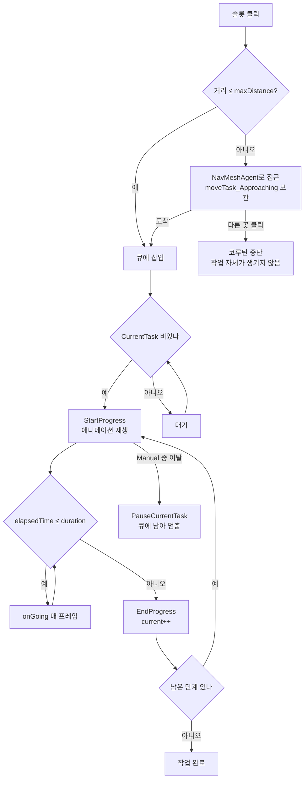

# 상호작용 · 작업 큐

> Unity 2023.2 / URP · C# · 개인 프로젝트 *BuilderRPG* 중 상호작용 파트
>
> 구현 성숙도 — 부분 동작. 클릭 → 메뉴 → 접근 → 다단계 수행 → 완료의 핵심 경로는 돌아갑니다.
> 편집 도구(커스텀 인스펙터)와 일부 필드의 소비처가 비어 있습니다. 7절에 정리했습니다.

## 1. 개요

필드의 오브젝트를 클릭하면 그 대상이 제공하는 상호작용 목록이 뜨고,
하나를 고르면 캐릭터가 스스로 다가가서 작업을 수행합니다.

설계의 축은 세 가지입니다.

| 축 | 내용 |
|---|---|
| 대상이 큐를 소유한다 | 작업 큐는 유닛이 아니라 `Prop`에 있습니다. 같은 대상에 들어온 작업은 줄을 섭니다 |
| 상호작용은 다단계다 | 하나의 상호작용이 여러 진행 단계로 쪼개지고, 각 단계가 자기 지속시간·애니메이션·콜백을 가집니다 |
| 접근이 작업의 일부다 | 거리가 모자라면 이동을 선행하고, 이동 자체가 취소 가능한 상태로 관리됩니다 |

---

## 2. 세 개의 타입

이름이 비슷해 혼동하기 쉬우므로 먼저 구분합니다.

| 타입 | 답하는 질문 | 수명 |
|---|---|---|
| `Interaction` | 이 대상으로 무엇을 할 수 있는가 | 대상이 살아 있는 동안 |
| `IAProgress` | 그것이 어떻게 진행되는가 (단계 하나) | `Interaction`에 종속 |
| `IATask` | 누가 지금 무엇을 하고 있는가 | 작업 하나가 끝날 때까지 |

`Interaction`이 정의라면 `IATask`는 그 정의를 특정 유닛에 대해 실행한 인스턴스입니다.
같은 "파괴" 상호작용이라도 유닛 둘이 각각 요청하면 `IATask`는 둘입니다.

```csharp
public class IATask
{
  public Interaction interaction;
  public float elapsedTime = 0;
  public int current = 0;        // 몇 번째 단계인가
  public Prop prop;
  public FieldUnit unit;
}
```

`current`와 `elapsedTime`이 실행 상태의 전부입니다.
정의(`Interaction`)에는 가변 상태를 두지 않았습니다 — 그래야 하나의 정의를 여러 실행이 공유할 수 있습니다.

### 2.1 단계 — `IAProgress`

한 단계는 지속시간과 네 개의 콜백을 가집니다.

```csharp
public IAProgress(
  Type type, float duration, FieldAnimatorState anim = FieldAnimatorState.None,
  Act onStart = null, Act onGoing = null, Act onCancelled = null, Act onEnd = null,
  bool cancellable = true)
```

`Type`이 단계의 성격을 정합니다.

| `Type` | 의미 | 유닛 구속 |
|---|---|---|
| `Manual` | 유닛이 붙어서 직접 하는 일 (채굴, 수리) | 있음 — 유닛이 자리를 뜨면 멈춥니다 |
| `Auto` | 걸어 두면 알아서 되는 일 (제련 대기 등) | 없음 |
| `Special` | 별도 취급이 필요한 일 (전투·건설) | 미정 — 7절 참조 |

이 구분 덕분에 "광석을 캐서(Manual) 화로에 넣고(Manual) 굽는 동안 기다린다(Auto)" 같은
복합 작업을 상호작용 하나로 표현할 수 있습니다. 단계 리스트에 셋을 넣으면 됩니다.

### 2.2 정의를 코드로 조립한다

기본 제공되는 파괴 상호작용입니다. `Prop`이 런타임에 조립합니다.

```csharp
public Interaction DefaultDestroyInteraction
{
  get
  {
    Interaction p = new() { name = "파괴", tooltip = "이 대상을 파괴합니다.", maxDistance = 4 };
    p.progress.Add(new(
      IAProgress.Type.Manual, 5,
      FieldAnimatorState.Destroy,
      onGoing: t => {
        // 단순 비율 감소. 다른 효과 무시
        float ratio = (int)(t.elapsedTime * 2 / 5) / 2f;
        if (t.prop.DurRatio > ratio)
        {
          var m = t.prop.Durability.maximum;
          t.prop.Durability = new(m * ratio, m);
        }
      },
      onEnd: _ => Destroy(gameObject)
    ));
    p.sprite = p.DestroySprite;
    return p;
  }
}
```

`onGoing`이 `t.elapsedTime`을 0.5 단위로 끊어 내구도에 반영합니다.
매 프레임 연속적으로 깎지 않은 것은 UI에서 눈금이 보이게 하려는 의도입니다.

---

## 3. 큐를 대상이 소유한다

작업 큐는 `Prop`에 있습니다.

```csharp
public readonly List<Interaction> slots = new();
public IATask CurrentTask { get; private set; }
public readonly Queue<IATask> waitingTasks = new();
```

유닛이 아니라 대상에 둔 이유는 자원 경합이 대상 단위로 일어나기 때문입니다.
나무 한 그루를 두 사람이 동시에 벨 수는 없습니다. 큐를 대상이 가지면 이 배타성이 자료구조로 보장됩니다.
유닛이 큐를 가지면 같은 대상에 대한 동시 접근을 별도로 막아야 합니다.

진행은 `Update`에서 한 프레임에 한 걸음씩 나아갑니다.

```csharp
protected void UpdateTasks()
{
  if (CurrentTask != default)
  {
    var t = CurrentTask;
    var p = t.interaction.progress;
    var prog = p[t.current];
    if (prog.type == IAProgress.Type.Manual && paused) return;
    else if ((t.elapsedTime += Time.deltaTime) <= prog.duration)
      prog.onGoing?.Invoke(t);
    else
    {
      EndProgress(t);
      if (p.Count <= t.current) { CurrentTask = default; return; }
      else StartProgress(t);
    }
  } else if (waitingTasks.TryDequeue(out var newTask)) {
    CurrentTask = newTask;
    StartProgress(newTask);
  }
}
```

읽는 순서는 이렇습니다 — 진행 중인 작업이 있으면 시간을 흘려보내고,
없으면 큐에서 하나 꺼냅니다. 한 단계가 끝나면 `EndProgress`가 `current`를 올리고,
남은 단계가 있으면 같은 프레임에 다음 단계를 시작합니다.

`paused`가 `Manual`일 때만 검사되는 것에 주의하십시오.
유닛이 자리를 떠도 `Auto` 단계는 계속 흘러갑니다. 이것이 2.1절 구분의 실제 효과입니다.

---

## 4. 접근 — 이동을 작업에 엮는다

작업 요청은 큐에 바로 들어가지 않습니다. 거리부터 봅니다.

```csharp
public void TryAddTask(FieldUnit u, Interaction i)
{
  u.moveTask_Approaching = new(i, StartCoroutine(CheckMovingNeeded(u, i)));
}
private IEnumerator CheckMovingNeeded(FieldUnit u, Interaction i) {
  var dist = Vector3.Distance(u.transform.position, Tr.position);
  if (i.maxDistance > 0 && dist > i.maxDistance)
  {
    u.agent.SetDestination(Tr.position);
    yield return new WaitWhile(() => Vector3.Distance(u.transform.position, Tr.position) > i.maxDistance);
    u.agent.ResetPath();
  }
  AddTask(u, i);
  u.moveTask_Approaching = default;
}
```

코루틴 핸들을 유닛에 보관하는 것이 핵심입니다.
유닛은 두 종류의 "취소 가능한 상태"를 튜플로 들고 있습니다.

```csharp
/// <summary>유닛이 이동하면 취소되는 코루틴을 할당합니다</summary>
public (Interaction i, Coroutine c) moveTask_Approaching;
/// <summary>유닛이 이동하면 취소되는 상호작용 작업을 할당합니다</summary>
public (Prop p, IATask t) moveTask_Interacting;
```

접근 중인가, 수행 중인가. 이 둘은 취소 방법이 다릅니다.
플레이어가 다른 지점을 클릭하면 `FieldUnit.Move`가 상태에 따라 갈라집니다.

```csharp
protected void Move(Vector3 point) {
  if (moveTask_Approaching.c is not null) {
    StopCoroutine(moveTask_Approaching.c);   // 접근 중 → 코루틴만 끊는다
    moveTask_Approaching = default;
  } else if (moveTask_Interacting != default) {
    moveTask_Interacting.p.PauseCurrentTask();  // 수행 중 → 대상에게 일시정지를 알린다
    moveTask_Interacting = default;
    animator.Play(FieldAnimatorState.Idle.ToString());
  }
  agent.SetDestination(point);
}
```

접근 단계에서 이탈하면 작업은 큐에 들어간 적조차 없습니다 — 코루틴을 끊는 것으로 끝입니다.
수행 단계에서 이탈하면 이미 큐에 있으므로 대상 쪽에 일시정지를 요청합니다.
작업이 사라지지 않고 멈춰만 있다는 점이 중요합니다. 돌아오면 이어서 할 수 있어야 하기 때문입니다.



---

## 5. UI — 매 프레임 차이만 반영한다

`FieldInteractionMenu`가 슬롯과 대기 작업을 화면에 올립니다.
갱신 전략은 매 프레임 전체 재계산 후 차이만 반영입니다.

```csharp
foreach (var i in Current.slots)
{
  if (!slots.TryGetValue(i, out var ui))
  {   // UI가 없는 슬롯은 UI 생성
    ui = Instantiate(slotUI, buttonArea).GetComponent<InteractSlotUI>();
    ui.Init(Current, i);
    slots.Add(i, ui);
  }
  ui.rect.anchoredPosition = new(0, y1);
  y1 -= _slotInterval;
}
foreach (var kp in slots.ToList())
{
  if (Current.slots.Contains(kp.Key)) continue;
  Destroy(kp.Value.gameObject);   // 슬롯이 사라진 경우 제거
  slots.Remove(kp.Key);
}
```

`Dictionary<Interaction, InteractSlotUI>`가 정의와 UI를 잇습니다.
이미 있는 슬롯은 위치만 다시 잡고, 없어진 것만 파괴합니다.

이 방식을 택한 이유는 상호작용 목록이 런타임에 바뀔 수 있기 때문입니다.
내구도가 가득 차면 수리 슬롯이 사라지는 식의 동작을 UI 쪽에서 따로 구독할 필요 없이,
`Prop.slots`만 보면 항상 최신 상태가 반영됩니다.

대가는 비용입니다. `LateUpdate`마다 `ToList()`와 `Contains()`가 돌아갑니다.
슬롯이 한 자릿수인 현재 규모에서는 측정되지 않습니다.

---

## 6. 설계 판단 기록

### 6.1 `Interaction`에서 `ScriptableObject` 상속을 뗐습니다

원래 `Interaction`은 `ScriptableObject`를 상속하고 있었는데,
정작 `DefaultDestroyInteraction` 등이 `new Interaction()`으로 생성했습니다.
Unity는 이를 금지합니다.

```
Interaction must be instantiated using ScriptableObject.CreateInstance
instead of new Interaction.
```

오류가 나고 객체가 온전하지 않은 상태로 반환됩니다.
`Prop.OnEnable`이 `useDestroy`/`useRepair` 플래그를 보고 이 프로퍼티를 호출하므로,
플래그가 켜진 프롭이 씬에 있으면 활성화될 때마다 발생했습니다.
즉 기본 파괴·수리 상호작용이 동작하지 않는 상태로 방치되어 있었습니다.

고치는 길은 둘이었습니다.

| 방향 | 판단 |
|---|---|
| `CreateInstance`로 교체 | 최소 수정. 다만 생성한 인스턴스의 수명을 누군가 관리해야 합니다 |
| 상속을 뗀다 | 채택. 에셋으로 저장된 적이 없고, `Prop`이 코드에서 만들어 쓰는 값 객체입니다 |

프로젝트 전체에 `Interaction` 타입의 `.asset` 인스턴스가 0건이라는 것이 결정적이었습니다.
에셋 수명 관리가 필요 없는 타입에 `ScriptableObject`를 붙일 이유가 없습니다.
`ScriptableObject.name`을 가리던 `new string name` 한정자도 함께 걷어냈습니다.

경위는 [보완 작업 기록](internal/보완-작업-기록.md)의 P0-12 항목에 있습니다.

### 6.2 정의와 실행을 분리했습니다

`Interaction`에 `elapsedTime`을 두면 코드가 짧아집니다. 그렇게 하지 않은 이유는
같은 대상에 여러 유닛이 붙는 상황을 열어 두기 위해서입니다.
지금은 플레이어 하나뿐이라 차이가 드러나지 않지만, NPC가 작업하게 되면 바로 필요해집니다.

같은 이유로 `IAProgress`의 필드는 전부 `readonly`입니다 — 단계 정의는 실행 중에 바뀌지 않습니다.

### 6.3 접근을 코루틴으로 둔 이유

`Update`에서 매 프레임 거리를 재고 상태 머신을 돌리는 방법도 있습니다.
코루틴을 택한 것은 취소가 한 줄로 끝나기 때문입니다 — `StopCoroutine` 하나면
진행 중이던 이동 대기가 통째로 사라집니다.
상태 머신이었다면 어느 단계에서 끊겼는지에 따라 정리 코드가 갈라졌을 것입니다.

---

## 7. 남은 한계

### 7.1 `OnEnable`이 슬롯을 중복으로 쌓습니다

```csharp
protected virtual void OnEnable()
{
  if (useDestroy) slots.Add(DefaultDestroyInteraction);
  if (useRepair) slots.Add(DefaultRepairInteraction);
}
```

`slots`를 비우지 않고 `Add`만 합니다. `OnEnable`은 게임오브젝트가 활성화될 때마다 호출되므로,
프롭을 껐다 켜면 파괴·수리 슬롯이 두 벌이 됩니다.
현재 씬에는 프롭을 토글하는 경로가 없어 드러나지 않습니다.

### 7.2 `Prop.Update`가 입력을 직접 읽습니다

```csharp
protected virtual void Update()
{
  if (Input.GetKeyDown(KeyCode.F8))
    CancelCurrentTask();
  UpdateTasks();
}
```

씬에 있는 모든 프롭이 각자 F8을 검사합니다. 프롭이 100개면 검사도 100번입니다.
같은 F8이 `Player.Update`에서 어빌리티 해제에도 쓰이고 있어 키가 겹칩니다.
작업 취소는 UI 버튼(`InteractTaskUI.Cancel`)으로도 제공되므로 이 단축키는 중복 경로입니다.

### 7.3 커스텀 인스펙터가 비활성 상태입니다

`Prop.cs` 하단에 200행 규모의 `PropEditor`가 `#if false`로 묶여 있습니다.
슬롯을 `ReorderableList`로 편집하고 타입에 따라 필드를 바꿔 그리는 물건인데,
`Prop`에서 제거된 `triggers`/`cancellers`/`conditions` 필드를 참조하고 있어 컴파일되지 않습니다.

위치도 어긋나 있습니다. `Prop` 본체는 런타임 어셈블리(`Rair.Runtime`)에 있어
`UnityEditor`를 참조할 수 없으므로, 에디터 코드가 같은 파일에 있을 수 없습니다.

그 결과 상호작용은 코드로만 정의할 수 있습니다. 데이터 주도가 아니라는 뜻입니다.

### 7.4 선언되었으나 쓰이지 않는 것들

| 대상 | 상태 |
|---|---|
| `IAProgress.cancellable` | 필드만 있고 `UpdateTasks`가 참조하지 않습니다. 취소는 무조건 가능합니다 |
| `Interaction.onCondition` | 슬롯 표시 조건. 호출하는 곳이 없습니다 |
| `Interaction.level` | 요구 레벨. 판정 코드가 없습니다 |
| `IAProgress.Type.Special` | 전투·건설용. 건축 시스템이 현재 부재라 소비처가 없습니다 |
| `IUpgradable.cs` | 빈 네임스페이스만 있는 껍데기 파일입니다 |

`Special`이 비어 있는 것은 건축 시스템이 삭제된 커밋(`0d8ef958`)과 맞물려 있습니다.
그 커밋이 상호작용 시스템을 갈아엎으면서 `Prop`/`Interaction` API가 전부 바뀌었고,
건축 쪽 코드는 새 API로 옮겨지지 못한 채 남았습니다.
자세한 사정은 [미완성 설계](05-미완성-설계.md) 문서에 있습니다.

### 7.5 성능

- `Interaction.DestroySprite` 등이 `Resources.Load`를 프로퍼티 접근마다 호출합니다 (캐시 없음)
- `FieldInteractionMenu.LateUpdate`가 매 프레임 `ToList()` · `Contains()`를 돌립니다 (5절)
- `InteractSlotUI.LateUpdate`가 매 프레임 `prop == null`을 검사합니다. Unity의 `==` 오버로드는 네이티브 객체 조회를 수반합니다

셋 다 현재 규모에서는 측정되는 비용이 아닙니다.

---

## 8. 코드 위치

| 영역 | 경로 |
|---|---|
| 상호작용 대상 · 작업 큐 | `Assets/Game Assets/Scripts/Fields/Interact/Prop/Prop.cs` |
| 정의 · 단계 · 실행 타입 | `.../Fields/Interact/Interactions/Interaction.cs` |
| 파생 프롭 예제 | `.../Fields/Interact/Prop/Prop_Sample.cs` |
| 슬롯 UI | `.../Fields/Interact/InteractSlotUI.cs` |
| 대기 작업 UI | `.../Fields/Interact/InteractTaskUI.cs` |
| 메뉴 조립 · 갱신 | `.../Fields/UI/FieldInteractionMenu.cs` |
| 유닛 측 이동·취소 결합 | `.../Units/FieldUnit.cs` (`Move`, `moveTask_*`) |
| 클릭 판정 | `.../Units/Player.cs`, `.../Fields/MainCamera.cs` |
