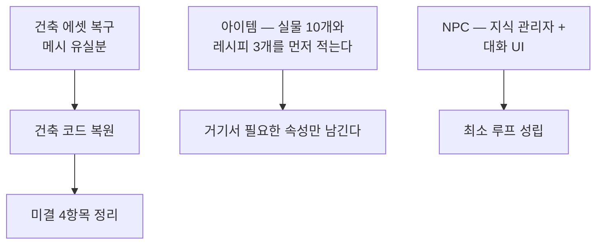

# 미완성 설계 — 아이템 · NPC · 건축

> Unity 2023.2 / URP · C# · 개인 프로젝트 *BuilderRPG*
>
> **구현 성숙도 — 프로토타입 이하.** 이 문서에 나오는 것들은 완성된 기능이 아닙니다.

## 1. 이 문서의 성격

다른 문서는 동작하는 것을 설명합니다. 이 문서는 **동작하지 않는 것**을 다룹니다.

개인 프로젝트에서 모든 갈래가 끝까지 가는 일은 없습니다.
문제는 미완성 자체가 아니라, 그것이 완성된 것처럼 섞여 있어
읽는 사람이 코드를 열어 보고서야 알게 되는 상황입니다.

그래서 세 갈래를 한곳에 모았습니다. 각 절은 세 가지만 답합니다 —
**무엇을 하려 했는가, 어디까지 있는가, 왜 멈췄는가.**

| 갈래 | 상태 | 남아 있는 것 |
|---|---|---|
| 아이템 | 프로토타입 | 속성 모델과 병합 엔진은 있고, 이를 쓰는 아이템이 없습니다 |
| NPC | 프로토타입 | 지식 표시기는 동작하고, 그것을 소비할 NPC가 없습니다 |
| 건축 | **유실** | 코드는 git 이력에 있고, 의존 에셋이 복구 불가 상태입니다 |

---

## 2. 아이템 — 물성으로 기술하고 규칙으로 조합한다

### 2.1 의도

아이템을 "이름 붙은 데이터 덩어리"가 아니라 **물리적 성질의 집합**으로 두려 했습니다.
그러면 제작 결과를 레시피마다 손으로 적지 않고 **규칙에서 유도**할 수 있습니다.

```csharp
public class Property
{
  public readonly EFloat mass   = new(1, MergeType.Sum);
  public readonly EFloat volume = new(1, MergeType.Sum);
  public readonly EFloat temperature = new(0, MergeType.None);
  public float Hardness { get; set; } = 1;      // 경도(고체)
  public float Viscosity { get; set; } = 1;     // 점도(액체)
  public float SpecificHeat { get; set; } = .5f;
  public float HeatCapacity => mass * SpecificHeat;
  public float Conductivity { get; set; } = 0;  // 열전도율
  public float Density => mass / volume;
}
```

각 속성이 **자기 병합 방식을 알고 있다**는 것이 설계의 핵심입니다.
질량과 부피는 더하고(`Sum`), 온도는 그럴 수 없으므로 별도로 처리합니다.

```csharp
public void Merge(IEnumerable<Attributes> items)
{
  for (int i = 0; i < Floats.Length; i++)
    Floats[i].Merge(items.Select(s => s.Floats[i]));
  // 온도 : 열용량 기준 계산
  var temSum = items.Sum(s => s.property.mass * s.property.temperature);
  property.temperature.Value = temSum / property.mass;
  Initialize();
}
```

뜨거운 쇠와 찬물을 합치면 열용량 가중 평균으로 온도가 정해집니다.
이런 것을 레시피별로 적지 않겠다는 것이 목표였습니다.

### 2.2 병합 엔진 — `EventProperty`

값 하나가 초기값 · 병합 정책 · 수정자 체인을 함께 갖습니다.

```csharp
public enum MergeType { None, Sum, Average, Max, Min, Mode, Median }

public T Value {
  get {
    T value = this.value;
    ModifierDelegates?.Invoke(ref value);   // 외부 효과를 통과시킨 결과
    return value;
  }
}
```

`bool` · `int` · `float` 세 파생 타입이 각자 정책을 해석합니다.
`bool`에서 `Max`는 "하나라도 참", `Min`은 "전부 참", `Average`는 "과반수"입니다.

여기까지는 **완성되어 있고 단독으로 동작합니다.**

> 이 구조는 스탯 시스템의 `RValue` 계층([문서 02](02-스탯-버프-시스템.md))과 문제의식이 같습니다.
> 원본 값과 그 위에 얹힌 수정자를 분리한다는 점이 같고,
> 차이는 `RValue`가 **누산기 방식**(순서 무관)인 반면 이쪽은 **델리게이트 체인**(순서 의존)이라는 점입니다.
> 실제로 쓰이며 검증된 쪽은 `RValue`입니다.

### 2.3 비어 있는 것

| 대상 | 상태 |
|---|---|
| `Item` | 필드 선언과 디버그용 `ToString`뿐인 30행 스텁입니다. `GetItem(int)`은 `new("DEBUG")`를 반환합니다 |
| `Properties` | **빈 클래스입니다.** 이름만 있습니다 |
| `Recipe` | 추상 메서드 둘(`CanUseRecipe` · `RunRecipe`)과 실패 사유 열거형만. 구현 0건 |
| `Attributes.Initialize()` | `Debug.Log("초기화 완료")` 한 줄. **속성 정합성 검사가 들어가야 할 자리입니다** |
| `Tags` | 태그 3개(디버그 · 식용 · 도구)만 정의. `__NULL1` 같은 자리 표시가 남아 있습니다 |

즉 **모델은 있고 인스턴스가 없습니다.** 실제 아이템이 하나도 정의되어 있지 않습니다.

### 2.4 왜 멈췄는가

`Initialize()`가 비어 있는 것이 상징적입니다.
속성을 자유롭게 조합하게 두면 **모순된 아이템**이 만들어집니다 —
`Phase.Gas`인데 경도가 있거나, `IsWeapon`인데 공격력이 0인 경우입니다.

이걸 막는 방법은 두 가지입니다. 생성 시점에 검증하거나, 애초에 조합을 제한하거나.
전자는 규칙을 전부 열거해야 하고, 후자는 물성 모델의 이점을 없앱니다.
**이 판단을 내리지 못한 채로 멈췄습니다.**

되살린다면 순서는 반대여야 합니다 — 모델을 먼저 짜지 말고,
실제 아이템 열 개와 레시피 세 개를 먼저 적은 뒤 거기서 필요한 속성만 남기는 편이 낫습니다.

---

## 3. NPC — 욕구와 지식

### 3.1 의도

두 축을 생각했습니다.

- **모티브** — NPC가 무엇을 원하는지. 욕구 수치가 행동 선택의 가중치가 됩니다
- **지식** — NPC가 무엇을 아는지. 대화로 전파되고, 아는 만큼만 보입니다

### 3.2 지식 — 실제로 동작하는 부분

키워드 기반 지식 표시기는 **구현되어 있고 동작합니다.**
설명문에 `{키워드}` 자리를 두고, 플레이어가 아직 습득하지 않은 것은 가립니다.

```csharp
public string GetText(IEnumerable<Keyword> acquired) {
  StringBuilder s = new(first);
  foreach (var (key, text) in rest) {
    s.Append(acquired.Contains(key) ? key.Name : "???");
    s.Append(text);
  }
  return s.ToString();
}
```

정규식 `\{(\w+)\}([^{]*)`로 문자열을 파싱해 키워드와 뒤따르는 텍스트 조각으로 나눕니다.
키워드는 서로를 참조할 수 있어(`Relevant`) 지식 그래프를 이룹니다.

```csharp
Conversation = new() {
  Name = "Conversation",
  Description = new KeywordString[] {
    new("Conversation is the process of talking with {People}."),
    new("Conversation is the most common way to {Acquire} {Keyword}."),
  },
  Relevant = new[] { Keyword },
  RewardInfo = new("Now talking with people can give you {Keyword}s.")
};
```

"대화를 알아야 대화로 지식을 얻을 수 있다"는 자기 참조 구조를 의도한 것입니다.

### 3.3 비어 있는 것

| 대상 | 상태 |
|---|---|
| `NPC` 클래스 | **빈 클래스입니다.** `// : FieldUnit` — 상속조차 주석 처리되어 있습니다 |
| `Goal` 열거형 | `public enum Goal { }` — 비어 있습니다 |
| `Activity` | 필드 둘. 주석에 **"실제 행동 내용. 와 이거 어떻게 하지"** |
| `Keywords.Job` | `Job = new() { }` — 다른 키워드가 참조하는데 내용이 없습니다 |
| 미완성 표기 | `new("Research is the process of studying {}.")` — `{}` 안이 비어 있고 `//! 보완 필요` 주석이 달려 있습니다 |
| 습득 판정 | 어떤 키워드를 습득했는지 관리하는 주체가 없습니다. `//TODO Player/KnowledgeManager` |

`MotiveWeights`는 인덱서까지 갖췄지만 이 값을 읽는 코드가 없습니다.

### 3.4 왜 멈췄는가

`Activity`의 주석이 정확한 진단입니다. 욕구 수치로 행동을 **고르는 것**까지는 설계가 되는데,
고른 행동을 **실행하는 것**은 상호작용 시스템과 맞물려야 합니다.

그런데 그 시점의 상호작용 시스템은 플레이어 조작만 상정한 구조였습니다.
`Prop.TryAddTask(FieldUnit, Interaction)`이 유닛을 인수로 받게 된 것은
NPC를 염두에 둔 결과지만, **거기까지가 전부입니다.**

지금 되살린다면 지식 쪽이 더 가깝습니다.
표시기가 이미 동작하므로, 습득 상태를 들고 있을 관리자 하나와
대화 UI만 있으면 최소 루프가 성립합니다.

---

## 4. 건축 — 유실된 시스템

### 4.1 무엇이 있었는가

격자 위에 벽과 바닥을 놓는 시스템이 있었고, 커밋 `0d8ef958`에서 삭제됐습니다.

| 파일 | 행 | 역할 |
|---|---|---|
| `BuildableGrid.cs` | 237 | 격자 점유 판정과 배치 가능 여부 |
| `Building.cs` | 193 | 건축물 인스턴스와 상태 |
| `BuildingMono.cs` | 14 | 씬 컴포넌트 |
| `SimpleStructure.cs` | 11 | 단순 구조물 |

같은 커밋에서 UI 프리팹도 함께 사라졌습니다 —
`Build Info` · `Build mode` · `Cell` · 선택 표시기 3종.

삭제 커밋의 제목은 **"상호작용 시스템 작업 #2"**입니다.
건축을 없애려던 커밋이 아니라, 상호작용 시스템을 갈아엎으면서
새 API로 옮겨지지 못한 코드가 함께 정리된 것입니다.

### 4.2 왜 못 되살리는가

코드가 git에 남아 있으므로 되돌리는 것 자체는 어렵지 않습니다. 문제는 셋입니다.

| 장애물 | 내용 |
|---|---|
| **에셋 유실** | `Corner Wall` · `Edge Wall` · `Diagonal Wall` · `Floor` · `Wall` 프리팹의 `m_Mesh`가 전부 유실 상태입니다. **코드를 되살려도 화면에 아무것도 나오지 않습니다** |
| API 변경 | `Building.cs`가 지금 존재하지 않는 `UI` 클래스를 호출합니다. 삭제 커밋이 바로 `Prop`/`Interaction` API를 전부 바꾼 그 커밋입니다 |
| 어셈블리 분리 | `BuildableGrid.cs`는 MonoBehaviour와 인스펙터 코드가 한 파일에 섞여 있습니다. 씬 컴포넌트이므로 런타임 어셈블리에 두어야 합니다 ([문서 06](06-엔지니어링.md) 2.4절) |

첫 번째가 결정적입니다. 에셋 복구가 선행되지 않으면 나머지를 해도 확인할 방법이 없습니다.
사정은 [GUID 유실 사고](07-에셋-GUID-복구.md) 문서에 있습니다.

### 4.3 되살아나면 함께 풀리는 것

건축 시스템은 **네 개의 미결 항목을 물고 있습니다.**

| 항목 | 지금 상태 | 건축이 돌아오면 |
|---|---|---|
| `Occupy` ↔ `Buildable` 대응 | 플래그 구성이 거의 일대일이지만 확정하지 못했습니다 | 소비처가 생겨 확정됩니다 |
| `MainCamera.blockingLayers` 선정 | 무엇을 가림 대상으로 볼지 미정 ([문서 04](04-URP-가림-반투명화.md)) | 건축물이 원래의 대상입니다 |
| 반투명화 실제 검증 | 임시 Lit 큐브로만 확인했습니다 | 원래 대상에서 재확인 가능 |
| `IAProgress.Type.Special` | 전투·건설용인데 소비처 0건 ([문서 03](03-상호작용-작업큐.md)) | 건설이 그 소비처입니다 |

`OccupyGridTests`가 **의미만이라도 테스트로 못박아 둔** 것은 이 때문입니다.
소비처가 없으면 회귀를 잡을 다른 수단이 없습니다.

---

## 5. 공통점

세 갈래의 멈춘 지점이 비슷합니다.

**모델을 먼저 만들고 사용처를 나중에 두었습니다.**
아이템은 속성 모델을 짜고 아이템을 안 만들었고,
NPC는 욕구 모델을 짜고 행동을 안 만들었습니다.
건축만 반대 순서였고, 실제로 그것만 한때 동작했습니다.

모델은 사용처가 없으면 검증되지 않습니다.
`EventProperty`의 `MergeType` 7종 중 실제로 실행된 것이 몇 개인지 아무도 모릅니다.
반면 `RValue`는 스탯 시스템이 매 프레임 쓰고 있어 두 성질이 테스트로 고정되어 있습니다
([문서 06](06-엔지니어링.md) 3.1절).

되살릴 때의 우선순위도 여기서 나옵니다.



건축이 가장 값이 큽니다. 혼자 풀리는 것이 아니라 넷을 함께 풀기 때문입니다.
다만 에셋 복구가 선행되어야 하고, 그 결과에 따라 범위가 달라집니다.

전체 착수 계획은 [남은 작업](internal/남은-작업.md)에 있습니다.

---

## 6. 코드 위치

| 영역 | 경로 |
|---|---|
| 아이템 속성 모델 | `Assets/Game Assets/Scripts/Items/ItemSystem/Attributes.cs` |
| 병합 엔진 | `.../Items/ItemSystem/EventProperty.cs` |
| 아이템 본체 · 태그 · 레시피 | `.../Items/ItemSystem/Item.cs`, `ItemTag.cs`, `.../Items/Recipe.cs` |
| 지식 · 키워드 문자열 | `.../Units/NPC/Knowledge.cs` |
| 키워드 정의 | `.../Units/NPC/Keywords.cs` |
| 모티브 · 활동 | `.../Units/NPC/NPC.cs` |
| 건축 시스템 (삭제됨) | 커밋 `0d8ef958`의 부모 — `Assets/Game Assets/Scripts/Fields/Building/` |
