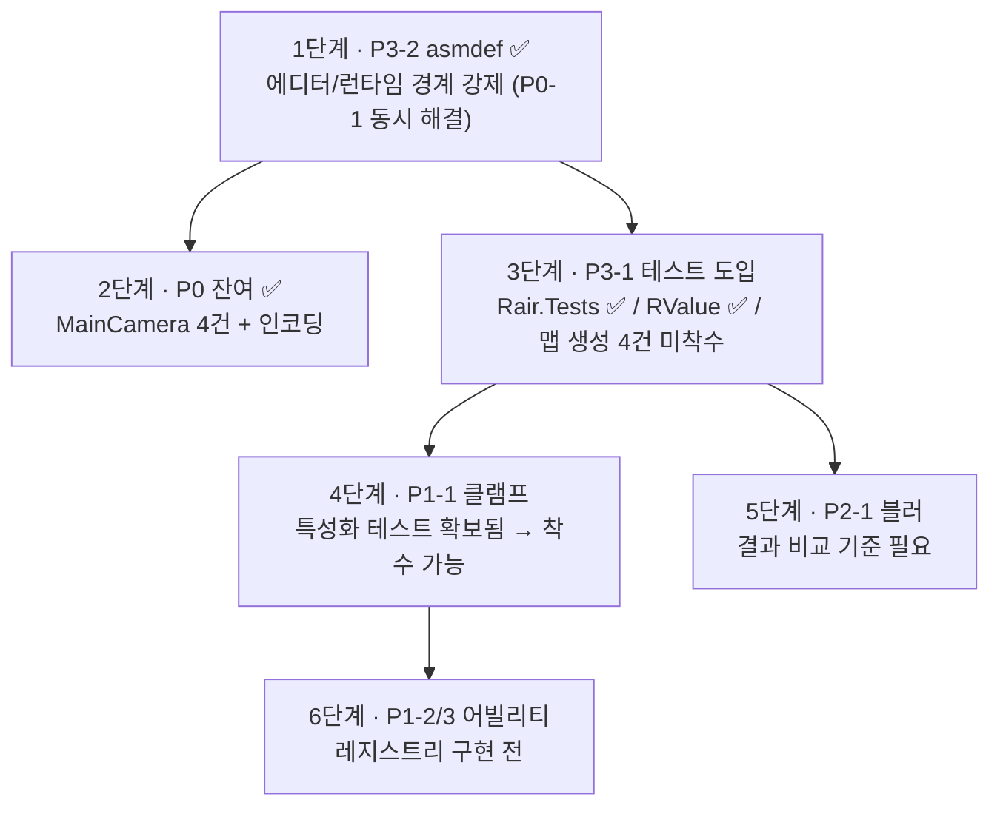

# 보완 필요 항목

> 문서 01~04 작성 과정에서 확인된 결함·미완성 항목의 종합 목록
> 최종 갱신 2026-07-28

## 1. 목적

포트폴리오 문서 4편을 쓰면서 코드를 정독한 결과 나온 항목들을 한 곳에 모았습니다.
각 문서의 「한계와 알려진 문제」 절에 흩어져 있던 것과,
문서에는 넣지 않았지만 확인된 프로젝트 전반 이슈를 함께 담았습니다.

**분류 기준은 "얼마나 나쁜가"가 아니라 "지금 고칠 수 있는가"입니다.**
같은 버그라도 한 줄로 끝나는 것과 밸런스 재조정을 동반하는 것은
착수 조건이 다르기 때문입니다.

| 등급 | 성격 | 착수 조건 |
|---|---|---|
| **P0** | 빌드 차단 또는 명백한 오동작 | 없음 — 즉시 가능 |
| **P1** | 구조적 결함 | 설계 결정 필요 |
| **P2** | 품질 문제 | 출력이 바뀌므로 눈으로 검증 필요 |
| **P3** | 기반 정비 | 별도 작업 단위 |

총 28건이었고, 처리 21.5건 · 신규 발견 1건(P0-8)을 반영해 현재 **7.5건** 남았습니다.
(P3-7은 두 도구 중 하나만 복원해 절반으로 셉니다.)
처리분은 8절, 판단이 필요해 멈춘 것은 9절에 있습니다.

---

## 2. P0 — 즉시 가능 (1건)

검증 없이도 옳다고 판단할 수 있고, 수정 범위가 국소적인 것들입니다.

**P0-1 ~ P0-6은 모두 처리했습니다** (경위는 8절).
P0-8도 처리했습니다. **P0-7만 남았고, 서브모듈이 브랜치로 올라와 착수 조건이 풀렸습니다.**

### ~~P0-8. 육지 비율 조정이 수렴하지 않음~~ → 처리 완료 (8절)

<details>
<summary>처리 전 서술 (기록용)</summary>

### P0-8. 육지 비율 조정이 수렴하지 않음 ★ (신규)

`IslandShape.cs:55` — `MakePerlin`이 **호출될 때마다 새 랜덤 오프셋**을 만듭니다.

```csharp
public static System.Func<Vector2, bool> MakePerlin(float size) {
  Vector2 offset = Random.value * new Vector2(10000, 10000);  // ← 매 호출 새 지형
  ...
}
```

그런데 `Graph.cs:257-267`의 `AssignLands`는 이 함수를 **루프 안에서 매 반복 다시 호출**하면서
`SeaLevel`을 이분 탐색합니다.

```csharp
do {
  var IsLand = IslandShape.MakePerlin(_size);   // 매번 다른 지형
  foreach (var q in vars.corners) if (q.water = !IsLand(q.point)) water++;
  var result = 1 - ((float)water/vars.corners.Count);
  if (Mathf.Abs(landRatio - result) < .01f) break;
  else IslandShape.SetPerlin(landRatio, result); // 지형 N을 보고 조정한 값을 지형 N+1에 적용
} while (++_tries < 10);
```

이분 탐색은 **대상 함수가 고정되어 있을 때만** 성립합니다.
여기서는 매 반복 다른 노이즈 필드를 재는 셈이라, 보폭만 절반씩 줄어드는 무작위 행보가 됩니다.
9회를 소진하면 마지막 지형의 결과가 그대로 채택됩니다.

**실측** (`Size.s2`, 목표 35%, 시드 5종):

| 시드 | `AssignLands` 직후 | 생성 완료 | 최종 `SeaLevel` |
|---|---|---|---|
| 1 | 13.3 % | 13.3 % | 0.9072 |
| 7 | 27.9 % | 27.9 % | 0.9229 |
| 42 | 35.5 % | 35.5 % | 0.8711 |
| 99 | 34.5 % | 34.5 % | 0.8340 |
| 123 | 26.1 % | 25.7 % | 0.8604 |

5개 중 2개만 목표 근처입니다. `SeaLevel`이 초기값 0.5에서 0.83~0.92까지
한 방향으로 밀린 것도 탐색이 구간을 좁히지 못했다는 신호입니다.

> `AssignCoasts`가 맵 경계 Corner를 물로 덮어쓰는 것은
> **원인이 아닙니다.** 직후/완료 열의 차이가 0.4%p 이내입니다.

**해결 방향** — 오프셋을 루프 밖으로 빼서 같은 지형에 대해 탐색하도록 합니다.
다만 **생성되는 모든 지형이 달라지므로**, 착수 조건은 P0이 아니라 P2에 가깝습니다.
샘플 프리셋 시드 재선정이 동반됩니다(P2-1과 같은 성격).

*테스트는 작성해 두었고 `[Ignore]`로 표시했습니다. 고치면 그 표시를 떼면 됩니다.*

</details>

### P0-7. `MapTexture` 채널 주석 불일치

주석은 `B: occupy, A: biome`인데 실제 인코딩은 `B: biome, A: land`입니다.
소비하는 쪽이 실제 인코딩을 따르므로 동작 문제는 없습니다.

실제 인코딩은 `VectorExtensions.FillPolygon`의 `new Color(h, m, b, l)`입니다.
`b = center.biome.ToFloat()`, `l = center.ocean ? 0 : 1` — 즉 **B는 biome, A는 land**입니다.
소비하는 쪽도 이를 따릅니다(`TerrainGenerator`는 `.b.ToBiome()`, `MapOverlay`는 `p.a`).

**착수 조건이 풀렸습니다.** 이 파일은 포크한 별도 저장소
(`TcDRair/polygon-map-unity`)에 있고 한동안 detached HEAD였으나,
현재 `master` 브랜치 위에 있습니다(`09e481a`).
P0-8 수정도 이미 이 서브모듈에 커밋되어 있으므로,
주석 한 줄 고쳐 커밋 → 푸시 → 부모 저장소 포인터 갱신이면 끝납니다.

---

## 3. P1 — 설계 결정 필요 (3건)

무엇이 옳은지 정해야 고칠 수 있는 것들입니다.

### ~~P1-1. `RAFloat`이 최종 클램프를 하지 않음~~ → 처리 완료 (8절)

### ~~P1-2. `Ability` 인스턴스의 가변 상태~~ → 처리 완료 (8절)

### ~~P1-3. 효과 중첩·갱신 미구현~~ → 처리 완료 (8절)

### ~~P1-5. 적용기 순서에 우선순위 없음~~ → 처리 완료 (8절)

<details>
<summary>처리 전 서술 (기록용)</summary>

### P1-1. `RAFloat`이 최종 클램프를 하지 않음 ★

`RValue.cs:124, 46, 166`

```csharp
// RMFloat : 최종 클램프 O
public virtual float Value => Nullify ? 0 : Mathf.Clamp((value + add) * mul, Min, Max);
// RVFloat : 최종 클램프 X (생성 시점의 baseValue만 클램프)
public readonly float Value => Nullify ? 0 : (baseValue.Value + Adder) * Multiplier;
// RAFloat : RVFloat.Value를 그대로 반환 → 선언 범위를 넘어설 수 있음
public override float Value => RVValue.Value;
```

`RunSpeed = new(runSpeed, 0, 20)`의 상한 20이 최종값에 적용되지 않습니다.
상속 관계인 두 타입이 같은 표현식에 다르게 반응하는 것이라 결함이 맞지만,
**현재 밸런스가 이 동작 위에서 맞춰져 있습니다.**

결정할 것 — 적용기 체인 **이후**에 클램프할 것인가, **이전**에 할 것인가.
이후가 자연스럽지만, 그러면 버프가 상한에 막혀 체감이 달라집니다.

### P1-2. `Ability` 인스턴스의 가변 상태 ★

`RunnersHigh`의 `trigger`/`elapsed`, `IronStep`의 `rcr`이 어빌리티 필드입니다.
현재는 `Player.Start()`에서 유닛마다 새로 만들어 문제가 없지만,
`Ability.cs:50-52`의 `Abilities` 싱글턴이
`Dictionary<Abil, Ability>`로 **어빌리티를 공유하려는 설계**입니다.

이대로 레지스트리를 구현하면 여러 유닛이 같은 인스턴스의 상태를 덮어씁니다.
**레지스트리를 구현하기 전에 반드시 정리해야 합니다.**

결정할 것 — 상태를 `UnitEffect`로 옮길 것인가,
어빌리티를 유닛마다 복제할 것인가.
전자가 맞아 보이지만 `Effect.Stack` 외에 상태 슬롯이 더 필요합니다.

### P1-3. 효과 중첩·갱신 미구현

`FieldUnit.cs:96-114` — 같은 `IDSet`의 효과를 다시 적용하면 아무 일도 없습니다.

```csharp
if (effects.TryGetValue(effect.ID, out var e)) {
  //todo 효과 중첩 or 갱신 or 덮어쓰기
}
```

결정할 것 — 중첩/갱신/덮어쓰기 중 무엇을 기본으로 할지,
그리고 그 선택을 효과별로 지정 가능하게 할지.
`RemoveEffect(stack >= 0)` 경로도 함께 비어 있습니다.
**P1-2와 함께 다뤄야 합니다** (스택 상태의 소유자가 정해져야 하므로).

### P1-4. `UnitStat` / `UnitInfo`가 가변 struct

값 타입 멤버(`RFloat Load`)와 참조 타입 멤버(`RAFloat HP`)가 섞여 있어
복사 시맨틱이 일관되지 않습니다. 복사하면 참조 멤버는 공유되고 값 멤버는 스냅샷이 됩니다.

```csharp
var s = P.stat;   // FieldUI — 읽기만 해서 현재는 무해
s.Load += 10;     // 이렇게 쓰면 원본에 반영되지 않음
```

결정할 것 — 클래스로 전환할 것인가, `readonly ref` 접근만 허용할 것인가.
클래스 전환이 단순하지만 매 프레임 접근 경로라 할당 비용을 확인해야 합니다.

### P1-5. 적용기 순서에 우선순위 없음

`Aggregate`가 도는 순서는 델리게이트 **등록 순서**입니다.
기본 적용기가 `Start()`에서 먼저 등록되고 어빌리티가 나중에 붙는 현재 구성에서는
의도대로 동작하지만, **문서화되지 않은 암묵적 계약**입니다.
가산 적용기와 승산 적용기가 섞이면 순서가 결과를 바꿉니다.

결정할 것 — 우선순위 값을 도입할 것인가,
아니면 "가산 먼저, 승산 나중"을 규약으로 못박고 검증할 것인가.

</details>

### P1-6. `Ability.ID`가 직렬화에 부적합

`Ability.cs:45` — `(FieldID, AbilID).GetHashCode()`는 실행 간 안정성이 보장되지 않습니다.
세이브 데이터에 쓰려면 명시적 ID가 필요합니다.
**저장/로드를 구현하는 시점에 반드시 걸립니다.**

### P1-7. `OccupyGrid`의 점유 의미 미정

축소 변환의 `&=` → `|=` 버그는 수정했지만, 상위 의미가 정해지지 않았습니다.
호출부가 육지를 `FULL`(완전 점유)로 매핑하고 있어
**"육지 = 건축 가능"인지 "육지 = 점유됨"인지** 불분명합니다.
현재 이 값을 소비하는 코드가 없어 드러나지 않은 상태입니다.

결정할 것 — 건축 시스템을 되살릴 때 함께 정의.

---

## 4. P2 — 출력 검증 필요 (0건)

수정 자체는 간단하지만 **결과물이 달라져** 눈으로 확인해야 하는 것들입니다.

### ~~P2-1. 블러가 in-place로 동작~~ → 처리 완료 (8절)

### ~~P2-2. `MIN_ALPHA = 0.85`~~ → 인스펙터 노출로 처리 (8절)

값 자체는 여전히 0.85입니다. **정하기 전에 확인할 것이 있습니다** — 8절 참조.

### ~~P2-3. `renderer.material` 접근이 머티리얼을 복제~~ → 처리 완료

### ~~P2-4. 플레이어 렌더러를 하나만 제외~~ → 처리 완료

### ~~P2-5. 레이캐스트에 레이어 마스크 없음~~ → 인스펙터 노출로 처리 (8절)

레이어 선정은 남아 있습니다. 고르기 전까지 `floorGap`으로 기존 동작을 유지합니다.

### ~~P2-6. `UnitEffect.Stack` 초기값이 계산식에 유입~~ → 처리 완료

예상대로 P1-3과 함께 정리되었습니다. 8절 참조.

---

## 5. P3 — 기반 정비 (3.5건)

별도의 작업 단위가 필요한 것들입니다.

### ~~P3-1. 테스트 전무~~ → 처리 완료 (6개 대상 전부)

착수 당시 `com.unity.test-framework`는 설치되어 있었지만 테스트가 하나도 없었습니다.
아래는 속성 기반 테스트에 정확히 맞는 대상으로 지목되었던 것들입니다.

| 대상 | 검증할 성질 | 상태 |
|---|---|---|
| `RValue` 연산자 | 적용 후 해제하면 원래 값으로 돌아온다 | **완료** |
| `RValue` 연산자 | 적용 순서를 바꿔도 결과가 같다 | **완료** |
| 섬 생성 | 육지 비율이 목표치 ±1%로 수렴한다 | **완료** (P0-8 처리 후 통과) |
| 섬 생성 | 모든 강이 해안 또는 종점에 도달한다 | **완료** |
| 섬 생성 | 고도가 `[-1, 1]` 범위를 벗어나지 않는다 | **완료** |
| 스플랫맵 | 모든 바이옴 행의 가중치 합이 1이다 | **완료** |

마지막 항목은 당초 수동으로 검산했지만(18행 전부 1.0),
테스트가 있었다면 `TODO` 주석이 몇 달간 남아 있지 않았을 것입니다.
이제는 `Biome` 열거형을 직접 순회하므로 **바이옴을 추가하고 행을 빠뜨리면 자동으로 실패합니다.**

**6건 모두 통과합니다** (`Assets/Tests/EditMode/`, 현재 53개 케이스 전부 통과).
그 과정에서 육지 비율 항목이 성립하지 않는다는 것이 드러나 **P0-8**로 등록했고,
지금은 처리되어 `[Ignore]`를 뗀 상태로 통과합니다. 경위는 8절 참조.

### ~~P3-2. asmdef 부재~~ → 처리 완료 (`Rair.Runtime` / `Rair.Editor` / `Rair.Tests`)

경위는 8절 참조. 최소 분할안 3종이 모두 생겼습니다.

### P3-3. 어빌리티 데이터 하드코딩

`Ability.cs:59` — `Abilities.Initialize()`가 `//TODO 데이터 로드`로 비어 있고,
어빌리티 3종이 C# 클래스로 직접 작성돼 있습니다.
발동도 디버그 키(`F5`~`F10`)로만 가능합니다.

`Assets/Migrated`의 이전 이터레이션에 **JSON 데이터 주도 + 설명문 미니 DSL**이
이미 구현되어 있으므로, 그 방식을 되살리는 것이 출발점입니다.

### P3-4. 런타임 맵 생성 불가

`RandomTextureGenerator`와 `TerrainGenerator`는 `AssetDatabase`·`EditorCoroutine`에 의존합니다.
인게임에서 맵을 생성하려면 코루틴 구동부와 에셋 입출력부를 교체해야 합니다.
`ProgressTimer` 자체는 런타임 의존성이 없으므로 그대로 쓸 수 있습니다.

asmdef 분리 과정에서 두 파일은 `Scripts/Editors/Map/`(`Rair.Editor`)으로 옮겼습니다.
`#if UNITY_EDITOR` 가드로 표현되던 사실이 이제 **어셈블리 경계로 표현**되므로,
이 항목을 처리하지 않은 채 런타임에서 참조하려 들면 컴파일이 막힙니다.

같은 이유로 `MapOverlay`는 `RandomTextureGenerator` 참조를 끊었습니다.
실제로 쓰던 것은 `mapVariables.MapTerrain` 하나뿐이라 `Terrain`을 직접 들고 있게 했고,
`SampleScene`의 해당 필드도 같은 `Terrain`으로 재연결했습니다.

### ~~P3-5. `RECOVERY-TODO.md`가 최신이 아님~~ → 처리 완료

자동 생성으로 바꿨습니다. 8절 참조.

### ~~P3-6. 복구 대상과 정리 대상이 섞여 있음~~ → 처리 완료

분류를 도구가 수행합니다. 8절 참조.

### ~~P3-7. 복구 탐색 스크립트 미보존~~ → 부분 완료

"끊긴 참조 수집"은 상시 도구로 복원했습니다(8절).
**"도달 가능성 BFS"(미사용 에셋 탐색)는 아직입니다.**
끊긴 참조 쪽이 조기 경보로서 가치가 더 크고 판정 기준이 명확해 먼저 했습니다.

### P3-8. `TH_ToonWater` 셰이더 임시 조치

`_CameraDepthTexture_TexelSize` 중복 정의를 주석 처리로 우회했습니다(`5cf1cfaf`).
**Toon Harbor Pack을 다시 임포트하면 되돌아갑니다.**
재적용이 필요하다는 사실 자체를 잊기 쉬운 종류의 부채입니다.

---

## 6. 착수 순서 제안

의존 관계와 비용을 고려한 순서입니다.



**1단계 (P3-2)** — 완료. 가드를 먼저 넣는 대안 대신 asmdef를 택했고,
그 판단이 결과적으로 옳았습니다. 가드 방식이었다면 P0-1 목록에 없던 6건을
**그대로 지나쳤을 것**이기 때문입니다(8절).
플레이어 빌드도 통과했으므로, 이제 프로젝트는 실행 가능한 상태입니다.

**2단계 (P0 잔여)** — 완료. `MainCamera` 4건(P0-2/3/5/6)과 인코딩 복원(P0-4).
P0-7만 서브모듈 절차 때문에 남았습니다.

**3단계 (P3-1)** — `RValue` 2건 완료, 맵 생성 4건 미착수.
`RValue`의 "원복 가능" "순서 무관" 성질이 고정되었으므로
**4단계(P1-1)는 이제 안전하게 착수할 수 있습니다.**
맵 생성 4건은 생성기 구동이 필요해 비용이 다르므로 별도로 잡는 편이 낫습니다.

**4~5단계** — 테스트/기준선이 생긴 뒤에 착수.
P2-1(블러)은 생성 결과 비교가 필요하므로 스크린샷 기준선을 먼저 잡아야 합니다.

**6단계** — P1-2와 P1-3은 함께 다뤄야 합니다.
스택 상태의 소유자가 정해져야 중첩 규칙을 정의할 수 있습니다.

---

## 7. 출처 인덱스

| 등급 | 항목 | 출처 문서 |
|---|---|---|
| ~~P0-1~~ | `UnityEditor` 가드 누락 → P3-2로 처리 | 03, 신규 전수 조사 |
| ~~P0-2~~ | 카메라 콜백 필터 누락 → 처리 완료 | 03 |
| ~~P0-3~~ | `targeted` 미연결 → 처리 완료 | 03 |
| ~~P0-4~~ | 인코딩 손상 → 처리 완료 | 신규 전수 조사 |
| ~~P0-5~~ | `blockings` 자료구조 → 처리 완료 | 03 |
| ~~P0-6~~ | `ToOpaqueMode` 죽은 코드 → 처리 완료 | 03 |
| P0-7 | 채널 주석 불일치 | 01 |
| ~~P1-1~~ | `RAFloat` 클램프 → 처리 완료 | 02 |
| ~~P1-2~~ | `Ability` 가변 상태 → 처리 완료 | 02 |
| ~~P1-3~~ | 효과 중첩 미구현 → 처리 완료 | 02 |
| P1-4 | 가변 struct | 02 |
| ~~P1-5~~ | 적용기 순서 → 처리 완료 | 02 |
| P1-6 | `Ability.ID` 직렬화 | 02 |
| P1-7 | `OccupyGrid` 의미 | 01 |
| ~~P2-1~~ | 블러 in-place → 처리 완료 | 01 |
| ~~P2-2, P2-5~~ | 카메라 관련 → 인스펙터 노출로 처리 | 03 |
| ~~P2-3, P2-4~~ | 카메라 관련 → 처리 완료 | 03 |
| ~~P2-6~~ | `Stack` 초기값 → 처리 완료 | 02 |
| ~~P3-1~~ | 테스트 전무 → 처리 완료 | 01, 02 |
| ~~P3-2~~ | asmdef 부재 → 처리 완료 | 전체 파악 |
| ~~**P0-8**~~ | 육지 비율 미수렴 → 처리 완료 | **P3-1 테스트 작성 중 발견** |
| P3-3 | 어빌리티 하드코딩 | 02 |
| P3-4 | 런타임 생성 불가 | 01 |
| ~~P3-5, P3-6~~ | 복구 목록 → 처리 완료 | 04 |
| P3-7 | 복구 도구 → 절반 완료(BFS 잔여) | 04 |
| P3-8 | 셰이더 임시 조치 | 04 |

---

## 8. 이미 처리된 항목

기록 목적으로 남깁니다.

| 항목 | 처리 | 근거 |
|---|---|---|
| `OccupyGrid.ApplyScale`이 `&=` 누적으로 항상 빈 결과 | `\|=`로 수정 | 0 초기화 배열에 `&=`는 의도일 수 없음. 합집합이 범위 밖 `FULL` 처리와 일관 |
| 스플랫맵 배합비 `TODO` | 제거 후 불변 조건 주석으로 대체 | 18행 전부 합 1.0 검산 완료, `Biome` 18종 전부 스위치에 포함 |
| **P3-2 asmdef 부재 + P0-1 빌드 실패** | `Rair.Runtime` / `Rair.Editor` 분리 | 아래 상세 |
| **P0-2/3/5/6** `MainCamera` 4건 | 문서의 수정안대로 적용 | 아래 상세 |
| **P0-4** `FieldUnit.cs` 인코딩 손상 | 역디코딩으로 원문 복원 (7행) | 아래 상세 — 당초의 "복원 불가" 판단은 틀렸습니다 |
| **P3-1** 테스트 전무 (`RValue` 2건) | `Rair.Tests` 신설 + 12개 케이스 | 아래 상세 — 변이 테스트로 유효성 확인 |
| **P3-1** 테스트 전무 (맵 생성 4건) | 43개 케이스로 확장 | 아래 상세 — **P0-8을 여기서 발견** |
| **P2-3/P2-4** 카메라 2건 | `sharedMaterial` 필터 / 렌더러 전체 제외 | 아래 상세 |
| **P1-1** `RAFloat` 클램프 | 모든 연산 후 클램프 | 아래 상세 — **실제로 값이 바뀌는 경로 1건** |
| **P1-5** 적용기 순서 | 순서 의존성 실행 검출 | 아래 상세 — 완전 차단은 비용이 큼 |
| **P1-2 · P1-3 · P2-6** 효과 | 상태 소유자 이전 + 갱신 규칙 | 아래 상세 |
| **P0-8 · P2-1** 지형 | 오프셋 고정 + 블러 버퍼 교대 | 아래 상세 — **생성 지형이 달라짐** |
| **P1-2 후속** 씬 컴포넌트 | RTG를 런타임/에디터로 분리 | 아래 상세 — **P3-2에서 낸 회귀를 바로잡음** |
| **P2-2 · P2-5** 튜닝 | 인스펙터 노출 | 아래 상세 — **반투명화 적용 범위 확인 필요** |
| **P3-5/P3-6** + **P3-7 일부** | 끊긴 참조 감사 도구 + 목록 자동 생성 | 아래 상세 — **집계가 기존 기록과 다릅니다** |

### P3-2 · P0-1 처리 상세

**결정** — P0-1을 `#if UNITY_EDITOR` 가드로 때우는 대신 asmdef 분리로 해결했습니다.

**착수 전 재조사에서 P0-1 목록이 6건이 아니라 12건임이 드러났습니다.**
`UnityEditor` 문자열 검색만으로는 앞의 6건까지만 잡히고,
나머지는 "가드가 있는가"가 아니라 **"가드가 무엇을 감싸고 있는가"**를 봐야 드러납니다.

| 누락분 | 실제 형태 |
|---|---|
| `Fields/Map/TerrainProps.cs` | `[EnumAsElementName]`을 쓰는데 **어트리뷰트 정의 자체가** `#if UNITY_EDITOR` 안에 있어 빌드 시 타입이 소멸 |
| `Fields/Map/TerrainGenerator.cs` | `using UnityEditor;`가 `#if UNITY_EDITOR` **바깥**(11행에서 시작)에 위치 |
| `Fields/Map/RTGEditor.cs` | 동일 — `using`이 가드 밖 |
| `Dagger's-AssetCleaner/Scritps/` 3파일 | 전부 에디터 코드인데 `Editor` 폴더 밖 + 가드 없음 |

가드 방식을 택했다면 이 6건은 그대로 남았을 것입니다.
**컴파일러가 잡아야 하는 문제를 검색으로 잡으려 한 것이 원래 문제였습니다.**

**수행 내역**

| 대상 | 처리 |
|---|---|
| `Scripts/Rair.Runtime.asmdef` | 신규. `UnityEngine.UI`, `Unity.TextMeshPro` 참조 |
| `Scripts/Editors/Rair.Editor.asmdef` | 신규. `includePlatforms: [Editor]`, `Rair.Runtime` + `Unity.EditorCoroutines.Editor` 참조 |
| 어트리뷰트 3종 | `Scripts/Attributes/`로 가드 없이 분리. 드로어만 `Editors/`에 잔류 |
| `MainCameraEditor`, `EditorSceneShortcutUtil` | 런타임 파일에서 떼어 `Editors/`로 이동 |
| `RandomTextureGenerator` / `TerrainGenerator` / `RTGEditor` | `.meta`와 함께 `Editors/Map/`으로 이동(GUID 보존), `#if` 가드 제거 |
| `MapOverlay` | `RandomTextureGenerator` 참조 → `Terrain` 직접 참조. `SampleScene` 필드 재연결 |
| `Prop.cs` / `StringExtensions.cs` | 사용되지 않는 에디터 참조 제거 (`ToNiceString(string)`은 호출부 0건) |
| `Dagger's-AssetCleaner` | `Scritps/Editor/` 하위로 이동 (Unity 특수 폴더 규칙) |

**검증** — 에디터 컴파일 오류 0건, `SampleScene` 유실 스크립트 0건,
런타임 어셈블리에 남은 `#if UNITY_EDITOR` 0건.

**플레이어 빌드 통과 (StandaloneWindows64 / Mono / Development)**

프로젝트 최초의 플레이어 빌드입니다. 산출물 구성은 다음과 같습니다.

| `BuilderRPG_Data/Managed/` | 판정 |
|---|---|
| `Assembly-CSharp.dll` | 포함 — `Assets/Migrated` 등 |
| `Rair.Runtime.dll` | 포함 |
| `Rair.Editor.dll` | **미포함** — `includePlatforms: [Editor]`가 의도대로 동작 |
| `Assembly-CSharp-Editor.dll` | **미포함** |

에디터 어셈블리가 산출물에서 완전히 빠지므로, 앞으로 런타임 코드가
에디터 API에 의존하면 **빌드가 아니라 컴파일 단계에서** 막힙니다.
P0-1과 같은 유형의 재발 경로가 닫혔습니다.

### P0-2 · P0-3 · P0-5 · P0-6 처리 상세 (`MainCamera.cs`)

문서에 적힌 수정안을 그대로 적용했습니다. 판단이 필요했던 것은 P0-6뿐입니다.

| 항목 | 처리 |
|---|---|
| P0-2 콜백 필터 | `MakeTranslucencyProps` 진입부에 `if (cam != Cam) return;` |
| P0-3 `targeted` 미연결 | `ToFadeMode()` 직후 `targeted = true` 대입 |
| P0-5 `blockings` | `List<int>` → `HashSet<int>` |
| P0-6 `ToOpaqueMode` | **삭제하지 않고** `<summary>`/`<remarks>`로 사유 명시 |

P0-6은 문서의 권고("삭제 대신 왜 안 쓰는지를 남기는 편")를 따랐습니다.
남긴 내용은 **왜 안 쓰는지가 아니라 왜 못 쓰는지**입니다 —
대상 머티리얼이 원래 Opaque라는 보장이 없어서 상수 복원이 성립하지 않고,
그래서 `GetLitVar`/`SetLitVar` 스냅샷 방식으로 바뀌었다는 것.
이 사실을 적어 두지 않으면 "복원 함수가 있는데 왜 안 쓰지?"에서 다시 출발하게 됩니다.

### P0-4 처리 상세 — 원문은 **복원되었습니다**

이 문서는 당초 "원문 복원은 불가능하므로(정보가 소실됨) 문맥에 맞게 다시 작성"이라고
적었지만, 실제로는 **기계적으로 대부분 복원할 수 있었습니다.**

손상 형태는 `UTF-8 → CP949 → UTF-8` 왕복이었습니다.
CP949로 표현되지 않는 바이트만 `?`(0x3F)로 치환되었고 나머지는 그대로 남아 있어서,
**역방향으로 한 번 더 돌리면 유실 바이트를 제외한 전부가 되살아납니다.**

```
입력  하중 구간 → 湲곕낯...  (CP949로 인코딩 → UTF-8로 디코딩)
결과  ?중 구간 ?에?의 비율???환합니다
      └ 3바이트 한글 중 첫 바이트만 유실 → 문맥으로 확정 가능
```

복원한 7행은 다음과 같습니다(마지막 행은 인코딩이 아니라 `<` 유실).

| 행 | 복원 결과 |
|---|---|
| 25 | `//todo Decision 관련 함수를 묶을 것` |
| 34 | `기본적으로 <see cref="Default_MovementDecision"/>가 할당됩니다.` |
| 40 | `유닛의 이동 가능성을 판단하는 기본 함수입니다.` |
| 87 | `<summary>하중 구간 내에서의 비율을 반환합니다.</summary>` |
| 94 | `<summary>현재 적용중인 효과를 반환합니다. 여기의 요소를 변경시켜도 실제 효과에는 영향을 주지 않습니다.</summary>` |
| 112 | `//todo 중첩 제거 시 만료되는 것도 있고 아닌 것도 있기 때문` |
| 92 | `할당합니다/summary>` → `할당합니다</summary>` |

94행은 `Effects => effects.Values.ToList()`가 복사본을 돌려준다는 사실과
정확히 들어맞아, 복원 결과가 맞다는 방증이 됩니다.

### P3-1 처리 상세 (`RValue` 2건)

`Assets/Tests/EditMode/`에 `Rair.Tests.asmdef`와 `RValueTests.cs`(12개 케이스).
어셈블리 3분할이 완성되었습니다.

**두 성질이 성립하는 이유**를 테스트 주석에 남겼습니다.
`RVFloat`의 `*`는 곱셈이 아니라 `Multiplier += (f - 1)`이고 `/`는 그 역입니다.
즉 승산과 가산이 **서로 독립적인 누산기**에 쌓이므로,
교환법칙이 성립하고(성질 2) 역연산이 정확히 상쇄됩니다(성질 1).
이 구조를 실제 곱셈으로 바꾸면 두 성질이 동시에 깨집니다.

실사용 경로와도 맞습니다 — `LightBreeze`가 `*=` / `/=`로 짝을 이루고,
`IronStep` 3레벨은 `WalkSpdMod`가 **0**인데도 `/= 0`으로 복원됩니다.
진짜 곱셈이었다면 여기서 정보가 소실되어 복원이 불가능합니다.
이 경우를 테스트에 포함했습니다.

**특성화 테스트 3건** — 결함이지만 지금은 계약인 것들입니다.

| 테스트 | 고정한 동작 |
|---|---|
| `RAFloat는_RMFloat와_달리_최종_클램프를_하지_않는다` | P1-1. `RMFloat`는 20에서 잘리고 `RAFloat`는 30이 됩니다 |
| `RAFloat의_기저값은_생성_시점에만_클램프된다` | 생성 시 클램프는 되지만 승산 결과는 안 됩니다 |
| `RMFloat_경계에_닿으면_가감산_왕복이_복원되지_않는다` | `+`/`-`는 기저값을 Clamp하므로 상한에서 정보가 소실됩니다 |

P1-1을 처리하면 앞의 두 건이 깨져야 정상이고, 기대값을 바꾸라는 주석을 달아 뒀습니다.

**유효성 검증 — 변이 테스트**

사후에 작성한 테스트가 통과하는 것만으로는 아무것도 증명되지 않으므로,
`RValue.cs`에 의도적인 결함을 넣어 실제로 잡히는지 확인했습니다.

| 변이 | 잡아낸 테스트 |
|---|---|
| `RVFloat.Value`에 최종 클램프 추가 (= P1-1을 고친 것과 같은 효과) | P1-1 특성화 2건 |
| `operator +`를 `Adder += f * Multiplier`로 변경 (순서 의존성 유발) | 순서 무관 2건 |

두 변이 모두 원복 후 12/12 통과를 재확인했습니다.
`RValue.cs`는 현재 git 원본과 동일합니다.

### P3-1 처리 상세 (맵 생성 4건)

`IslandGenerationTests.cs`(섬 생성) · `SplatmapTests.cs`(가중치 표) · `CoroutineDriver.cs`.
전체 **43개 케이스 / 38 통과 · 5 스킵 · 0 실패**
(스킵은 P0-8 때문에 `[Ignore]` 처리한 수렴 테스트 1종 × 시드 5개).

**코루틴 구동** — 생성기는 `yield return 다른코루틴()`으로 단계를 중첩합니다.
이 중첩을 펼치는 것은 Unity 런타임의 일이라, 테스트에서 `while (e.MoveNext())`만
돌리면 **안쪽 단계가 실행되지 않은 채 통과**합니다. 아무것도 검증하지 못하는 테스트가 되므로,
`Current`가 `IEnumerator`면 재귀로 내려가는 드라이버를 따로 두었습니다.

**검증한 성질**

| 성질 | 방식 |
|---|---|
| 고도 `[-1, 1]` | Corner·Center 전수. NaN·무한대도 함께 검사(초기값 `PositiveInfinity`가 안 덮인 경우 탐지) |
| 강의 종료 | 모든 강 발원점에서 `downslope`를 따라가 해안 또는 지역 최소점에 도달하는지, 순환이 없는지 |
| `downslope` 단조성 | 위 성질이 **왜** 성립하는지. 고도가 단조 감소하므로 순환이 불가능합니다 |
| 스플랫맵 가중치 | `Biome` 열거형 전수 순회 — 행 누락 시 자동 실패 |

`TerrainGenerator`의 가중치 표는 이중 루프 안에 인라인으로 박혀 있어 검증할 수 없었습니다.
`BiomeWeights(Biome)`로 추출했고, 값과 동작은 그대로입니다.

**이 작업의 성과는 P0-8입니다.** 문서가 예상한 대로,
"육지 비율이 목표치 ±1%로 수렴한다"를 실제로 검사하자마자 성립하지 않는 것이 드러났습니다.
수동 검산으로는 나올 수 없는 종류의 결함입니다 — 시드를 바꿔 여러 번 돌려야 보입니다.

### P2-3 · P2-4 처리 상세

| 항목 | 처리 |
|---|---|
| P2-3 | 필터를 `renderer.sharedMaterial`로 변경(null 검사 포함). 실제 조작 대상일 때만 `material`을 한 번 잡아 재사용 |
| P2-4 | `_targetRenderer`(단일 `int`) → `_targetRenderers`(`HashSet<int>`). `GetComponentsInChildren<Renderer>(true)`로 전부 수집 |

P2로 분류돼 있지만 **눈으로 확인할 변화가 없습니다.**
P2-3은 불필요한 머티리얼 인스턴스화를 없애는 것이고,
P2-4는 현재 캐릭터 구성(렌더러 1개)에서는 동작이 동일하며 장비 시스템을 붙일 때 효과가 납니다.
판단이 필요한 P2-2(`MIN_ALPHA` 값)·P2-5(레이어 선정)와 달라 먼저 처리했습니다.

### P3-5 · P3-6 · P3-7 처리 상세

`Scripts/Editors/Audit/`에 두 파일을 두었습니다.

| 파일 | 역할 |
|---|---|
| `BrokenReferenceAudit.cs` | 프로젝트 전체에서 해석되지 않는 GUID 참조를 수집 |
| `RecoveryReport.cs` | 원인 GUID 단위로 묶고 분류해 `RECOVERY-TODO.md` 생성 |

메뉴는 `Tools/Rair/Audit/`입니다.
`RECOVERY-TODO.md`는 이제 **자동 생성**이며, `<!-- MANUAL -->` 표식 아래의
수동 판정 구간은 재생성해도 보존됩니다. 더 이상 수기 갱신이 필요 없습니다(P3-5).

**분류 기준** (P3-6) — `m_Script` 참조가 끊긴 것은 에셋 유실이 아니라
**스크립트 파일이 삭제된 결과**이므로 되살릴 대상이 아니라 참조를 걷어낼 대상입니다.
이 한 가지 기준으로 복구/정리가 갈립니다.

**집계 방식이 달라졌습니다** — 기존 목록은 참조 *발생 지점*을 한 행씩 나열해서
프리팹 하나가 유실되면 그 안의 오버라이드마다 행이 생겼습니다
(`Small Wooden Shelter.prefab` 127행 → 실제 원인은 몇 건).
새 목록의 작업 단위는 **원인 GUID**입니다.

| 구분 | 원인 GUID | 참조 발생 | 영향 파일 |
|---|---|---|---|
| 복구 대상 (에셋 유실) | 101 | 217 | 74 |
| 정리 대상 (스크립트 삭제분) | 8 | 14 | 12 |
| 합계 | **109** | **231** | **78** |

> **당초 "실제 잔여량은 이보다 적습니다"라는 추정은 틀렸습니다.**
> 기존 기록(52파일 / 506행 / GUID 70개)과 직접 비교할 수 없습니다. 범위가 다릅니다.
>
> - **줄어든 것** — `Shaders/ShaderFunctions/*.asset` 22개 파일의 `m_Script` 유실은 해소되었습니다(패키지 재임포트로 추정).
> - **늘어난 것** — `Resources/Prefabs/Field/`(Grass·Foilage·Bush·Tree)가 기존 목록에 아예 없었습니다. 여기서 43건이 새로 잡힙니다.
>
> `1a5b723d`(foilage/터레인 **텍스처** 복구)와는 다른 범주입니다.
> 남은 것은 `m_Mesh`와 `m_SourcePrefab`이라 그 커밋이 다루지 않은 부분입니다.

**검증** — Unity의 `AssetDatabase` 판정과, `.meta`를 직접 훑는 독립 스크립트의
판정이 231건 / 109 GUID로 정확히 일치했습니다.
표본 GUID 3건은 `.meta` 전수 검색으로도 프로젝트에 없음을 확인했습니다.

**이 도구가 에디터를 두 번 멈췄습니다.** 원인은 정규식 백트래킹입니다.
`NanumBarunGothic SDF.asset`은 아틀라스 전체를 **한 줄(3,300만 자)**로 직렬화하는데,
참조 정규식이 매칭에 실패하면 시작 위치마다 재시도합니다.
방어를 세 겹으로 두었습니다.

1. 정상적인 YAML 한 줄이 가질 수 없는 길이(4,096자 초과)는 읽지 않음
2. `guid:` 문자열이 없는 줄은 정규식을 아예 돌리지 않음
3. 정규식 자체에 1초 타임아웃, 스캔 전체에 60초 예산 — 초과 시 경고와 함께 중단

현재 소요는 약 7초입니다.

### P1-1 처리 상세 — 모든 연산 후 클램프

`RAFloat.Value`가 적용기 체인을 **모두 거친 뒤** 선언 범위로 클램프합니다.

```csharp
public override float Value => Nullify ? 0 : Mathf.Clamp(RVValue.Value, Min, Max);
```

`RVValue`는 클램프 이전의 원본을 그대로 돌려줍니다.
범위를 얼마나 넘어섰는지 알아야 하는 곳이 있을 수 있고,
적용기 체인의 중간값은 클램프되면 안 되기 때문입니다.

`Nullify ? 0 :` 형태를 유지한 것은 의도적입니다.
`Mathf.Clamp(0, Min, Max)`를 그냥 씌우면 **하한이 양수인 스탯에서 0이 아니라 하한이 나옵니다.**

**실제로 값이 바뀌는 경로가 하나 있습니다.**
전 스탯을 대조한 결과 문서가 예시로 든 `RunSpeed`(기본 5, 상한 20)는
`LightBreeze` 2레벨의 ×1.2로 6이 되어 상한에 닿지 않습니다. 걸리는 것은 다른 쪽입니다.

| 단계 | 결과 |
|---|---|
| `RunSPCost = new(6, 0)` | 기본 6, **하한 0** |
| `LightBreeze` — `*= 0.5` | 배율 0.5 |
| `RunnersHigh` — `ApplySP: *= SP` | `SP = 1 - 0.02 × Stack`, 2레벨 최대 스택 50 → `SP = 0` |
| 배율 합 | `0.5 + (0 - 1) = -0.5` |
| 값 | `6 × (-0.5) = -3` |

`FieldUnit.cs`가 `stat.SP += (SPRegen - SPCost) * dt`이므로
**소모값이 음수면 달릴수록 SP가 찹니다.**
두 어빌리티를 동시에 켜고 50초 연속 질주해야 도달하는 조합이라 드러나지 않았습니다.

단일 효과만으로는 범위를 넘지 않도록 설계되어 있었고,
조합으로 범위를 넘는 것은 의도가 아니므로 **클램프가 고치는 결함**으로 판정했습니다.
이 경로는 테스트로 고정해 두었습니다(`RAFloat의_클램프는_하한에도_걸린다`).

### P1-5 처리 상세 — 순서 의존성 검출

먼저 사실 확인 — **적용기가 둘 이상 붙은 `RAFloat`는 현재 하나도 없습니다.**
등록 지점 7곳이 전부 서로 다른 스탯입니다. 순서 문제는 아직 발생한 적이 없습니다.

구조적 차단(적용기가 `RVFloat` 대신 "얼마나 더할지/곱할지"만 반환하게 하는 방식)을
검토했으나 **기존 기본 적용기가 막습니다.**
`Default_RunSpeed`와 `Default_WalkSpeed`는 승가산 외에 `Nullify`를 제3의 채널로 쓰고,
그중 하나는 진입 시 `Nullify = false`로 **지우기까지** 합니다.
교환법칙이 성립하는 형태로 만들려면 `Nullify`의 의미부터 재정의해야 해서
"구조를 크게 바꾸지 않고"에 해당하지 않습니다.

대신 **실제로 순서를 뒤집어 접어 보고 결과가 다르면 오류를 냅니다.**

- 적용기가 2개 이상일 때만, 에디터·개발 빌드에서만 동작 (현재는 실행되지 않음)
- 새 `RVFloat`를 만들어 반환하는 경우와 누적값을 읽고 분기하는 경우를 **둘 다** 잡음
- API 변경 없음, 기존 적용기 수정 없음

컴파일러가 막을 수 없는 계약이라 실행으로 검사하는 방식입니다.
부수효과 없는 적용기를 전제하며(한 프레임에 두 번 호출), 이 계약을 `Applier` 문서에 명시했습니다.

### P1-2 · P1-3 · P2-6 처리 상세 — 상태의 소유자와 중첩 규칙

**상태를 어빌리티에서 꺼냈습니다.**

`Ability.Effect`(단일 공유 인스턴스)를 `Ability.CreateEffect(unit)` 팩터리로 바꿔
효과를 **유닛마다 새로** 만듭니다. 진행 상태는 그 효과 인스턴스가 가집니다.

| 어빌리티 | 옮긴 상태 |
|---|---|
| `RunnersHigh` | `trigger` → `State.running`, `elapsed` → `State.elapsed` |
| `IronStep` | `rcr` → `State.restricted`, `hp_trigger` → `State.consuming` |
| `LightBreeze` | 없음 (`UnitEffect`를 그대로 사용) |

`UnitEffect`를 상속한 `State` 중첩 클래스를 두는 방식이라
범용 슬롯을 늘리지 않고도 타입이 유지됩니다.
`FieldUnit.effects`가 이미 유닛별이므로 이것만으로 공유 문제가 사라집니다.

`Ability` 클래스에는 **가변 상태를 두지 말라는 주의문**을 달았습니다.

**중첩 규칙의 기본은 갱신입니다.**

```csharp
public virtual void Refresh(UnitEffect incoming) {
  Duration = (Duration < 0 || incoming.Duration < 0) ? -1 : Mathf.Max(Duration, incoming.Duration);
}
```

`-1`은 무기한을 뜻하므로 어느 쪽이든 `-1`이면 무기한이 남습니다.
`virtual`이라 중첩이 필요한 효과는 재정의해 `Stack`을 직접 다룰 수 있습니다.
중첩 일부 제거(`Consume`)도 같은 이유로 열려 있습니다 —
중첩을 걷어냈을 때 만료되는 효과와 그렇지 않은 효과가 모두 있을 수 있기 때문입니다.

**P2-6**은 `UnitEffect.Begin()`에서 해결했습니다.
`MaxStack >= 0`인 효과만 `Stack`을 0으로 맞춥니다.
스택을 쓰지 않는 효과의 `-1`은 UI가 "스택 표시 없음"을 판단하는 근거라 유지해야 합니다.

### P0-8 · P2-1 처리 상세 — 지형 출력이 바뀌는 수정

두 건을 함께 처리했습니다. 어차피 시드를 다시 고를 일이라 나눌 이유가 없었습니다.

**P0-8** — `MakePerlin`이 호출마다 뽑던 오프셋을 `ResetPerlin`으로 옮겨,
탐색 루프 전체가 **같은 지형**을 대상으로 돌게 했습니다.
펄린 노이즈는 위치에 대해 결정적이므로 오프셋이 곧 지형의 시드입니다.

결과는 `[Ignore]`를 뗀 테스트로 확인했습니다.
**시드 5종 전부 목표 35% ±1% 이내로 수렴합니다.**
(생성 완료 후 측정값 기준이므로 `AssignCoasts`의 경계 보정까지 포함한 수치입니다.)

**P2-1** — 하이트맵·스플랫맵 양쪽 모두 버퍼를 교대하도록 고쳤습니다.
하이트맵은 아예 버퍼가 없어 새로 만들었고, 스플랫맵은 버퍼는 있었으나
`splatmap = result` 한 방향 대입이라 2회차부터 별칭이 되던 것을 `(a, b) = (b, a)`로 바꿨습니다.

> **생성되는 지형이 달라집니다.** 기존 프리셋 시드(`870685556`)는 이제 다른 결과를 냅니다.

### P1-2 후속 — 에디터 어셈블리의 씬 컴포넌트 (실측으로 확인)

P3-2에서 `RandomTextureGenerator`를 `Rair.Editor`로 옮긴 것은 **잘못이었습니다.**

**에디터 전용 어셈블리의 MonoBehaviour를 씬에 붙이면
플레이 모드를 오갈 때 직렬화 값이 전부 기본값으로 초기화됩니다.**
필드가 사라지는 것이 아니라 값만 0/null이 됩니다.

```
-  seed: 870685556                    +  seed: 0
-  mapSize: 512                       +  mapSize: 0
-    MapTerrain: {fileID: 1086074461} +    MapTerrain: {fileID: 0}
```

**에디트 모드에서는 전혀 드러나지 않습니다.** 컴파일·바인딩·씬 검증이 모두 통과합니다.
당시 "유실 스크립트 0건 / 컴파일 오류 0건"으로 안전하다고 판단했으나,
그 검증은 이 문제를 잡을 수 없는 종류였습니다. 플레이 모드에 들어가 봐야 합니다.

대조 실험으로 확정했습니다 — 타입을 런타임 어셈블리로 되돌린 뒤
같은 왕복을 하니 값이 전부 유지되었고, 저장 후 diff도 의도한 4줄뿐이었습니다.

**분리 구조**

| 어셈블리 | 파일 | 역할 |
|---|---|---|
| `Rair.Runtime` | `Fields/Map/RandomTextureGenerator.cs` | MonoBehaviour + 직렬화 필드. GUID 보존 |
| `Rair.Runtime` | `Fields/Map/MapGeneratorData.cs` | `MapVar` / `TerrainVar` 구조체 |
| `Rair.Editor` | `Editors/Map/MapGenerationRunner.cs` | 생성 코루틴 (`AssetDatabase` · `EditorCoroutine`) |
| `Rair.Editor` | `Editors/Map/TerrainGenerator.cs` | 지형 생성 로직 |
| `Rair.Editor` | `Editors/Map/RTGEditor.cs` | 인스펙터 |

이 분리는 P3-4(런타임 맵 생성)의 사전 작업이기도 합니다.
남은 것은 `MapGenerationRunner`에서 에디터 의존을 걷어내는 일뿐입니다.

> **재발 방지** — `RandomTextureGenerator.cs`와 `MapGeneratorData.cs` 주석에
> 에디터 어셈블리로 옮기지 말라는 경고를 달았습니다.

### P2-2 · P2-5 처리 상세 — 튜닝 값 노출과, 그 과정에서 드러난 것

`minAlpha` · `fadeSpeed` · `blockingLayers` · `floorGap`을 인스펙터로 노출했습니다.
`const`였을 때는 값을 바꿀 때마다 재컴파일 후 다시 플레이해야 해서
"눈으로 보면서 정한다"가 사실상 불가능했습니다.

레이 길이 단축(`floorGap`)은 **남겨 두었습니다.**
`blockingLayers` 기본값이 "전체"인 상태에서 길이까지 늘리면
플레이어 발밑 바닥이 가림 대상이 됩니다. 레이어를 정한 뒤 0으로 두면 됩니다.

**값을 정하기 전에 확인해야 할 것이 있습니다.**
플레이 모드에서 바위로 플레이어를 가리고 `minAlpha`를 0.85 → 0.3으로 낮췄는데
**화면이 전혀 변하지 않았습니다.** 셰이더 필터 때문입니다.

```csharp
renderer.sharedMaterial.shader.name is not shaderName   // "Universal Render Pipeline/Lit"
```

씬 프롭이 쓰는 셰이더 분포입니다.

| 셰이더 | 개수 |
|---|---|
| `Polyart/Dreamscape Surface` (+WorldAligned) | 3 — 바위 등 대부분의 프롭 |
| `Universal Render Pipeline/Lit` | 2 |
| TerrainLit / SimpleLit / ToonWater / Sprite-Lit / Decal | 각 1 |

이것은 결함이 아니라 **의도된 범위**입니다.
GridCell 기반 건축물(`Wooden Shelter`, `Wall` 등)이 Lit 기반이라 거기에만 적용한 로직이었고,
그 에셋들이 현재 씬에 없어서 효과가 보이지 않는 것입니다.

다만 `MIN_ALPHA = 0.85`가 몇 달간 방치된 이유는 이걸로 설명됩니다 — 눈에 보인 적이 없습니다.
**다른 셰이더로 범위를 넓힐지는 공개 문서에 담을 범위를 함께 고려해 정할 문제입니다.** (9-3 참조)

### P0-4 · 부수적으로 확인된 것

손상은 `bb73f662`의 변환 때문이 아닙니다.
그 커밋의 부모(`42c73c78`)에는 해당 주석이 아예 없고,
`bb73f662`에서 **이미 깨진 상태로 처음 커밋**되었습니다.
즉 변환이 기존 파일을 망가뜨린 것이 아니라,
변환 시점에 작성 중이던 내용이 깨진 채로 들어온 것입니다.
git 이력에 깨끗한 원본은 존재하지 않습니다.

---

## 9. 결정 대기 목록

9-1(클램프) · 9-2(지형) · 9-4(효과) · 9-5(적용기 순서) · 9-6은 결론이 나 처리했습니다. 8절 참조.
남은 것은 아래 둘입니다.

### 9-3. 반투명화 적용 범위와 튜닝 값 (P2-2 · P2-5)

값을 바꿔 볼 수 있게는 만들었습니다(인스펙터 노출). **정하기 전에 범위를 정해야 합니다.**

현재 필터는 `Universal Render Pipeline/Lit` 하나만 통과시킵니다.
이것은 결함이 아니라 **의도된 범위**였습니다 —
GridCell 기반 건축물(`Wooden Shelter`, `Wall` 등)이 Lit 기반이라 거기에만 걸었던 로직입니다.
다만 그 에셋들이 현재 씬에 없어서, 플레이 모드에서 값을 바꿔도 **화면에 아무 변화가 없습니다.**

정할 것 —

1. **적용 범위** — Lit 전용을 유지할 것인가, 다른 셰이더(특히 `Polyart/Dreamscape Surface`)까지 넓힐 것인가.
   공개 문서에 담을 범위와 함께 볼 문제입니다.
2. **확인 방법** — 건축 에셋을 되살려 원래 대상에서 볼 것인가,
   임시로 Lit 프롭을 하나 놓고 볼 것인가.
3. 범위가 정해진 뒤 **`minAlpha` 값**과 **`blockingLayers`**, 그리고 `floorGap`을 0으로 둘지.

### 9-7. 남은 P1 (P1-4 · P1-6 · P1-7)

착수 조건이 아직 오지 않은 것들입니다.

- **P1-4** 가변 struct — 클래스 전환 대 `readonly ref`. 매 프레임 경로라 할당 비용 확인이 선행되어야 합니다.
- **P1-6** `Ability.ID` 직렬화 — 저장/로드를 구현하는 시점에 반드시 걸립니다. 그때 명시적 ID를 정하면 됩니다.
- **P1-7** `OccupyGrid` 점유 의미 — 건축 시스템을 되살릴 때 함께 정의.

P1-6은 P3-3(어빌리티 데이터 주도화)의 선행 조건이기도 합니다.
