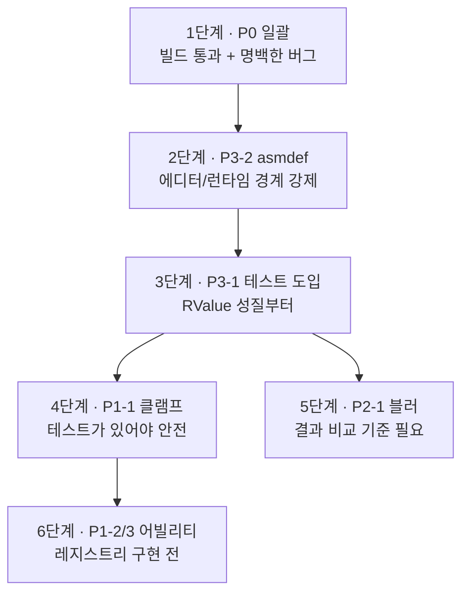

# 보완 필요 항목

> 문서 01~04 작성 과정에서 확인된 결함·미완성 항목의 종합 목록
> 최종 갱신 2026-07-28

## 1. 목적

포트폴리오 문서 4편을 쓰면서 코드를 정독한 결과 나온 항목들을 한 곳에 모았습니다.
각 문서의 「한계와 알려진 문제」 절에 흩어져 있던 것과,
문서에는 넣지 않았지만 확인된 프로젝트 전반 이슈를 함께 담았습니다.

**분류 기준은 "얼마나 나쁜가"가 아니라 "지금 고칠 수 있는가"입니다.**
같은 버그라도 한 줄로 끝나는 것과 밸런스 재조정을 동반하는 것은
착수 조건이 다르기 때문입니다.

| 등급 | 성격 | 착수 조건 |
|---|---|---|
| **P0** | 빌드 차단 또는 명백한 오동작 | 없음 — 즉시 가능 |
| **P1** | 구조적 결함 | 설계 결정 필요 |
| **P2** | 품질 문제 | 출력이 바뀌므로 눈으로 검증 필요 |
| **P3** | 기반 정비 | 별도 작업 단위 |

총 **28건**입니다.

---

## 2. P0 — 즉시 가능 (7건)

검증 없이도 옳다고 판단할 수 있고, 수정 범위가 국소적인 것들입니다.

### P0-1. 플레이어 빌드 실패 — `UnityEditor` 가드 누락 (6개 파일)

런타임 클래스에서 `UnityEditor`를 `#if UNITY_EDITOR` 없이 참조합니다.
에디터에서는 동작하지만 **플레이어 빌드가 컴파일 오류로 실패**합니다.

| 파일 | 형태 |
|---|---|
| `Fields/Interact/Prop/Prop.cs` | `using UnityEditor;`, `using UnityEditorInternal;` |
| `Fields/MainCamera.cs` | `using UnityEditor;` + `[CustomEditor]` 클래스 동거 |
| `Fields/Map/MapOverlay.cs` | `using UnityEditor;` |
| `DataManager.cs` | `using UnityEditor;` + `[InitializeOnLoad]`, `[MenuItem]` |
| `Editors/InspectorDrawer/UnityMethodDrawer.cs` | `using UnityEditor;` |
| `Extensions/StringExtensions.cs` | `UnityEditor.ObjectNames.NicifyVariableName` 정규화 참조 |

같은 폴더의 `EnumAsElementName.cs` / `InspectorName.cs` / `ReadOnly.cs`는
이미 가드가 있으므로, **그 패턴을 그대로 적용**하면 됩니다.

에디터 전용 클래스는 `Editor` 폴더로 분리하는 것이 정석이지만,
우선은 가드만 넣어 빌드를 통과시키는 편이 빠릅니다.

> 이 프로젝트는 **한 번도 플레이어 빌드를 해본 적이 없는 것으로 보입니다.**
> 빌드를 시도했다면 즉시 발견됐을 문제입니다.

### P0-2. 카메라 콜백이 모든 카메라에서 실행됨

`MainCamera.cs:69` — `beginCameraRendering`은 렌더링되는 카메라마다 호출되는데
`Camera cam` 인자를 한 번도 쓰지 않습니다.
UI 카메라나 리플렉션 프로브가 있으면 **페이드 속도가 카메라 수만큼 빨라지고**,
에디터에서는 씬 뷰 카메라까지 이 로직을 돌립니다.

```csharp
protected void MakeTranslucencyProps(ScriptableRenderContext context, Camera cam) {
  if (cam != Cam) return;   // ← 추가
  ...
```

*출처: 04 문서 5절 · P0 중 우선순위 최상*

### P0-3. `targeted` 플래그 미연결

`MainCamera.cs:59, 105` — `Blender.targeted`는 `ToFadeMode()`를 한 번만 부르려고
만든 필드인데 어디서도 `true`로 설정되지 않아 조건이 항상 참입니다.
가리는 오브젝트마다 매 프레임 셰이더 키워드 설정과 패스 토글이 반복됩니다.

```csharp
if (pair.Value.targeted is false) {
  pair.Value.material.ToFadeMode();
  pair.Value.targeted = true;   // ← 추가
}
```

복원 경로(`SetLitVar` 후 `blenders.Remove`)에서 항목 자체가 제거되므로
플래그를 `false`로 되돌릴 지점은 따로 필요 없습니다.

### P0-4. `FieldUnit.cs` 인코딩 손상 복원

EUC-KR → UTF-8 변환(커밋 `bb73f662`) 때 깨진 주석이 남아 있습니다.
전수 조사 결과 **`Units/FieldUnit.cs` 한 파일뿐**이고, 한자 혼입 20자 규모입니다.

```csharp
//todo Decision 愿???⑥닔瑜?臾띠쓣 寃?
/// 상황에 따라 유닛이 달리거나 걸을 수 있는지 판단합니다. 湲곕낯?곸쑝濡?...
```

원문 복원은 불가능하므로(정보가 소실됨) **문맥에 맞게 다시 작성**해야 합니다.
분량이 작아 한 번에 끝납니다.

### P0-5. `blockings` 자료구조 교체

`MainCamera.cs:72` — `List<int>`의 `Contains()`가 선형 탐색입니다.
`HashSet<int>`로 바꾸면 됩니다. 동작 변화 없음.

### P0-6. 죽은 코드 제거 — `ToOpaqueMode()`

`MainCamera.cs:135` — 설계 변경(스냅샷 복원 방식 채택)의 잔재로
정의만 있고 호출부가 없습니다.

> 삭제 대신 **주석으로 "왜 안 쓰는지"를 남기는 편**이 나을 수 있습니다.
> 나중에 같은 함수를 다시 만들 유혹이 있는 종류의 코드입니다.

### P0-7. `MapTexture` 채널 주석 불일치

주석은 `B: occupy, A: biome`인데 실제 인코딩은 `B: biome, A: land`입니다.
소비하는 쪽이 실제 인코딩을 따르므로 동작 문제는 없습니다.

**단, 이 파일은 포크한 별도 저장소**
(`TcDRair/polygon-map-unity`, 현재 detached HEAD)**에 있습니다.**
수정하려면 서브모듈에서 브랜치 체크아웃 → 커밋 → 푸시 →
부모 저장소의 서브모듈 포인터 갱신이 필요합니다.
한 줄 수정치고 절차가 크므로 서브모듈에 손댈 일이 생길 때 묶어서 처리하는 편이 낫습니다.

---

## 3. P1 — 설계 결정 필요 (7건)

무엇이 옳은지 정해야 고칠 수 있는 것들입니다.

### P1-1. `RAFloat`이 최종 클램프를 하지 않음 ★

`RValue.cs:124, 46, 166`

```csharp
// RMFloat : 최종 클램프 O
public virtual float Value => Nullify ? 0 : Mathf.Clamp((value + add) * mul, Min, Max);
// RVFloat : 최종 클램프 X (생성 시점의 baseValue만 클램프)
public readonly float Value => Nullify ? 0 : (baseValue.Value + Adder) * Multiplier;
// RAFloat : RVFloat.Value를 그대로 반환 → 선언 범위를 넘어설 수 있음
public override float Value => RVValue.Value;
```

`RunSpeed = new(runSpeed, 0, 20)`의 상한 20이 최종값에 적용되지 않습니다.
상속 관계인 두 타입이 같은 표현식에 다르게 반응하는 것이라 결함이 맞지만,
**현재 밸런스가 이 동작 위에서 맞춰져 있습니다.**

결정할 것 — 적용기 체인 **이후**에 클램프할 것인가, **이전**에 할 것인가.
이후가 자연스럽지만, 그러면 버프가 상한에 막혀 체감이 달라집니다.

### P1-2. `Ability` 인스턴스의 가변 상태 ★

`RunnersHigh`의 `trigger`/`elapsed`, `IronStep`의 `rcr`이 어빌리티 필드입니다.
현재는 `Player.Start()`에서 유닛마다 새로 만들어 문제가 없지만,
`Ability.cs:50-52`의 `Abilities` 싱글턴이
`Dictionary<Abil, Ability>`로 **어빌리티를 공유하려는 설계**입니다.

이대로 레지스트리를 구현하면 여러 유닛이 같은 인스턴스의 상태를 덮어씁니다.
**레지스트리를 구현하기 전에 반드시 정리해야 합니다.**

결정할 것 — 상태를 `UnitEffect`로 옮길 것인가,
어빌리티를 유닛마다 복제할 것인가.
전자가 맞아 보이지만 `Effect.Stack` 외에 상태 슬롯이 더 필요합니다.

### P1-3. 효과 중첩·갱신 미구현

`FieldUnit.cs:96-114` — 같은 `IDSet`의 효과를 다시 적용하면 아무 일도 없습니다.

```csharp
if (effects.TryGetValue(effect.ID, out var e)) {
  //todo 효과 중첩 or 갱신 or 덮어쓰기
}
```

결정할 것 — 중첩/갱신/덮어쓰기 중 무엇을 기본으로 할지,
그리고 그 선택을 효과별로 지정 가능하게 할지.
`RemoveEffect(stack >= 0)` 경로도 함께 비어 있습니다.
**P1-2와 함께 다뤄야 합니다** (스택 상태의 소유자가 정해져야 하므로).

### P1-4. `UnitStat` / `UnitInfo`가 가변 struct

값 타입 멤버(`RFloat Load`)와 참조 타입 멤버(`RAFloat HP`)가 섞여 있어
복사 시맨틱이 일관되지 않습니다. 복사하면 참조 멤버는 공유되고 값 멤버는 스냅샷이 됩니다.

```csharp
var s = P.stat;   // FieldUI — 읽기만 해서 현재는 무해
s.Load += 10;     // 이렇게 쓰면 원본에 반영되지 않음
```

결정할 것 — 클래스로 전환할 것인가, `readonly ref` 접근만 허용할 것인가.
클래스 전환이 단순하지만 매 프레임 접근 경로라 할당 비용을 확인해야 합니다.

### P1-5. 적용기 순서에 우선순위 없음

`Aggregate`가 도는 순서는 델리게이트 **등록 순서**입니다.
기본 적용기가 `Start()`에서 먼저 등록되고 어빌리티가 나중에 붙는 현재 구성에서는
의도대로 동작하지만, **문서화되지 않은 암묵적 계약**입니다.
가산 적용기와 승산 적용기가 섞이면 순서가 결과를 바꿉니다.

결정할 것 — 우선순위 값을 도입할 것인가,
아니면 "가산 먼저, 승산 나중"을 규약으로 못박고 검증할 것인가.

### P1-6. `Ability.ID`가 직렬화에 부적합

`Ability.cs:45` — `(FieldID, AbilID).GetHashCode()`는 실행 간 안정성이 보장되지 않습니다.
세이브 데이터에 쓰려면 명시적 ID가 필요합니다.
**저장/로드를 구현하는 시점에 반드시 걸립니다.**

### P1-7. `OccupyGrid`의 점유 의미 미정

축소 변환의 `&=` → `|=` 버그는 수정했지만, 상위 의미가 정해지지 않았습니다.
호출부가 육지를 `FULL`(완전 점유)로 매핑하고 있어
**"육지 = 건축 가능"인지 "육지 = 점유됨"인지** 불분명합니다.
현재 이 값을 소비하는 코드가 없어 드러나지 않은 상태입니다.

결정할 것 — 건축 시스템을 되살릴 때 함께 정의.

---

## 4. P2 — 출력 검증 필요 (6건)

수정 자체는 간단하지만 **결과물이 달라져** 눈으로 확인해야 하는 것들입니다.

### P2-1. 블러가 in-place로 동작

`TerrainGenerator.cs` — 하이트맵 블러는 이웃 평균을 같은 배열에 바로 씁니다.
스플랫맵 블러는 별도 버퍼(`result`)를 할당해 두고도
매 반복 끝에 `splatmap = result` 한 방향으로만 대입해서,
**반복 2회차부터는 두 변수가 같은 배열을 가리켜** 역시 in-place가 됩니다.
(`iterations` 범위가 1~3이라 기본값 1에서만 무사합니다.)

```csharp
(splatmap, result) = (result, splatmap);   // 버퍼 교대로 해결
```

둘 다 주사 방향으로 미세한 편향이 생깁니다.
**고치면 생성 지형이 달라지므로 샘플 프리셋 시드 재선정이 동반됩니다.**

### P2-2. `MIN_ALPHA = 0.85`

`MainCamera.cs:54` — 85% 불투명이면 사실상 거의 안 비칩니다.
튜닝 과정에서 남은 값으로 보이며 0.2~0.4 수준이 의도에 맞을 것입니다.
실제로 눈으로 보면서 정해야 합니다.

### P2-3. `renderer.material` 접근이 머티리얼을 복제

`MainCamera.cs:86` — 필터 검사 단계에서 이미 `renderer.material`을 읽습니다.
Unity에서 이 프로퍼티는 접근 순간 **렌더러 전용 인스턴스를 생성**하므로,
스쳐 지나간 오브젝트까지 인스턴스가 생기고 SRP 배칭에서 빠집니다.
필터는 `sharedMaterial`로, 실제 조작 시점에만 `material`을 잡아야 합니다.

### P2-4. 플레이어 렌더러를 하나만 제외

`MainCamera.cs:35` — `GetComponentInChildren<Renderer>()`는 첫 번째만 반환합니다.
캐릭터가 몸·옷·무기로 나뉘면 나머지가 가림 대상으로 잡혀 자기 자신이 투명해집니다.
현재 캐릭터 구성에서는 드러나지 않지만, 장비 시스템을 붙이면 즉시 발생합니다.

### P2-5. 레이캐스트에 레이어 마스크 없음

`MainCamera.cs:76` — 바닥은 레이 길이를 `-0.2f` 줄여서 피하고 있습니다.
`MainSetting`에 이미 마스크 상수가 정의되어 있으므로 그걸 쓰면 더 싸고 정확합니다.
다만 어떤 레이어를 가림 대상으로 볼지 정하는 판단이 필요합니다.

### P2-6. `UnitEffect.Stack` 초기값이 계산식에 유입

`UnitEffect.cs:33` — 기본값 `-1`은 "스택 없음"을 뜻하는 UI용 감시값인데,
`RunnersHigh`가 이를 초기화하지 않고 활성화합니다.
첫 틱까지 약 1초 동안 `Stack = -1`이 그대로 계수 계산에 들어갑니다.
`Reset()`이 존재하지만 `ToggleOff`에서만 호출됩니다.

`OnApply`에서 `Reset()`을 부르면 해결되지만,
**P1-3(중첩 구현)과 함께 정리하는 편이 낫습니다.**

---

## 5. P3 — 기반 정비 (8건)

별도의 작업 단위가 필요한 것들입니다.

### P3-1. 테스트 전무 ★

`com.unity.test-framework`는 설치되어 있지만 테스트가 하나도 없습니다.
이 프로젝트에서 **가장 아쉬운 부분**입니다.
특히 아래는 속성 기반 테스트에 정확히 맞는 대상입니다.

| 대상 | 검증할 성질 |
|---|---|
| `RValue` 연산자 | 적용 후 해제하면 원래 값으로 돌아온다 |
| `RValue` 연산자 | 적용 순서를 바꿔도 결과가 같다 |
| 섬 생성 | 육지 비율이 목표치 ±1%로 수렴한다 |
| 섬 생성 | 모든 강이 해안 또는 종점에 도달한다 |
| 섬 생성 | 고도가 `[-1, 1]` 범위를 벗어나지 않는다 |
| 스플랫맵 | 모든 바이옴 행의 가중치 합이 1이다 |

마지막 항목은 이번에 수동으로 검산했지만(18행 전부 1.0),
테스트가 있었다면 `TODO` 주석이 몇 달간 남아 있지 않았을 것입니다.

### P3-2. asmdef 부재

전체가 `Assembly-CSharp` 단일 어셈블리입니다.
스크립트 하나만 고쳐도 전체가 재컴파일되고,
**에디터 코드와 런타임 코드의 경계가 강제되지 않습니다** — P0-1의 근본 원인입니다.

최소 분할안: `Rair.Runtime` / `Rair.Editor` / `Rair.Tests`.
P0-1을 가드로 때우는 대신 이걸 하면 같은 문제가 재발하지 않습니다.

### P3-3. 어빌리티 데이터 하드코딩

`Ability.cs:59` — `Abilities.Initialize()`가 `//TODO 데이터 로드`로 비어 있고,
어빌리티 3종이 C# 클래스로 직접 작성돼 있습니다.
발동도 디버그 키(`F5`~`F10`)로만 가능합니다.

`Assets/Migrated`의 이전 이터레이션에 **JSON 데이터 주도 + 설명문 미니 DSL**이
이미 구현되어 있으므로, 그 방식을 되살리는 것이 출발점입니다.

### P3-4. 런타임 맵 생성 불가

`RandomTextureGenerator`와 `TerrainGenerator`가 `#if UNITY_EDITOR`로 묶여 있고
`EditorCoroutine`에 의존합니다.
인게임에서 맵을 생성하려면 코루틴 구동부를 교체해야 합니다.
`ProgressTimer` 자체는 런타임 의존성이 없으므로 그대로 쓸 수 있습니다.

### P3-5. `RECOVERY-TODO.md`가 최신이 아님

마지막 갱신이 `9334a15f`(07-25)이라 이후 두 커밋의 결과가 반영되어 있지 않습니다.
현재 52개 파일 / 506행 / 고유 GUID 70개가 등록되어 있는데,
**실제 잔여량은 이보다 적습니다.**

### P3-6. 복구 대상과 정리 대상이 섞여 있음

`RECOVERY-TODO.md`의 상당수는 GUID 유실 사고와 무관합니다.

- `Small Wooden Shelter.prefab`의 127건 → `Scripts/Fields/Building` 폴더가 사고 이전에 삭제됨
- `Map Generator.prefab`의 `MapGenScript` → 커밋 `e3a6185`에서 제거됨

**복구할 것과 삭제할 것을 분리**해야 남은 목록이 실질적으로 줄어듭니다.

### P3-7. 복구 탐색 스크립트 미보존

GUID 특정에 쓴 일회용 스크립트들이 커밋되지 않았습니다.
근거와 결론은 커밋 메시지에 남아 있지만 **판정 과정을 재실행할 수 없습니다.**
최소한 "끊긴 참조 수집"과 "도달 가능성 BFS"는 상시 점검 도구로 복원해 두면,
같은 사고의 조기 발견에도 쓸 수 있습니다.

### P3-8. `TH_ToonWater` 셰이더 임시 조치

`_CameraDepthTexture_TexelSize` 중복 정의를 주석 처리로 우회했습니다(`5cf1cfaf`).
**Toon Harbor Pack을 다시 임포트하면 되돌아갑니다.**
재적용이 필요하다는 사실 자체를 잊기 쉬운 종류의 부채입니다.

---

## 6. 착수 순서 제안

의존 관계와 비용을 고려한 순서입니다.



**1단계 (P0)** — 반나절 규모. 빌드가 통과하는 상태를 먼저 만듭니다.
지금은 프로젝트가 실행 가능한지조차 확인되지 않은 상태입니다.

**2단계 (P3-2)** — asmdef를 P0-1의 가드보다 먼저 하는 것도 방법입니다.
어셈블리를 나누면 에디터 코드가 런타임을 오염시키는 것이 **컴파일 단계에서 막힙니다.**
다만 참조 관계 정리에 시간이 걸리므로, 빌드를 급히 통과시켜야 하면 P0-1을 먼저 합니다.

**3단계 (P3-1)** — P1과 P2를 건드리기 전에 필요합니다.
특히 `RValue`의 "원복 가능" "순서 무관" 성질은
테스트 없이 고치면 회귀를 알아챌 방법이 없습니다.

**4~5단계** — 테스트/기준선이 생긴 뒤에 착수.
P2-1(블러)은 생성 결과 비교가 필요하므로 스크린샷 기준선을 먼저 잡아야 합니다.

**6단계** — P1-2와 P1-3은 함께 다뤄야 합니다.
스택 상태의 소유자가 정해져야 중첩 규칙을 정의할 수 있습니다.

---

## 7. 출처 인덱스

| 등급 | 항목 | 출처 문서 |
|---|---|---|
| P0-1 | `UnityEditor` 가드 누락 | 03, 신규 전수 조사 |
| P0-2 | 카메라 콜백 필터 누락 | 03 |
| P0-3 | `targeted` 미연결 | 03 |
| P0-4 | 인코딩 손상 | 신규 전수 조사 |
| P0-5 | `blockings` 자료구조 | 03 |
| P0-6 | `ToOpaqueMode` 죽은 코드 | 03 |
| P0-7 | 채널 주석 불일치 | 01 |
| P1-1 | `RAFloat` 클램프 | 02 |
| P1-2 | `Ability` 가변 상태 | 02 |
| P1-3 | 효과 중첩 미구현 | 02 |
| P1-4 | 가변 struct | 02 |
| P1-5 | 적용기 순서 | 02 |
| P1-6 | `Ability.ID` 직렬화 | 02 |
| P1-7 | `OccupyGrid` 의미 | 01 |
| P2-1 | 블러 in-place | 01 |
| P2-2~5 | 카메라 관련 4건 | 03 |
| P2-6 | `Stack` 초기값 | 02 |
| P3-1 | 테스트 전무 | 01, 02 |
| P3-2 | asmdef 부재 | 전체 파악 |
| P3-3 | 어빌리티 하드코딩 | 02 |
| P3-4 | 런타임 생성 불가 | 01 |
| P3-5~7 | 복구 잔여 3건 | 04 |
| P3-8 | 셰이더 임시 조치 | 04 |

---

## 8. 이미 처리된 항목

기록 목적으로 남깁니다.

| 항목 | 처리 | 근거 |
|---|---|---|
| `OccupyGrid.ApplyScale`이 `&=` 누적으로 항상 빈 결과 | `\|=`로 수정 | 0 초기화 배열에 `&=`는 의도일 수 없음. 합집합이 범위 밖 `FULL` 처리와 일관 |
| 스플랫맵 배합비 `TODO` | 제거 후 불변 조건 주석으로 대체 | 18행 전부 합 1.0 검산 완료, `Biome` 18종 전부 스위치에 포함 |
