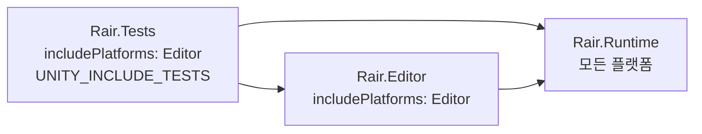

# 엔지니어링 — 어셈블리 · 테스트 · 감사 도구

> Unity 2023.2 / URP · C# · 개인 프로젝트 *BuilderRPG*
>
> 게임 콘텐츠가 아니라 **프로젝트를 굴러가게 만든 작업**의 기록입니다.
> 다른 문서가 "무엇을 만들었나"라면 이 문서는 "그것을 어떻게 지키고 있나"입니다.

## 1. 개요

개인 프로젝트가 오래되면 공통적으로 겪는 것들이 있습니다 —
빌드가 안 되고, 고쳐도 뭐가 깨졌는지 모르고, 에셋이 조용히 끊깁니다.
이 프로젝트도 전부 겪었고, 세 방향으로 대응했습니다.

| 영역 | 이전 | 현재 |
|---|---|---|
| 어셈블리 | 정의 없음. `#if UNITY_EDITOR` 산재 | **`Rair.Runtime` / `Rair.Editor` / `Rair.Tests` 3분할** |
| 플레이어 빌드 | **실패** — 런타임 코드가 `UnityEditor` 참조 | **통과** (프로젝트 최초) |
| 테스트 | **0개** | **81개 메서드 · 97개 실행 케이스** (`[Values]` 전개 포함) |
| 끊긴 참조 | 일회용 스크립트로 그때그때 조사 | 상시 도구 3종 — 목록이 자동 생성됩니다 |

규모는 다음과 같습니다.

| 어셈블리 | 파일 | 행 | 성격 |
|---|---|---|---|
| `Rair.Runtime` | 53 | 4,301 | 게임 로직. 빌드 산출물에 포함 |
| `Rair.Editor` | 12 | 1,153 | 에디터 도구. **산출물에서 제외** |
| `Rair.Tests` | 8 | 1,560 | EditMode 테스트 81개 메서드 |

---

## 2. 어셈블리 3분할

### 2.1 문제는 빌드가 아니라 검색이었습니다

플레이어 빌드가 실패하고 있었습니다. 런타임 코드가 `UnityEditor`를 참조했기 때문입니다.
처음 조사에서 대상은 6건으로 파악됐습니다.

**착수해 보니 12건이었습니다.** 나머지 6건은 `UnityEditor` 문자열 검색으로 잡히지 않는 형태였습니다.

| 누락분 | 실제 형태 |
|---|---|
| `TerrainProps.cs` | `[EnumAsElementName]`을 쓰는데 **어트리뷰트 정의 자체가** `#if UNITY_EDITOR` 안에 있어 빌드 시 타입이 소멸 |
| `TerrainGenerator.cs` | `using UnityEditor;`가 `#if UNITY_EDITOR` **바깥**에 위치 |
| `RTGEditor.cs` | 동일 — `using`이 가드 밖 |
| 서드파티 도구 3파일 | 전부 에디터 코드인데 `Editor` 폴더 밖 + 가드 없음 |

"가드가 있는가"가 아니라 **"가드가 무엇을 감싸고 있는가"**를 봐야 드러나는 것들입니다.

여기서 방향이 정해졌습니다. 가드를 더 꼼꼼히 붙이는 것으로는 같은 유형이 계속 새어 나옵니다.
**컴파일러가 잡아야 할 문제를 검색으로 잡으려 한 것이 원래의 문제**였습니다.

### 2.2 구조



의존은 한 방향으로만 흐릅니다. `Rair.Runtime`은 위쪽을 모릅니다.

```jsonc
// Rair.Editor.asmdef
{
  "name": "Rair.Editor",
  "references": [ "Rair.Runtime", "UnityEngine.UI", "Unity.TextMeshPro",
                  "Unity.EditorCoroutines.Editor" ],
  "includePlatforms": [ "Editor" ]
}
```

`includePlatforms: ["Editor"]` 한 줄이 이전의 모든 `#if UNITY_EDITOR`를 대체합니다.
가드가 표현하던 사실이 **어셈블리 경계로 표현**되므로, 위반하면 컴파일이 실패합니다.

### 2.3 빌드 산출물로 확인했습니다

**StandaloneWindows64 / Mono / Development 빌드가 통과했습니다.** 프로젝트 최초입니다.

| `BuilderRPG_Data/Managed/` | 결과 |
|---|---|
| `Rair.Runtime.dll` | 포함 |
| `Assembly-CSharp.dll` | 포함 (`Assets/Migrated` 등 아직 asmdef 밖에 있는 코드) |
| `Rair.Editor.dll` | **미포함** |
| `Assembly-CSharp-Editor.dll` | **미포함** |

에디터 어셈블리가 산출물에서 완전히 빠집니다.
앞으로 런타임 코드가 에디터 API에 의존하면 **빌드가 아니라 컴파일 단계에서** 막힙니다.
재발 경로가 닫혔다는 뜻입니다.

### 2.4 함정 — 에디터 어셈블리에 씬 컴포넌트를 두면 안 됩니다

분할 과정에서 `RandomTextureGenerator`(맵 생성 설정을 들고 있는 씬 컴포넌트)를
`Rair.Editor`로 옮겼습니다. **잘못이었습니다.**

**에디터 전용 어셈블리의 `MonoBehaviour`를 씬에 붙이면
플레이 모드를 오갈 때 직렬화 값이 전부 기본값으로 초기화됩니다.**
필드가 사라지는 것이 아니라 값만 0/null이 됩니다.

```diff
-  seed: 870685556                    +  seed: 0
-  mapSize: 512                       +  mapSize: 0
-    MapTerrain: {fileID: 1086074461} +    MapTerrain: {fileID: 0}
```

**에디트 모드에서는 전혀 드러나지 않습니다.** 컴파일·바인딩·씬 검증이 모두 통과합니다.
당시 "유실 스크립트 0건 / 컴파일 오류 0건"으로 안전하다고 판단했지만,
그 검증은 이 문제를 잡을 수 없는 종류였습니다.

타입을 런타임 어셈블리로 되돌린 뒤 같은 왕복을 하니 값이 전부 유지되는 것으로 확정했습니다.
결론은 **역할로 쪼개는 것**이었습니다.

| 어셈블리 | 파일 | 역할 |
|---|---|---|
| `Rair.Runtime` | `Fields/Map/RandomTextureGenerator.cs` | MonoBehaviour + 직렬화 필드 |
| `Rair.Runtime` | `Fields/Map/MapGeneratorData.cs` | 설정 구조체 |
| `Rair.Runtime` | `Fields/Map/TerrainGenerator.cs` | 지형 생성 로직 (에디터 의존 없음) |
| `Rair.Editor` | `Editors/Map/MapGenerationRunner.cs` | 생성 코루틴 구동 · 에셋 저장 |
| `Rair.Editor` | `Editors/Map/RTGEditor.cs` | 인스펙터 |

"에디터에서만 쓰는 것"과 "에디터 API를 쓰는 것"은 다릅니다.
전자는 런타임 어셈블리에 있어도 됩니다. 후자만 넘어가야 합니다.
이 구분을 놓친 것이 실수의 원인이었고, 지금은 해당 파일 주석에 경고를 달아 두었습니다.

부수 효과로 **인게임 맵 생성 경로가 열렸습니다.** 생성 로직이 런타임 쪽에 있으므로,
남은 것은 구동부에서 `EditorCoroutine` 의존을 걷어내는 일뿐입니다.

---

## 3. 테스트 — 0개에서 81개로

### 3.1 무엇을 검사할 것인가

맵 생성은 시드마다 결과가 다릅니다. 기대 출력을 적어 둘 수 없습니다.
그래서 특정 값이 아니라 **어떤 시드에서도 성립해야 하는 불변 조건**만 검사합니다.

| 테스트 | 대상 | 성질의 예 |
|---|---|---|
| `IslandGenerationTests` | 그래프 생성 | 육지 비율이 목표에 ±1% 수렴한다 · 강이 바다로 흐른다 |
| `TerrainApplicationTests` | Terrain 적용 | 해수면이 월드 원점 높이에 온다 · 모든 프롭이 지표면에 놓인다 |
| `SplatmapTests` | 바이옴 가중치 표 | **모든 바이옴의 가중치 합이 1이다** |
| `TerrainSnapTests` | 지표면 스냅 계산 | 통제된 인공 지형에서 기대값과 일치한다 |
| `RValueTests` | 스탯 값 계층 | 적용 후 해제하면 원래 값으로 돌아온다 · 적용 순서를 바꿔도 결과가 같다 |
| `UnitEffectTests` | 효과 중첩·갱신 | 갱신은 지속시간이 긴 쪽을 남긴다 |
| `OccupyGridTests` | 점유 플래그 의미 | 축소 시 합집합으로 누적된다 |

`SplatmapTests`가 좋은 예입니다. 바이옴 18종의 가중치 표를 원래는 손으로 검산했고,
그래서 `TODO` 주석이 몇 달간 남아 있었습니다.
지금은 `Biome` 열거형을 **직접 순회**하므로 바이옴을 추가하고 가중치 행을 빠뜨리면
자동으로 실패합니다 (기본값이 0이라 합이 1이 되지 않기 때문).
표를 손으로 세는 것과 달리 이 성질은 시간이 지나도 유지됩니다.

`OccupyGridTests`는 사정이 다릅니다.
이 값을 소비하는 코드가 아직 없어(건축 시스템 부재) 회귀를 잡을 다른 수단이 없습니다.
그래서 **의미 자체를 테스트로 못박았습니다** — "플래그가 서 있으면 그만큼 이미 차 있다".

### 3.2 중첩 코루틴을 테스트에서 돌리기

맵 생성 파이프라인은 진행률 표시를 위해 코루틴으로 작성되어 있고,
`yield return 다른코루틴()` 형태로 단계를 중첩합니다.
이 중첩을 펼치는 것은 **Unity 런타임 스케줄러의 일**이라 EditMode에는 없습니다.

```csharp
while (e.MoveNext()) { }   // 안쪽 단계가 실행되지 않은 채 통과한다
```

아무것도 검증하지 못하는 테스트가 됩니다. 그래서 스케줄러의 규칙을 직접 구현했습니다.

```csharp
public static void RunToEnd(IEnumerator routine) {
  while (routine.MoveNext())
    if (routine.Current is IEnumerator nested) RunToEnd(nested);
}
```

`Current`가 `IEnumerator`면 재귀로 내려가고, `yield return null`(한 프레임 양보)은 무시합니다.
결과적으로 전체 절차가 한 번에 완주합니다. 세 줄이지만 이것이 없으면
지형 관련 테스트 40여 건이 전부 무의미해집니다.

### 3.3 테스트를 검증했습니다 — 변이 테스트

**사후에 쓴 테스트가 통과하는 것만으로는 아무것도 증명되지 않습니다.**
이미 고쳐진 코드에 대해 쓴 테스트는, 애초에 결함을 잡을 능력이 없어도 초록색이 뜹니다.

그래서 고쳤던 결함을 **일부러 다시 넣어** 실제로 잡히는지 확인했습니다.

`TerrainApplicationTests` —

| 변이 (결함 재현) | 결과 |
|---|---|
| 높이를 상수 10으로 되돌림 (P0-10) | **4건 실패** — 높이 3건 + `해수면이_월드_원점_높이에_온다` |
| 오프셋 설정 제거 (P0-11) | **3건 실패** — 오프셋 2건 + 해수면 1건 |
| `SampleHeight` 제거 (P0-13) | **1건 실패** — `모든_프롭이_지표면_높이에_놓인다` |

`해수면이_월드_원점_높이에_온다`가 앞의 두 변이에 **모두** 걸리는 것이 의도한 바입니다.
높이와 오프셋은 한 쌍이고, 이 테스트가 그 짝의 일관성을 봅니다.

`TerrainSnapTests` —

| 변이 | 결과 |
|---|---|
| `SurfaceHeight`에서 터레인 y 오프셋 제거 | 7건 실패 |
| `GetBottom`이 항상 피벗을 반환 | 6건 실패 |
| `Contains`가 항상 `true` | 3건 실패 |
| `Undo.RecordObject` 제거 | 1건 실패 |
| `Undo.CollapseUndoOperations` 제거 | **0건 — 잡지 못했습니다** |
| Undo 그룹 관리 전체 제거 | **0건 — 잡지 못했습니다** |

마지막 두 건을 그대로 기록해 둔 이유가 있습니다.
이것은 테스트의 구멍이 아니라 **변이가 동작을 바꾸지 않았다**는 뜻입니다.
한 호출 안의 `RecordObject`들은 프레임 경계가 없어 이미 같은 그룹에 들어갑니다.
그룹 관리가 실제로 기여하는 것은 되돌리기 이력의 *이름*과 직전 편집과의 분리인데,
그것은 자동 검사보다 사람이 Undo 메뉴를 보는 편이 확실합니다.

**변이가 잡히지 않았을 때 테스트를 늘리는 것이 항상 옳지는 않습니다.**
먼저 그 변이가 정말 다른 동작인지를 물어야 합니다.

### 3.4 테스트가 못 하는 것

정직하게 적습니다.

| 못 하는 것 | 이유 |
|---|---|
| `FieldUnit` 경로 전반 | `MonoBehaviour`라 EditMode에서 생성할 수 없습니다. `UnitEffect` 자체 규칙만 검사합니다 |
| 상호작용 · 작업 큐 | 같은 이유. `Prop`·`FieldUnit` 모두 씬 컴포넌트입니다 |
| 씬 전체 훑기 (`FindBuried`) | 대상이 열려 있는 씬의 최상위 오브젝트라 테스트가 통제할 수 없습니다. 판정의 실체인 `TryGetGap`만 검사합니다 |
| 카메라 반투명화 | 렌더링 결과 검증이 필요합니다 |
| 플레이 모드 왕복 | 2.4절의 직렬화 유실은 **자동 검사로 잡히지 않았습니다.** 사람이 플레이 모드에 들어가야 했습니다 |

마지막 항목이 이 절의 요지입니다. 81개가 있어도 못 잡는 종류가 있고,
그걸 아는 것이 테스트를 늘리는 것보다 중요할 때가 있습니다.

---

## 4. 감사 도구 — 조용한 손상을 드러내기

2026년 7월 GUID 유실 사고([문서 07](07-에셋-GUID-복구.md)) 때 일회용 스크립트로 하던 일을
상시 도구로 옮겼습니다. 복구용이자 **조기 경보용**입니다.

| 도구 | 하는 일 | 메뉴 |
|---|---|---|
| `BrokenReferenceAudit` | 해석되지 않는 GUID 참조를 전수 수집 | — (아래 둘의 기반) |
| `RecoveryReport` | 원인 GUID 단위로 묶어 `RECOVERY-TODO.md` 생성 | `Tools/Rair/Audit/복구 목록 생성` |
| `ReachabilityAudit` | 씬·빌드 설정에서 BFS로 도달 불가 에셋 탐색 | `Tools/Rair/Audit/미참조 에셋 목록 생성` |

### 4.1 발생 지점이 아니라 원인으로 묶습니다

초기 목록은 참조 **발생 지점**을 한 행씩 나열했습니다.
그래서 프리팹 하나가 유실되면 그 안의 모든 오버라이드가 별도 행으로 잡혔습니다 —
`Small Wooden Shelter.prefab` 한 건이 127행을 차지했습니다.

실제로 손봐야 하는 것은 원인 GUID 몇 건입니다. 지금은 원인 단위로 묶고,
**복구할 것과 삭제할 것을 나눕니다.** 유실된 `m_Script`는 스크립트 파일이 지워진 결과이므로
되살릴 대상이 아니라 참조를 걷어낼 대상입니다.

현재 집계는 원인 GUID **109개** (복구 대상 101 / 정리 대상 8)입니다.

### 4.2 "참조되지 않음"과 "쓰이지 않음"은 다릅니다

도달 가능성 감사에서 가장 중요한 설계 판단입니다.
Unity에서는 정적 참조 없이 로드되는 것이 많습니다.

```csharp
static readonly (string prefix, string reason)[] ImplicitRoots = {
  ("Assets/Resources/",       "Resources.Load 경로 로드"),
  ("Assets/Editor/",          "에디터 도구"),
  ("Assets/Imported Assets/", "벤더 에셋 — 우리가 관리하지 않음"),
  // ...
};
```

여기 들어간 것은 "쓰이는 게 확실해서"가 아니라
**"정적 참조로는 판정할 수 없어서"**입니다. 이 구분을 주석에 명시해 두었습니다.

그래서 산출물의 성격도 못박아 두었습니다 — **삭제 목록이 아니라 조사 대상 목록입니다.**
현재 28건 / 19.4 MB이며 대부분 설계용 스크린샷과 이전 이터레이션의 씬입니다.

### 4.3 자동 생성과 수동 판정을 공존시킵니다

```csharp
const string MANUAL_MARKER = "<!-- MANUAL: 이 아래는 자동 생성이 덮어쓰지 않습니다 -->";
```

목록은 다시 뽑을 수 있어야 하지만, "이건 확인했고 이런 이유로 남긴다"는 판단은 보존되어야 합니다.
표식 아래를 덮어쓰지 않는 것으로 둘을 한 파일에 담았습니다.

---

## 5. 남은 한계

| 항목 | 내용 |
|---|---|
| `Assembly-CSharp` 잔존 | `Assets/Migrated` 등이 아직 asmdef 밖에 있어 기본 어셈블리로 컴파일됩니다 |
| PlayMode 테스트 부재 | 전부 EditMode입니다. 3.4절의 공백 대부분이 여기서 옵니다 |
| CI 없음 | 테스트·빌드가 수동 실행입니다. 개인 프로젝트라 우선순위를 낮게 두었습니다 |
| 감사 도구 수동 실행 | 메뉴에서 사람이 눌러야 합니다. 커밋 훅이나 주기 실행이 없습니다 |
| 커버리지 미측정 | 무엇을 덮는지는 3.1절의 대상 목록으로만 파악됩니다 |

---

## 6. 코드 위치

| 영역 | 경로 |
|---|---|
| 런타임 어셈블리 정의 | `Assets/Game Assets/Scripts/Rair.Runtime.asmdef` |
| 에디터 어셈블리 정의 | `.../Scripts/Editors/Rair.Editor.asmdef` |
| 테스트 어셈블리 정의 | `Assets/Tests/EditMode/Rair.Tests.asmdef` |
| 코루틴 구동 장치 | `Assets/Tests/EditMode/CoroutineDriver.cs` |
| 테스트 7종 | `Assets/Tests/EditMode/*Tests.cs` |
| 끊긴 참조 수집 | `.../Scripts/Editors/Audit/BrokenReferenceAudit.cs` |
| 복구 목록 생성 | `.../Editors/Audit/RecoveryReport.cs` |
| 도달 가능성 감사 | `.../Editors/Audit/ReachabilityAudit.cs` |
| 감사 산출물 | `RECOVERY-TODO.md` · `UNREACHABLE-ASSETS.md` (저장소 루트) |

처리 경위 전체는 [보완 작업 기록](internal/보완-작업-기록.md)에 있습니다.
