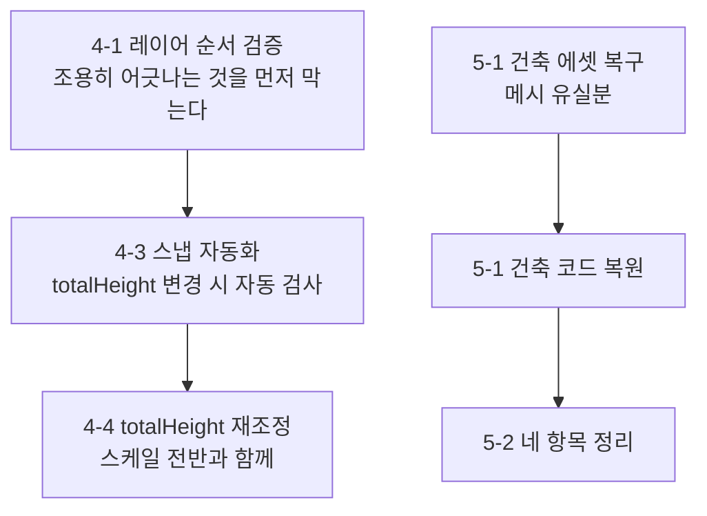

# 남은 작업

> 보완 계획([보완 작업 기록](보완-작업-기록.md)) 종료 시점의 잔여 항목 정리
> 최종 갱신 2026-08-04

## 1. 이 문서의 위치

보완 작업 기록은 **무엇을 고쳤는가**의 기록입니다. 항목별 경위와 판단 근거가 8절에 쌓여 있고,
분량이 1,300행을 넘어 "지금 뭘 해야 하는가"를 찾기 어려워졌습니다.

이 문서는 그 답만 따로 뽑은 것입니다.
각 항목의 배경이 필요하면 보완 작업 기록의 해당 절을 보십시오.

**보완 계획 자체는 종료되었습니다.** 아래는 의도적으로 남긴 것과, 작업 중 새로 드러난 것입니다.

---

## 2. 완료된 것 — 요약

| 영역 | 결과 |
|---|---|
| 빌드 | **플레이어 빌드가 통과합니다.** 프로젝트 최초 |
| 어셈블리 | `Rair.Runtime` / `Rair.Editor` / `Rair.Tests` 3분할 |
| 테스트 | 0개 → **81개 메서드 · 97개 실행 케이스** (`[Values]` 전개 포함) |
| 감사 도구 | 끊긴 참조 · 도달 가능성 · 지표면 스냅 — 목록이 자동 생성됩니다 |

원래 28건 중 25건을 처리했고, 작업 중 **6건(P0-8 ~ P0-13)을 새로 발견해 함께 처리**했습니다.

---

## 3. 의도적으로 제외한 것 (3건)

착수 조건이 오지 않았거나, 지금 할 이유가 없다고 판단한 것들입니다.

### 3-1. P1-6 · `Ability.ID`가 직렬화에 부적합

`(FieldID, AbilID).GetHashCode()`는 실행 간 안정성이 보장되지 않습니다.

**착수 조건** — 저장/로드를 구현할 때. 그 시점에 명시적 ID 체계를 함께 정하는 것이 맞습니다.
지금 정해 봐야 세이브 포맷이 정해지지 않아 다시 손대게 됩니다.

### 3-2. P3-3 · 어빌리티 데이터 주도화

`Abilities.Initialize()`가 비어 있고 어빌리티 3종이 C# 클래스로 직접 작성돼 있습니다.

**3-1에 종속됩니다.** 데이터에서 어빌리티를 식별할 안정적 ID가 없으면 스키마를 짤 수 없습니다.
출발점은 `Assets/Migrated`의 이전 이터레이션(JSON + 설명문 미니 DSL)입니다.

> P1-2를 처리해 어빌리티에서 가변 상태를 걷어냈으므로,
> **레지스트리 구현을 막던 구조적 장애물은 이미 없습니다.** 남은 것은 ID와 스키마뿐입니다.

### 3-3. P3-8 · `TH_ToonWater` 셰이더 임시 조치

`_CameraDepthTexture_TexelSize` 중복 정의를 주석 처리로 우회한 상태입니다.
Toon Harbor Pack을 다시 임포트하면 되돌아갑니다.

**재임포트 계획이 없으므로 지금 처리할 이유가 없습니다.**
임포트하게 되면 이 항목을 먼저 확인하십시오.

---

## 4. 지형 작업에서 새로 드러난 것 (5건)

`totalHeight`를 10 → 96으로 올리면서 나온 후속 항목입니다. 배경은 보완 작업 기록의 P0-13 절에 있습니다.

### 4-1. 바이옴 → 터레인 레이어 순서 결합이 주석뿐

`BiomeWeights`의 열 순서와 `terrainData.terrainLayers` 배열 순서가 일치해야 하는데
**코드로 강제되지 않습니다.** 레이어를 이름으로 조회해 배열을 구성하거나,
최소한 개수와 이름을 검사해야 합니다.

지금은 순서가 맞아 있지만, 레이어를 하나 끼워 넣는 순간 조용히 어긋납니다.

### 4-2. 터레인 레이어가 서드파티 에셋에 의존

복원한 8종이 `TerrainSampleAssets`의 것입니다. 그 패키지를 정리하면 같은 문제가 재발합니다.
자체 레이어로 대체하거나, 최소한 의존 사실을 문서에 명시해야 합니다.

### 4-3. 지표면 스냅이 수동

`TerrainSnap`으로 검사·수정은 되지만 사람이 실행해야 합니다.

- **가벼운 안** — `totalHeight`를 바꿀 때 생성기가 검사를 자동으로 겁니다
- **근본적인 안** — 씬 배치를 지형 상대 좌표로 둡니다. 씬 구조를 바꾸는 일이라 별도 작업입니다

### 4-4. `totalHeight` 기본값 96은 임시값

눈으로 보고 고른 첫 값입니다.
프롭 스케일·카메라 거리·이동 속도와 함께 다시 봐야 합니다.

### 4-5. `Terrain Palette.asset`의 끊긴 참조 6건

존재하지 않는 GUID 6개를 참조합니다. **이력에 없어 복구가 불가능하므로** 팔레트를 새로 구성해야 합니다.
현재 생성 경로는 팔레트를 쓰지 않아 동작에는 영향이 없습니다.

---

## 5. 별도 작업 단위 — 건축 시스템 복원

가장 큰 덩어리입니다. **이것 하나가 다른 항목 넷을 물고 있습니다.**

### 5-1. 선행 과제

| 과제 | 내용 |
|---|---|
| **에셋 복구** | `Corner Wall` · `Edge Wall` · `Diagonal Wall` · `Floor` · `Wall` 프리팹의 `m_Mesh`가 전부 유실 상태입니다. **코드를 되살려도 화면에 아무것도 나오지 않습니다** |
| API 재작성 | `Building.cs`가 현재 없는 `UI` 클래스를 호출합니다. 삭제 커밋(`0d8ef958`)이 상호작용 시스템을 갈아엎은 그 커밋이라 `Prop`/`Interaction` API가 전부 바뀌었습니다 |
| 어셈블리 분리 | `BuildableGrid.cs`는 MonoBehaviour와 인스펙터가 섞여 있습니다. 씬 컴포넌트이므로 런타임 어셈블리에 두어야 합니다 |

코드 자체는 `0d8ef958`에 남아 있습니다 — `BuildableGrid` 236행, `Building` 193행 등 총 452행.

> **주의** — 씬 MonoBehaviour의 타입을 에디터 전용 어셈블리에 두면
> 플레이 모드를 오갈 때 직렬화 값이 전부 기본값으로 초기화됩니다.
> 이 세션에서 실측으로 확인했고 되돌리는 데 시간을 썼습니다. 보완 작업 기록의 「P1-2 후속」 절 참조.

### 5-2. 함께 풀리는 것들

건축 시스템이 돌아오면 아래가 자연히 정리됩니다.

- **`Occupy` ↔ `Buildable` 대응 확정** — 플래그 구성이 거의 일대일입니다. 의미는 이미 정의해 뒀습니다("플래그가 서 있으면 그만큼 차 있다")
- **`MainCamera.blockingLayers` 선정과 `floorGap` 0 전환** — 무엇을 가림 대상으로 볼지가 정해집니다
- **반투명화를 원래 대상에서 재확인** — 지금은 임시 Lit 큐브로만 확인했습니다. 씬의 `Translucency Test Block`(비활성)을 켜면 재현됩니다
- **P1-4 가변 struct 재검토** — 현재는 복사 지점이 전부 읽기 전용이라 보류했습니다. 건축 시스템이 `stat`을 복사해 쓰기 시작하면 당위성이 생깁니다

---

## 6. 상시 점검 대상

수치가 남아 있는 것들입니다. 도구로 언제든 다시 뽑을 수 있습니다.

| 대상 | 현황 | 도구 |
|---|---|---|
| 끊긴 참조 | 원인 GUID **109개** (복구 대상 101 / 정리 대상 8) | `Tools/Rair/Audit/복구 목록 생성` |
| 미참조 에셋 | **28건 / 19.4 MB** | `Tools/Rair/Audit/미참조 에셋 목록 생성` |
| 지표면 어긋남 | 0건 (마지막 검사 기준) | `TerrainSnap` |

미참조 에셋 28건은 대부분 `Assets/Ideas/`(설계용 스크린샷·영상)와 `Assets/Migrated/`의 옛 씬입니다.
**삭제 목록이 아니라 조사 대상 목록**이라는 점에 유의하십시오 —
Unity에서 "참조되지 않음"과 "쓰이지 않음"은 다릅니다.

---

## 7. 착수 순서 제안

**4번대를 먼저** 하는 것이 낫습니다. 셋 다 작고, 지금 안 하면 나중에 조용히 어긋납니다.
특히 4-1은 레이어를 한 번만 건드려도 바로 문제가 되므로 값이 큽니다.

**5번은 별도 세션**으로 잡으십시오. 에셋 복구가 선행되어야 하고,
그 결과에 따라 코드 복원의 범위가 달라집니다.

3번대(P1-6·P3-3·P3-8)는 각자의 착수 조건이 올 때까지 두면 됩니다.
